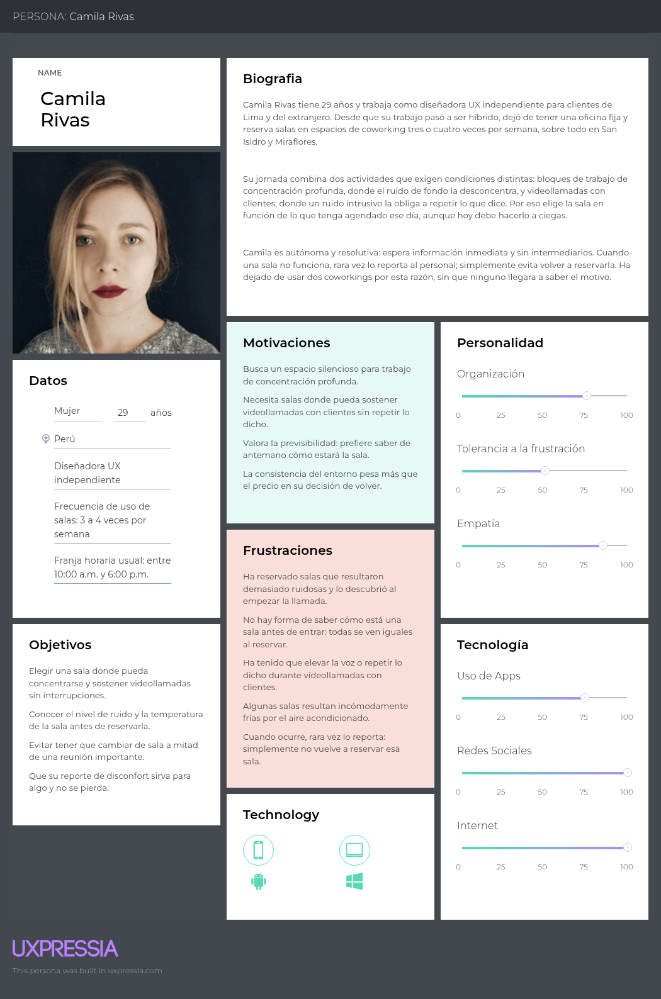
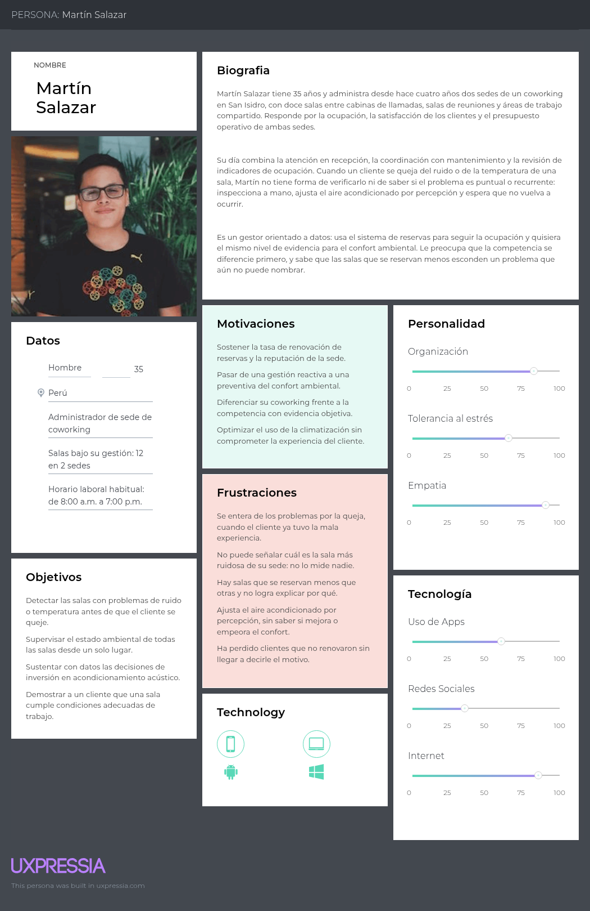
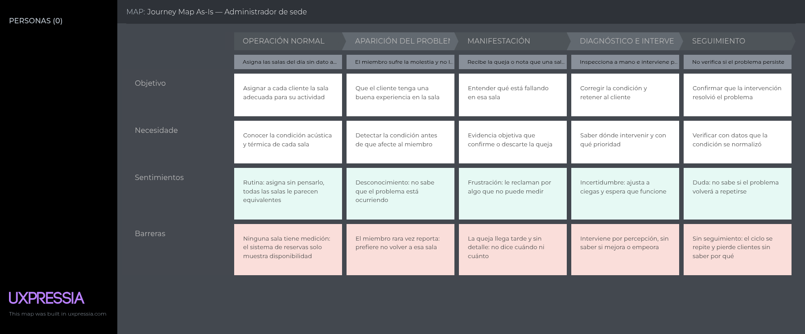
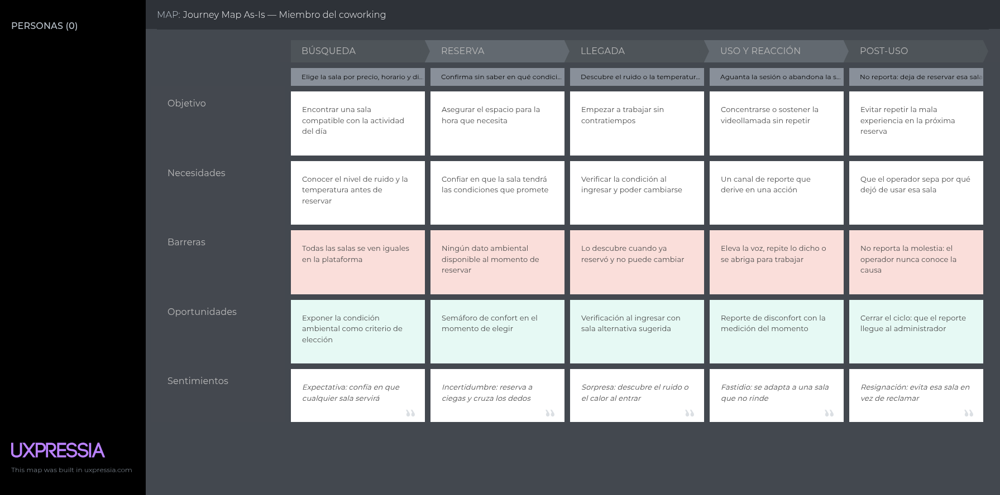
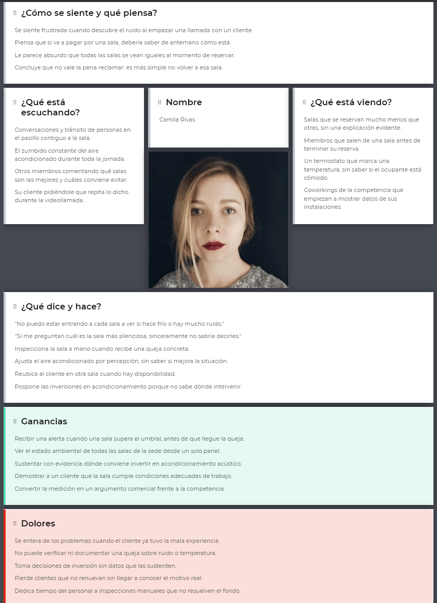
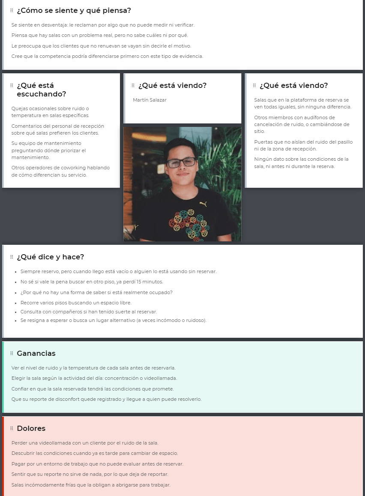
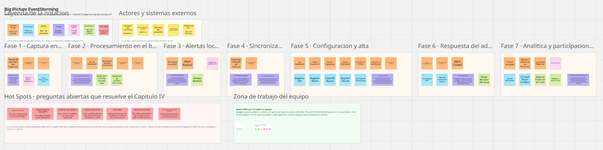

    

<h3 align="center">UNIVERSIDAD PERUANA DE CIENCIAS APLICADAS</h3>

<h3 align="center">INGENIERÍA DE SOFTWARE</h3>
<h4 align="center">CICLO 8</h4>
<h4 align="center">1ASI0572 - DESARROLLO DE SOLUCIONES IOT</h4>
<h4 align="center"><strong>NRC:</strong> 8721</h4>
<h4 align="center"><strong>PROFESOR:</strong> Javier Antonio Prudencio Vidal</h4>

<h3 align="center">INFORME DE TRABAJO FINAL</h3>
<h4 align="center"><strong>CICLO:</strong> 2026-20</h4>
<h4 align="center"><strong>STARTUP:</strong> SenseWork</h4>
<h4 align="center"><strong>PRODUCT:</strong> ZenRoom</h4>

<h4 align="center"><strong>INTEGRANTES:</strong></h4>

<h4 align="center">U202122129 - Espino Flores, Alejandro</h4>
<h4 align="center">U202322187 - Huarcaya Matias, Gilbert Alonso</h4>
<h4 align="center">U202310003 - Lang Nassi, Werner Khalil</h4>
<h4 align="center">U201923571 - Llamccaya Arone, Juan Paul</h4>
<h4 align="center">U202314513 - Luyo Correa, Sandra Paula</h4>
<h4 align="center">U202318615 - Solis Santa Cruz, Giancarlo Rafael</h4>

<h4 align="center"><i>AGOSTO 2026</i></h4>

# **Registro de Versiones del Informe**

| Versión | Fecha      | Autor                                                                                                                                                                                            | Descripción de modificación                                                                                                                                                                                                                                                      |
|:--------|:-----------|:-------------------------------------------------------------------------------------------------------------------------------------------------------------------------------------------------|:---------------------------------------------------------------------------------------------------------------------------------------------------------------------------------------------------------------------------------------------------------------------------------|
| AV1     | 18/09/2025 | Espino Flores, Alejandro  Huarcaya Matias, Gilbert Alonso  Lang Nassi, Werner Khalil   Llamccaya Arone, Juan Paul  Luyo Correa, Sandra Paula   Solis Santa Cruz, Giancarlo Rafael | En la primera entrega del informe de nuestro proyecto, hemos realizado los primeros cuatro capítulos del informe (Capítulo I: Introducción, Capítulo II: Requirements Elicitation & Analysis, Capítulo III: Requirements Specification y Capítulo IV: Solution Software Design). |

# **Project Report Collaboration Insights**

# **Contenido**

 
<a href="#registro-de-versiones-del-informe">Registro de Versiones del Informe</a> 
 
<a href="#project-report-collaboration-insights">Project Report Collaboration Insights</a> 
 
<a href="#contenido">Contenido</a> 
 
<a href="#tabla-de-contenidos">Tabla de contenidos</a> 
 
<a href="#student-outcome">Student Outcome</a> 
 
<a href="#capítulo-i-introducción">Capítulo I: Introducción</a>    
<ul>
    <a href="#11-startup-profile">1.1. Startup Profile</a> 
    <ul>
        <a href="#111-descripción-de-la-startup">1.1.1. Descripción de la Startup</a> 
        <a href="#112-perfiles-de-integrantes-del-equipo">1.1.2. Perfiles de integrantes del equipo</a> 
    </ul>
    <a href="#12-solution-profile">1.2. Solution Profile</a> 
    <ul>
        <a href="#121-antecedentes-y-problemática">1.2.1 Antecedentes y problemática</a> 
        <a href="#122-lean-ux-process">1.2.2 Lean UX Process.</a> 
        <ul>
            <a href="#1221-lean-ux-problem-statements">1.2.2.1. Lean UX Problem Statements.</a> 
            <a href="#1222-lean-ux-assumptions">1.2.2.2. Lean UX Assumptions.</a> 
            <a href="#1223-lean-ux-hypothesis-statements">1.2.2.3. Lean UX Hypothesis Statements.</a> 
            <a href="#1224-lean-ux-canvas">1.2.2.4. Lean UX Canvas.</a> 
        </ul>
    </ul>
    <a href="#13-segmentos-objetivo">1.3. Segmentos objetivo.</a> 
</ul>

<a href="#capítulo-ii-requirements-elicitation-analysis">Capítulo II: Requirements Elicitation & Analysis</a> 
<ul>
    <a href="#21-competidores">2.1. Competidores.</a> 
    <ul>
        <a href="#211-análisis-competitivo">2.1.1. Análisis competitivo.</a> 
        <a href="#212-estrategias-y-tácticas-frente-a-competidores">2.1.2. Estrategias y tácticas frente a competidores.</a> 
    </ul>
    <a href="#22-entrevistas">2.2. Entrevistas.</a> 
    <ul>
        <a href="#221-diseño-de-entrevistas">2.2.1. Diseño de entrevistas.</a> 
        <a href="#222-registro-de-entrevistas">2.2.2. Registro de entrevistas.</a> 
        <a href="#223-análisis-de-entrevistas">2.2.3. Análisis de entrevistas.</a> 
    </ul>
    <a href="#23-needfinding">2.3. Needfinding.</a> 
    <ul>
        <a href="#231-user-personas">2.3.1. User Personas.</a> 
        <a href="#232-user-task-matrix">2.3.2. User Task Matrix.</a> 
        <a href="#233-user-journey-mapping">2.3.3. User Journey Mapping.</a> 
        <a href="#234-empathy-mapping">2.3.4. Empathy Mapping.</a> 
    </ul>
    <a href="#24-big-picture-eventstorming">2.4. Big Picture EventStorming.</a> 
    <a href="#25-ubiquitous-language">2.5. Ubiquitous Language.</a> 
</ul>

<a href="#capítulo-iii-requirements-specification">Capítulo III: Requirements Specification</a> 
<ul>
    <a href="#31-user-stories">3.1. User Stories.</a> 
    <a href="#32-impact-mapping">3.2. Impact Mapping.</a> 
    <a href="#33-product-backlog">3.3. Product Backlog.</a> 
</ul>

<a href="#capítulo-iv-solution-software-design">Capítulo IV: Solution Software Design</a> 
<ul>
    <a href="#41-strategic-level-domain-driven-design">4.1. Strategic-Level Domain-Driven Design.</a> 
    <ul>
        <a href="#411-design-level-eventstorming">4.1.1. Design-Level EventStorming.</a> 
        <ul>
            <a href="#4111-candidate-context-discovery">4.1.1.1 Candidate Context Discovery.</a> 
            <a href="#4112-domain-message-flows-modeling">4.1.1.2 Domain Message Flows Modeling.</a> 
            <a href="#4113-bounded-context-canvases">4.1.1.3 Bounded Context Canvases.</a> 
        </ul>
        <a href="#412-context-mapping">4.1.2. Context Mapping.</a> 
        <a href="#413-software-architecture">4.1.3. Software Architecture.</a> 
        <ul>
            <a href="#4131-software-architecture-system-landscape-diagram">4.1.3.1. Software Architecture System Landscape Diagram.</a> 
            <a href="#4132-software-architecture-context-level-diagrams">4.1.3.2. Software Architecture Context Level Diagrams.</a> 
            <a href="#4132-software-architecture-container-level-diagrams">4.1.3.2. Software Architecture Container Level Diagrams.</a> 
            <a href="#4133-software-architecture-deployment-diagrams">4.1.3.3. Software Architecture Deployment Diagrams.</a> 
        </ul>
    </ul>
    <a href="#42-tactical-level-domain-driven-design">4.2. Tactical-Level Domain-Driven Design</a> 
    <ul>
        <a href="#421-bounded-context">4.2.1. Bounded Context: </a> 
        <ul>
            <a href="#4211-domain-layer">4.2.1.1. Domain Layer.</a> 
            <a href="#4212-interface-layer">4.2.1.2. Interface Layer.</a> 
            <a href="#4213-application-layer">4.2.1.3. Application Layer.</a> 
            <a href="#4214-infrastructure-layer">4.2.1.4. Infrastructure Layer.</a> 
            <a href="#4215-bounded-context-software-architecture-component-level-diagrams">4.2.1.5. Bounded Context Software Architecture Component Level Diagrams.</a> 
            <a href="#4216-bounded-context-software-architecture-code-level-diagrams">4.2.1.6. Bounded Context Software Architecture Code Level Diagrams.</a> 
            <ul>
                <a href="#42161-bounded-context-domain-layer-class-diagrams">4.2.1.6.1. Bounded Context Domain Layer Class Diagrams.</a> 
                <a href="#42162-bounded-context-database-design-diagram">4.2.1.6.2. Bounded Context Database Design Diagram.</a> 
            </ul>
        </ul>
    </ul>
</ul>

# **Student Outcome**

# Capítulo I: Introducción

Este capítulo introduce la visión general del proyecto, detallando el perfil de la startup emergente y la problemática que motiva la solución. Se plantea el diseño inicial siguiendo un enfoque estructurado para el desarrollo de la arquitectura IoT y los productos digitales asociados

## 1.1. Startup Profile

Esta sección describe la identidad de la organización responsable del proyecto, abarcando su propósito fundamental en la industria tecnológica y la composición del talento técnico encargado de la creación de la plataforma B2B.

### 1.1.1. Descripción de la Startup

SenseWork es una startup tecnológica dedicada a optimizar el confort ambiental en espacios de coworking y oficinas compartidas a través de una solución innovadora de Internet de las Cosas (IoT). Nuestra plataforma mide en tiempo real los niveles de ruido y las condiciones térmicas de las diferentes salas, alertando sobre inconvenientes de climatización o excesos de decibelios sin vulnerar en ningún momento la privacidad de los usuarios.

A través de nuestra aplicación móvil, los miembros del espacio de trabajo pueden visualizar y filtrar las salas disponibles utilizando un semáforo interactivo que califica el ambiente como óptimo, moderado o ruidoso, asegurando el lugar ideal para sus llamadas o trabajo enfocado. Por otro lado, ofrecemos a los administradores un dashboard web integral con mapas de calor y analíticas históricas que permite gestionar proactivamente las alertas, establecer umbrales de confort personalizados y evaluar el aislamiento de sus instalaciones.

SenseWork combina hardware IoT altamente accesible basado en Edge Computing con plataformas digitales intuitivas, logrando que los coworkings mejoren la retención de sus clientes al garantizar espacios de alta ergonomía ambiental, y que los usuarios maximicen su productividad sin fricciones.

**Misión**  
Conectar a los trabajadores y administradores de espacios compartidos mediante un ecosistema IoT accesible y 100% seguro. Buscamos empoderar a los usuarios para que encuentren el ambiente de trabajo perfecto de manera rápida, mientras facilitamos a las administraciones B2B la gestión proactiva de sus instalaciones, protegiendo siempre la privacidad de las conversaciones.

**Visión**  
Consolidarse como el estándar tecnológico B2B de referencia en el monitoreo del confort acústico y térmico corporativo en Latinoamérica, transformando la manera en que se auditan y habitan los coworkings a través de soluciones IoT escalables, precisas y preventivas.

### 1.1.2. Perfiles de integrantes del equipo

El equipo desarrollador está conformado por estudiantes de la carrera de Ingeniería de Software de la Universidad Peruana de Ciencias Aplicadas. A continuación, se detallan los perfiles de los miembros de la startup:

### 1.1.2. Perfiles de integrantes del equipo

| Foto del estudiante | Nombres y apellidos | Código de estudiante | Descripción |
|------------------------------------------------------------------------------------------------------|-----------------------------------------|----------------------|-------------------------------------------------------------------------------------------------------------------------------------------------------------------------------------------------------------------------------------------------------------------------|
|  | Dante Mateo Aleman Romano | u202319963 | Desarrollador de 20 años y estudiante de Ingeniería de Software, apasionado por Linux. Me encanta crear servicios, configurar máquinas y profundizar en prácticas de seguridad. |
|  | Contreras Peralta, Fabrizio Alessandro | u202319889 | Estudiante de Ingeniería de Software de 21 años, apasionado por resolver problemas con ideas creativas. Tengo un fuerte interés en la automatización de proyectos mediante LLMs y en explorar nuevas herramientas emergentes. |
|  | Curipaco Huayllani, Neil Aldrin Wilhelm | U20231B866 | Soy Neil Curipaco Huayllani, estudiante del 7mo ciclo de Ingeniería de Software en la UPC. Me apasionan los videojuegos, aprender cosas nuevas, escuchar música y mejorar mis habilidades para contribuir al equipo. |
|  | Solis Santa Cruz, Giancarlo Rafael | U202318615 | Estudiante de Ingeniería de Software cursando el 8 ciclo .Persona proactiva,intuitiuva, y enfocada en la eficiencia,con un enfoque preventivo frente a los problemas. |
|  | Paiva Quispe, Josue Gonzalo | u202119095 | Estudiante avanzado de Ingeniería de Software en el 8vo ciclo, realizando prácticas preprofesionales como desarrollador web fullstack junior. |

## 1.2. Solution Profile

En esta sección se expone la justificación de la propuesta tecnológica y el problema detectado en el mercado. Asimismo, se desarrolla el proceso Lean UX para validar las suposiciones e hipótesis que rigen la creación del modelo de negocio digital.

### 1.2.1 Antecedentes y problemática

### 1.2.2 Lean UX Process.

El marco de Lean UX Process abarca la visión del modelo de negocio que será soportado por el producto de software. Mediante iteraciones rápidas, se formulan declaraciones de problemas y suposiciones clave para dirigir el diseño de la solución hacia la entrega de valor tangible.

#### <i>**1.2.2.1. Lean UX Problem Statements.**</i>

Hemos observado que los administradores de coworkings y oficinas compartidas operan de manera reactiva ante las quejas ambientales, ya que carecen de herramientas de monitoreo de confort en tiempo real.
 ¿Cómo podemos proveerles un panel web (Dashboard) centralizado que les permita anticiparse a los problemas térmicos y de ruido en sus instalaciones?

Hemos observado que los trabajadores remotos e híbridos se sienten frustrados al ocupar cabinas o salas que resultan ser excesivamente ruidosas o calurosas, lo cual afecta severamente su concentración y productividad.
 ¿Cómo podemos ofrecerles una aplicación móvil intuitiva con indicadores visuales que les permita encontrar el espacio de trabajo ideal de manera rápida?

Hemos observado que los usuarios de oficinas compartidas desconfían de los sistemas de monitoreo acústico tradicionales por el temor legítimo a que sus conversaciones privadas sean grabadas o vulneradas.
 ¿Cómo podemos garantizar la medición precisa de decibelios en las salas sin capturar, almacenar ni transmitir audios crudos en ningún momento?

Hemos observado que la implementación de redes de sensores industriales resulta demasiado costosa y requiere instalaciones eléctricas complejas que los espacios B2B evitan realizar.
 
¿Cómo podemos diseñar un ecosistema de dispositivos IoT de bajo costo, basado en Edge Computing, que sea escalable, económico y totalmente seguro de implementar?

#### <i>**1.2.2.2. Lean UX Assumptions.**</i>

**Business Assumptions**

* El hardware IoT económico (~S/ 65 por nodo) facilitará la escalabilidad y adopción masiva en infraestructuras B2B frente a soluciones industriales costosas.
* El procesamiento *Edge* que elimina el audio instantáneamente superará las barreras de privacidad y legalidad, siendo un diferenciador clave de venta.

**Business Outcome Assumptions**

* Los coworkings incrementarán su retención de clientes corporativos en un 20% al poder garantizar y certificar ambientes ergonómicos.
* Se reducirán en un 40% los costos operativos derivados del uso ineficiente del aire acondicionado gracias al monitoreo térmico focalizado.

**User Assumptions**

* Los trabajadores remotos e híbridos se sienten profundamente frustrados al tener videollamadas interrumpidas por ruido externo superior a 55 dB.
* Los administradores de *facility management* operan a ciegas; solo descubren fallas de climatización cuando un cliente se queja formalmente.

**User Outcome and Benefit Assumptions**

* Los usuarios ahorrarán tiempo y reducirán su estrés al encontrar una sala óptima en menos de 60 segundos desde su móvil.
* Los administradores obtendrán tranquilidad y control predictivo, previniendo crisis ambientales en las instalaciones.

**Feature Assumptions**

* Un semáforo visual (Verde, Amarillo, Rojo) es la forma más rápida para que el usuario entienda el estado de una sala sin leer métricas complejas.
* El cruce de datos internos con la API de OpenWeatherMap permitirá a los administradores evaluar qué salas tienen fallas reales de aislamiento.

#### <i>**1.2.2.3. Lean UX Hypothesis Statements.**</i>

* **Hypothesis 1:**
    Creemos que lograremos un incremento del 30% en las renovaciones de membresías corporativas. Si los administradores de instalaciones B2B. Alcanzan un control proactivo sobre los problemas de climatización (HVAC) y aislamiento acústico. Con el mapa de calor del *Web Dashboard* y el centro de alertas automatizado.
* **Hypothesis 2:**
    Creemos que lograremos una alta tasa de usuarios activos diarios. Si los trabajadores híbridos miembros del coworking. Alcanzan la capacidad de encontrar al instante un espacio tranquilo y cómodo sin vulnerar su privacidad. Con el mapa móvil en vivo de las salas, el sistema inteligente de filtrado y los indicadores visuales tipo semáforo.
* **Hypothesis 3:**
    Creemos que lograremos una reducción del 40% en los costos de ancho de banda de hardware en la nube. Si nuestra arquitectura IoT. Alcanza el procesamiento local de las señales de audio. Con un enfoque de *Edge Computing* (Flask/ESP32) que calcula el $V_{RMS}$ y elimina los audios crudos de manera instantánea.

#### <i>**1.2.2.4. Lean UX Canvas.**</i>

## 1.3. Segmentos objetivo.

<u>**Segmento Objetivo #1: Miembros y Usuarios del Coworking**</u>

| Segmento Objetivo #1: | Miembros y Usuarios del Coworking  |
| :--- | :--- |
| **Aspectos demográficos** | **Sexo:** Indistinto **Edad:** 22 a 50 años **Nivel socioeconómico:** Profesionales, freelancers, nómadas digitales y emprendedores que invierten en espacios de trabajo flexible  |
| **Aspectos geográficos** | **Nacionalidad:** Peruana y extranjeros residentes **Zona geográfica:** Lima Metropolitana, especialmente en distritos con alta concentración de coworkings y centros empresariales (Miraflores, San Isidro, Surco, Barranco, San Borja) |
| **Aspectos psicográficos** | Profesionales enfocados en la alta concentración (*deep work*), la productividad y el bienestar durante su jornada laboral. Valoran el confort acústico y térmico como factores esenciales para realizar llamadas sin interrupciones y trabajar sin fatiga. Buscan herramientas digitales inmediatas, autónomas y transparentes que les eviten perder tiempo buscando salas adecuadas. |
| **Aspectos conductuales** | **Necesidad:** Encontrar rápidamente salas de concentración con bajo nivel de ruido (<45 dB) y temperatura óptima (20°C - 23°C) para llamadas importantes o trabajo enfocado. **Uso de herramientas:** Consultan la App para revisar el mapa en vivo con semáforo visual (Verde, Amarillo, Rojo), filtrar por decibelios/temperatura y consultar el histórico de tranquilidad por hora. **Respuesta:** Seleccionan la sala según las métricas en tiempo real y utilizan el botón de "Reporte de Disconfort" ante cualquier problema acústico o térmico en el espacio. |

 

<u>**Segmento Objetivo #2: Administradores y Gestores de Coworking**</u>

| Segmento Objetivo #2: | Administradores y Gestores de Espacios de Coworking  |
| :--- | :--- |
| **Aspectos demográficos** | **Sexo:** Indistinto **Edad:** 25 a 60 años **Nivel socioeconómico:** Administradores de sede, Community Managers y Jefes de Operaciones / Facilities con manejo de presupuesto operativo (NSE A y B) |
| **Aspectos geográficos** | **Nacionalidad:** Peruana **Zona geográfica:** Lima Metropolitana, en sedes corporativas, edificios comerciales y centros de coworking |
| **Aspectos psicográficos** | Gestores orientados a la eficiencia operativa, la satisfacción del cliente y la diferenciación competitiva de sus instalaciones. Valoran la automatización y el uso de datos en tiempo real (*data-driven*) para mantener estándares de confort y prevenir quejas antes de que ocurran. Muestran interés en soluciones que optimicen el uso de climatización y energía sin comprometer la experiencia ni la reputación del establecimiento. |
| **Aspectos conductuales** | **Necesidad:** Monitorear en tiempo real el confort ambiental integral (acústico y térmico) de todo el edificio y prevenir reclamos de los usuarios. **Uso de herramientas:** Acceden al Dashboard Web para supervisar el plano interactivo (Heatmap), analizar promedios históricos cruzados con el clima exterior (API) y configurar umbrales tolerables según el tipo de sala. **Respuesta:** Actúan inmediatamente ante alertas automáticas cuando una sala supera los límites de decibelios por más de 5 minutos o cuando la temperatura sale del rango de confort. |

# Capítulo II: Requirements Elicitation & Analysis

## 2.1. Competidores.

El análisis identifica a los competidores directos —soluciones digitales con modelos de negocio equivalentes— y a los indirectos, cuya oferta cubre parcialmente la misma necesidad.

**Airthings for Business**

Empresa noruega especializada en el monitoreo de calidad ambiental interior para el sector corporativo. Ofrece cinco modelos de monitor —Space Pro, Space Plus, Space Co2, Space Co2 Mini y Space Hub—, una plataforma de analítica y tres sensores virtuales: Virus Risk, Space Utilization y Ventilation Rate. Declara más de 10 000 edificios monitoreados y 150 000 dispositivos desplegados a nivel global (Airthings, 2026a).

Es el competidor más cercano a SenseWork, pues **sí incorpora un sensor de ruido ambiental**, y su enfoque de privacidad coincide con el de esta solución: el monitor muestrea 60 milisegundos de audio cada 6 segundos, calcula el nivel en decibelios dentro del propio dispositivo y descarta la muestra, de modo que resulta imposible reconstruir una conversación (Airthings, 2026b). El rango dinámico declarado es de 35 a 120 dBA SPL.

La diferencia se encuentra en la profundidad del tratamiento acústico. Airthings reporta el **nivel promedio en dBA a lo largo del tiempo**, sin aplicar las normas de confort acústico: no calcula el nivel continuo equivalente ponderado energéticamente ni los percentiles estadísticos L10, L50 y L90 de la norma ISO 1996, que son los que permiten distinguir un ruido de fondo permanente de picos intrusivos aislados. Tampoco calcula índices de confort térmico normalizados según ISO 7730, sino que reporta temperatura y humedad como valores independientes.

**Kaiterra**

Compañía enfocada en el sector B2B y la gestión de edificios inteligentes. Su línea de producto comprende monitores de interior —Sensedge, Sensedge Go y Sensedge Mini—, monitores de exterior y un modelo para instalación en conductos de climatización (Sensedge Duct), complementados por la Kaiterra Data Platform (Kaiterra, 2026).

Su ventaja competitiva reside en el cumplimiento normativo: sus dispositivos otorgan hasta 9 puntos en la certificación WELL y son compatibles con LEED, Fitwel, RESET y UL Verified Healthy Buildings. Se dirigen a desarrolladoras inmobiliarias y gestores de infraestructura de gran escala.

Su oferta **no contempla la dimensión acústica** —ninguno de sus monitores mide nivel sonoro— ni el confort térmico normalizado. Su unidad de gestión es el edificio y no la sala individual, lo que la aleja de la operación diaria de un espacio de trabajo compartido.

**Sonómetros profesionales (NTi Audio, Svantek)**

Instrumentos de medición acústica certificados según la norma IEC 61672, empleados en estudios acústicos, peritajes y verificación de cumplimiento normativo. Ofrecen exactitud metrológica y validez legal de las mediciones, lo que los convierte en el referente técnico del sector. No obstante, se trata de instrumentos de medición puntual que requieren operador, no generan registro histórico continuo ni alertas, y su costo por unidad impide instrumentar de forma permanente todas las salas de un establecimiento.

### 2.1.1. Análisis competitivo.

<table>
  <thead>
    <tr>
      <th colspan="6">Competitive Analysis Landscape</th>
    </tr>
  </thead>
  <tbody>
    <tr>
      <td colspan="2"><strong>¿Por qué llevar a cabo este análisis?</strong></td>
      <td colspan="4">El objetivo es identificar las brechas tecnológicas y de experiencia de usuario en las plataformas actuales de monitoreo ambiental interior, para validar que la especialización en confort acústico y térmico normalizado, con operación garantizada sin conexión a internet, responde a una demanda insatisfecha en los espacios de trabajo compartidos de Lima Metropolitana.</td>
    </tr>
    <tr>
      <td colspan="2"><strong>Competidores</strong></td>
      <td><strong>SenseWork</strong> </td>
      <td>Airthings for Business </td>
      <td>Kaiterra </td>
      <td>Sonómetros profesionales </td>
    </tr>
    <tr>
      <td rowspan="2"><strong>Perfil</strong></td>
      <td>Overview</td>
      <td>Plataforma IoT especializada en confort acústico y térmico para espacios de trabajo compartidos. Mide el nivel sonoro y las condiciones térmicas de cada sala, aplica las normas ISO 1996 e ISO 7730, y evalúa alertas en la capa Edge sin depender de la conexión a internet. El audio se procesa en el dispositivo y nunca se transmite.</td>
      <td>Plataforma noruega de monitoreo de calidad ambiental interior para el sector corporativo. Cinco modelos de monitor, panel en la nube y tres sensores virtuales. <strong>Mide nivel sonoro</strong> muestreando 60 ms cada 6 s y descartando el audio en el dispositivo, con un rango de 35 a 120 dBA SPL.</td>
      <td>Plataforma orientada a la gestión de edificios inteligentes y a la obtención de certificaciones. Línea Sensedge para interior, exterior y conductos de climatización, con analítica propia. Otorga hasta 9 puntos en la certificación WELL.</td>
      <td>Instrumentos de medición acústica de precisión certificados según IEC 61672, empleados en estudios acústicos, peritajes y verificación de cumplimiento normativo.</td>
    </tr>
    <tr>
      <td>Ventaja competitiva ¿Qué valor ofrece a los clientes?</td>
      <td><strong>Indicador interpretable sin formación técnica:</strong> expresa el confort como el porcentaje de personas que estaría insatisfecha, en lugar de valores crudos.  <strong>Operación sin internet:</strong> las alertas se evalúan en el propio local, de modo que una caída del enlace no deja al operador sin vigilancia.  <strong>Privacidad por diseño:</strong> el audio no abandona el dispositivo.  <strong>Costo por sala</strong> compatible con instrumentar el local completo.</td>
      <td><strong>Amplitud de variables:</strong> cobertura de contaminantes que ningún competidor iguala, incluido el radón.  <strong>Marca consolidada:</strong> más de 10 000 edificios y 150 000 dispositivos desplegados.  <strong>Instalación autónoma:</strong> dispositivos inalámbricos que el propio cliente instala.  <strong>Sensores virtuales</strong> derivados de los físicos: riesgo viral, uso del espacio y tasa de ventilación.</td>
      <td><strong>Cumplimiento normativo:</strong> hasta 9 puntos en WELL, más compatibilidad con LEED, Fitwel, RESET y UL Verified Healthy Buildings.  <strong>Cobertura integral del edificio:</strong> monitores de interior, exterior y de conducto de climatización bajo una misma plataforma.</td>
      <td><strong>Exactitud certificada</strong> y trazabilidad metrológica.  <strong>Validez legal</strong> de las mediciones para efectos normativos y periciales.</td>
    </tr>
    <tr>
      <td rowspan="2"><strong>Perfil de Marketing</strong></td>
      <td>Mercado objetivo</td>
      <td><strong>Primario:</strong> operadores de espacios de trabajo compartidos en Lima Metropolitana, con entre uno y cinco locales en operación.  <strong>Secundario:</strong> usuarios que reservan salas de forma recurrente para trabajo de concentración o videollamadas.</td>
      <td>Grandes corporaciones y administradores de edificios de oficinas en mercados desarrollados, con presupuestos de facilities consolidados.</td>
      <td>Desarrolladoras inmobiliarias y administradores de edificios corporativos que persiguen certificaciones de sostenibilidad.</td>
      <td>Consultoras de acústica, entidades de fiscalización ambiental y laboratorios de ensayo.</td>
    </tr>
    <tr>
      <td>Estrategias de marketing</td>
      <td><strong>Venta consultiva mediante diagnóstico:</strong> piloto gratuito que mide las salas del propio prospecto y entrega un informe con sus condiciones reales, convirtiendo la promesa comercial en evidencia. Presencia en asociaciones del sector inmobiliario corporativo.</td>
      <td>Marketing digital B2B, red de distribuidores e integración con plataformas de gestión de edificios.</td>
      <td><em>Account-Based Marketing</em> dirigido a arquitectos y gestores de infraestructura, para incorporar sus sensores desde la fase de diseño del proyecto.</td>
      <td>Venta especializada a través de distribuidores técnicos y presencia en el ámbito académico y profesional de la acústica.</td>
    </tr>
    <tr>
      <td rowspan="3"><strong>Perfil de Producto</strong></td>
      <td>Productos &amp; Servicios</td>
      <td><strong>Hardware:</strong> módulo IoT por sala basado en ESP32, con micrófono MEMS y sensor de temperatura y humedad.  <strong>Edge:</strong> servicio local que agrega por minuto, evalúa alertas y encola los datos ante la ausencia de conexión.  <strong>Cloud:</strong> API con analítica de tendencias y correlaciones.  <strong>Software:</strong> aplicación web adaptable, aplicación móvil de alertas y landing page.</td>
      <td><strong>Hardware:</strong> sensores de calidad del aire para interiores.  <strong>Software:</strong> panel en la nube, API e integraciones con sistemas de gestión de edificios.</td>
      <td><strong>Hardware:</strong> sensores modulares calibrables.  <strong>Software:</strong> panel de nivel industrial con reportes de cumplimiento.  <strong>Servicio:</strong> consultoría para la obtención de certificaciones.</td>
      <td><strong>Hardware:</strong> sonómetros de clase 1 y clase 2, y calibradores acústicos.  <strong>Software:</strong> herramientas de análisis de escritorio.</td>
    </tr>
    <tr>
      <td>Precios &amp; Costos</td>
      <td><strong>Modelo híbrido:</strong> venta del hardware a costo accesible por su base en ESP32, más suscripción mensual según el número de salas instrumentadas. El precio por sala se dimensiona por debajo del ingreso de unas pocas horas de reserva.</td>
      <td>Suscripción anual por dispositivo, con un costo de hardware por unidad que dificulta instrumentar todas las salas de un local.</td>
      <td>Presupuesto por proyecto para edificios completos, con planes de reemplazo periódico de los módulos de sensores.</td>
      <td>Compra del instrumento con costo elevado por unidad, más calibración periódica obligatoria.</td>
    </tr>
    <tr>
      <td>Canales de distribución (Web y/o Móvil)</td>
      <td><strong>Web:</strong> panel de gestión para el operador y el personal de recepción.  <strong>Móvil:</strong> aplicación de atención de alertas mientras se recorre el local.  <strong>Landing page:</strong> propuesta de valor para operadores que aún no son clientes.</td>
      <td><strong>Web:</strong> panel corporativo.  <strong>Móvil:</strong> aplicación de consulta.</td>
      <td><strong>Web:</strong> panel empresarial compatible con protocolos industriales.  <strong>API</strong> de integración.</td>
      <td><strong>Software de escritorio.</strong> El instrumento opera de forma autónoma.</td>
    </tr>
    <tr>
      <td rowspan="4"><strong>Análisis SWOT</strong></td>
      <td>Fortalezas</td>
      <td>Aplicación de normas internacionales de confort, no de valores crudos. Cobertura simultánea de la dimensión acústica y la térmica. Operación garantizada sin conexión a internet. Privacidad verificable por diseño. Costo compatible con la instrumentación completa del local. Conocimiento del contexto operativo del coworking limeño.</td>
      <td>Marca consolidada con base instalada global. Amplitud de variables medidas. Es el único competidor que aborda simultáneamente aire y ruido. Enfoque de privacidad ya resuelto en el dispositivo. Instalación sin técnico especializado.</td>
      <td>Único que garantiza puntajes para certificaciones internacionales. Diseño modular que facilita el mantenimiento en grandes infraestructuras.</td>
      <td>Exactitud metrológica certificada. Validez legal de la medición.</td>
    </tr>
    <tr>
      <td>Debilidades</td>
      <td>Marca nueva, sin trayectoria comercial ni base instalada. Hardware sin certificación metrológica. Recursos de investigación y desarrollo limitados frente a competidores globales.</td>
      <td>Tratamiento acústico superficial: reporta el promedio en dBA sin percentiles ISO 1996, por lo que no distingue ruido de fondo de picos intrusivos. No calcula confort térmico normalizado (PMV/PPD). Orientado a grandes corporaciones, con costo por dispositivo elevado para instrumentar sala por sala. Dependencia de conexión permanente a internet.</td>
      <td>No incorpora la dimensión acústica en ninguno de sus modelos. No calcula confort térmico normalizado. Orientado al edificio como unidad y no a la gestión sala por sala. Complejidad y costo excesivos para un operador mediano.</td>
      <td>Medición puntual y no continua. Requiere operador presente. No genera registro histórico ni alertas. Costo prohibitivo para instrumentación permanente.</td>
    </tr>
    <tr>
      <td>Oportunidades</td>
      <td>Crecimiento sostenido del trabajo híbrido y de la demanda de espacios flexibles. Ausencia de una solución especializada en confort acústico para coworkings en el mercado peruano. Posibilidad de convertir la evidencia ambiental en argumento comercial del propio operador.</td>
      <td>Profundizar su tratamiento acústico incorporando percentiles normalizados, dado que ya cuenta con el hardware necesario. Expansión hacia mercados emergentes.</td>
      <td>Incorporación de indicadores de confort térmico normalizados a su oferta actual.</td>
      <td>Integración de sus instrumentos con plataformas de monitoreo continuo.</td>
    </tr>
    <tr>
      <td>Amenazas</td>
      <td>Entrada de un competidor establecido al segmento de espacios de trabajo compartidos. Comercialización de sensores genéricos de bajo costo percibidos como suficientes. Consideración de la medición ambiental como un gasto prescindible por parte del operador.</td>
      <td>Aparición de competidores de menor costo en el monitoreo de calidad del aire.</td>
      <td>Desarrollo de capacidades equivalentes por parte de los fabricantes de sistemas de climatización.</td>
      <td>Sustitución progresiva por redes de sensores continuos de menor costo.</td>
    </tr>
  </tbody>
</table>

*Nota.* Elaboración propia. La información de productos y funcionalidades fue verificada en los sitios oficiales de cada competidor el 2 de septiembre de 2026. Los precios no se encuentran publicados: Airthings y Kaiterra los gestionan mediante contacto comercial directo, por lo que las cifras indicadas son estimaciones de orden de magnitud a partir de fuentes secundarias, pendientes de confirmación.

**Referencias de esta sección**

Airthings. (2026a). *Airthings for Business: indoor air quality monitoring*. https://www.airthings.com/business

Airthings. (2026b). *How does the ambient noise sensor work?* https://help.airthings.com/en/articles/9739502-how-does-the-ambient-noise-sensor-work

Kaiterra. (2026). *Indoor air quality monitors and data platform*. https://www.kaiterra.com/

### 2.1.2. Estrategias y tácticas frente a competidores.

Para afrontar de manera estratégica el panorama competitivo en Lima Metropolitana, SenseWork implementará una serie de tácticas ofensivas y defensivas orientadas a capitalizar las brechas de servicio de los actores globales y a mitigar las amenazas del mercado local.

**1. Profundidad acústica frente a amplitud de variables**

La verificación de los sitios oficiales muestra que Airthings **sí mide nivel sonoro**, por lo que la diferenciación no puede sustentarse en medir algo que el competidor no mide. La brecha real es de **profundidad en el tratamiento del dato**: Airthings reporta el promedio en dBA a lo largo del tiempo, mientras que Kaiterra no aborda la acústica en absoluto.

Nuestra estrategia consiste en aplicar las normas de confort —ISO 1996 e ISO 7730— sobre las mismas magnitudes físicas que el competidor ya captura, evitando la dispersión hacia el monitoreo de contaminantes donde ellos están consolidados.

*Táctica:* incorporar al panel los percentiles estadísticos L10, L50 y L90. Un promedio en dBA no distingue una sala con ruido de fondo permanente de otra con picos intrusivos aislados, aunque ambas registren el mismo promedio; sin embargo, la intervención correctiva es distinta en cada caso —aislamiento acústico en el primero, gestión de la actividad adyacente en el segundo—. Esa distinción es la que convierte el dato en una decisión.

*Táctica:* expresar el confort térmico como PPD, el porcentaje de personas que estaría insatisfecha, en lugar de reportar temperatura y humedad como valores independientes. Ningún competidor traduce ambas variables a un índice normalizado interpretable.

**2. Sustitución de la confianza en la marca por evidencia del propio local**

Como producto nuevo, SenseWork no puede apoyarse en referencias de clientes previos frente a marcas consolidadas como Airthings o Kaiterra.

*Táctica:* ofrecer un piloto gratuito de dos semanas instrumentando dos o tres salas del prospecto, cuyo resultado es un informe con las condiciones reales medidas en su establecimiento. El argumento comercial deja de ser una promesa y se convierte en un diagnóstico.

*Táctica:* documentar públicamente el método de cálculo y las normas aplicadas —ISO 1996 e ISO 7730—, de modo que la validez del indicador pueda verificarse con independencia de la reputación del proveedor.

**3. Delimitación del alcance frente a los instrumentos certificados**

Los sonómetros profesionales cuentan con certificación IEC 61672, de la que carece un módulo basado en ESP32. Competir en exactitud metrológica supondría una desventaja estructural.

*Táctica:* posicionar el producto de forma inequívoca como herramienta de gestión operativa y no de peritaje legal, delimitando explícitamente su alcance en la comunicación comercial.

*Táctica:* documentar el procedimiento de calibración del sensor contra un sonómetro de referencia y publicar el margen de error esperado, aportando trazabilidad sin pretender certificación.

**4. Construcción de ventaja en la operación sin conectividad**

Airthings o Kaiterra podrían incorporar indicadores de confort acústico normalizado a su oferta actual. La ventaja defendible se encuentra en una capa que un competidor global no replica con facilidad.

*Táctica:* consolidar la evaluación de alertas en la capa Edge como diferenciador central. En locales con infraestructura de red poco confiable, un sistema que deja de alertar cuando cae el enlace no resuelve el problema que dice atender.

*Táctica:* priorizar la profundidad de la integración con la operación diaria del coworking —asignación de salas y gestión de reservas— frente a la amplitud de variables medidas.

**5. Traducción del valor al lenguaje del negocio del operador**

El operador puede considerar que el problema no justifica una inversión recurrente.

*Táctica:* expresar el valor del producto en términos de reservas no renovadas y salas infrautilizadas, y no en términos técnicos de precisión de medición.

*Táctica:* dimensionar el precio por sala de modo que se mantenga por debajo del ingreso de unas pocas horas de reserva, situando la decisión en un umbral que no requiere aprobación presupuestaria formal.

**6. Anticipación de la objeción de privacidad**

La instalación de un micrófono en una sala ocupada genera resistencia inmediata, tanto en el operador como en sus clientes. Conviene señalar que Airthings ya resolvió esta objeción con un enfoque equivalente —procesamiento en el dispositivo y descarte del audio—, lo que confirma que es el estándar esperado del sector y no un diferenciador exclusivo.

*Táctica:* abordar la objeción en la primera conversación comercial, explicando que el audio se procesa en el propio dispositivo y que únicamente se transmite un valor numérico agregado, convirtiendo la restricción técnica en un argumento de confianza.

*Táctica:* documentar públicamente el diseño del pipeline acústico —de la muestra al indicador— de modo que la garantía de privacidad sea verificable y no una simple declaración comercial.

*Táctica:* habilitar la publicación del indicador de confort por sala en los canales de reserva del operador, de modo que la medición se transforme en un elemento de transparencia hacia el usuario final y no en un mecanismo de vigilancia.

## 2.2. Entrevistas.

La investigación se apoya en entrevistas a representantes de ambos segmentos objetivo, orientadas a recoger hechos verificables sobre su operación cotidiana antes que opiniones sobre la solución.

Las entrevistas se diseñaron siguiendo un enfoque **semiestructurado**: un guion base garantiza la comparabilidad entre sesiones, mientras que las preguntas de profundización permiten explorar los temas que cada participante identifique como relevantes. El principio rector del diseño es **preguntar por hechos y no por opiniones**: se indaga sobre lo que el participante hizo la última vez que enfrentó el problema, en lugar de pedirle que valore una solución hipotética. Las preguntas sobre el producto se reservan para el final de la sesión, de modo que no condicionen las respuestas previas.

| Aspecto | Definición |
| :---- | :---- |
| Modalidad | Presencial en el local del participante o videollamada, según su disponibilidad |
| Duración | Entre 20 y 30 minutos por sesión |
| Registro | Grabación de audio y video, previo consentimiento explícito del participante |
| Cantidad mínima | 3 entrevistas por segmento objetivo |
| Herramienta de registro | Microsoft Stream o Clipchamp |

### 2.2.1. Diseño de entrevistas.

| Segmento Objetivo #1: | Miembros y Usuarios del Coworking |
| :---- | :---- |
| **Datos Demográficos** | ¿Cuál es su nombre completo y edad? ¿Cuál es su ocupación? ¿En qué distrito suele trabajar? |
| **Ocupación y Background** | ¿Con qué frecuencia utiliza espacios de trabajo compartidos? ¿Para qué tipo de actividad reserva una sala: concentración, reuniones, videollamadas? ¿Suele volver al mismo espacio o los alterna? |
| **Perfil Psicográfico** | ¿Qué valora más al elegir un espacio de trabajo: el precio, la ubicación o las condiciones del ambiente? ¿Qué tan dispuesto está a pagar más por un espacio que le garantice mejores condiciones de trabajo? |
| **Confort acústico** | Cuénteme sobre la última vez que trabajó en una sala y la experiencia no resultó como esperaba. ¿Qué ocurrió? ¿Le ha sucedido que el ruido le impidiera concentrarse o dificultara una videollamada? ¿Qué hizo en ese momento? ¿Ha tenido que elevar la voz o repetir lo dicho durante una llamada por el ruido de la sala? ¿Ha abandonado una sala antes de tiempo por este motivo? |
| **Confort térmico** | ¿Le ha resultado alguna sala incómoda por temperatura? ¿Cómo lo resolvió? ¿Ha tenido que abrigarse o quitarse ropa dentro de una sala para poder trabajar? |
| **Comportamiento ante el problema** | Cuando ocurre algo así, ¿lo comunica al personal del espacio? Si no lo hace, ¿por qué? ¿Ha dejado de usar algún espacio por este motivo? ¿Llegó a explicarles la razón? |
| **Criterios de decisión** | Al reservar una sala, ¿qué información consulta previamente? ¿Qué información sobre una sala le gustaría conocer antes de reservarla? ¿Ha usado alguna aplicación para medir ruido o temperatura? ¿Con qué resultado? |
| **Tecnología y Canales** | ¿Esta información influiría en su elección de sala? ¿De qué manera? ¿Cómo preferiría verla expresada: en decibelios, en una escala de colores o de otra forma? ¿Desde qué dispositivo consultaría esta información al momento de reservar? |
| **Privacidad** | ¿Le generaría alguna inquietud saber que hay un sensor de sonido en la sala donde trabaja? ¿Cambiaría su percepción saber que el dispositivo no graba audio y solo mide el nivel de ruido? |

| Segmento Objetivo #2: | Administradores y Gestores de Espacios de Coworking |
| :---- | :---- |
| **Datos Demográficos** | ¿Cuál es su nombre completo y edad? ¿En qué distrito se ubica su establecimiento? ¿Cuál es su cargo actual? |
| **Ocupación y Background** | ¿Cuántas salas administra y qué tipo de clientes las utilizan? ¿Cuántas personas frecuentan el local en un día típico? ¿Cuánto tiempo lleva administrando este tipo de espacio? |
| **Perfil Psicográfico** | ¿Cómo toma decisiones cuando detecta un problema que afecta la experiencia de sus clientes? ¿Qué herramientas digitales usa actualmente para gestionar el local y las reservas? ¿Qué tan abierto se considera a adoptar nueva tecnología si resuelve un problema concreto? |
| **Confort acústico** | ¿Cuáles son las quejas más frecuentes que recibe sobre las salas? Cuénteme sobre la última vez que un cliente le manifestó una molestia por ruido. ¿Qué ocurrió y qué hizo usted? Si tuviera que señalar ahora mismo cuál es la sala más ruidosa de su local, ¿podría hacerlo? ¿En qué se basaría? ¿Hay alguna sala que se reserve menos que las demás? ¿A qué lo atribuye? ¿Sabía que en una sala de reuniones el ruido de fondo permanente y los picos aislados de voz requieren intervenciones distintas? |
| **Confort térmico** | ¿Cómo decide cuándo ajustar el aire acondicionado de una sala? ¿Ha recibido quejas sobre sensación de frío, calor o aire viciado dentro de las salas? ¿Cómo sabría hoy si la temperatura de una sala es adecuada para quienes la ocupan, más allá de lo que marca el termostato? |
| **Prácticas actuales de medición** | ¿Mide actualmente alguna condición ambiental de sus salas? ¿De qué manera? ¿Ha realizado alguna inversión en acondicionamiento acústico o climatización? ¿Cómo decidió dónde intervenir? ¿Qué información le habría resultado útil para tomar esa decisión? ¿Ha tenido clientes que dejaron de renovar? ¿Llegó a conocer el motivo? |
| **Objetivos y Frustraciones** | ¿Qué tan importante considera el confort de las salas para la reputación de su negocio? ¿Existe algún aspecto del ambiente interior que sienta que no puede controlar ni medir actualmente? ¿Le resultaría útil poder demostrar a un cliente que una sala cumple condiciones adecuadas de trabajo? |
| **Tecnología y Canales** | ¿Qué dispositivos usa a diario para gestionar el local? ¿Usaría una aplicación que le muestre en tiempo real el estado acústico y térmico de cada sala y le envíe alertas? ¿Le resultaría útil generar reportes históricos por sala para sustentar decisiones de inversión? Si el sistema le avisara ahora que una sala presenta ruido elevado de forma sostenida, ¿qué haría usted? |
| **Privacidad** | ¿Qué preocupación le genera instalar un sensor de sonido en una sala ocupada por clientes? ¿Cambiaría su percepción saber que el audio se procesa dentro del dispositivo y que solo se transmite un valor numérico, sin grabar conversaciones? |
| **Comportamiento de Decisión** | ¿Qué lo lleva a invertir en una mejora para el local? ¿Quién más participa en las decisiones de equipamiento o tecnología? ¿Qué tendría que costar mensualmente para que la decisión de contratarlo no requiera una aprobación mayor? ¿Recomendaría a otros operadores una solución que le haya dado resultados concretos? |

### 2.2.2. Registro de entrevistas.

> ‹TODO: completar tras realizar las entrevistas. Para cada participante debe registrarse: nombre y apellidos, edad, distrito, segmento, fecha, duración, captura de pantalla de la sesión, enlace a la grabación en Microsoft Stream y un resumen de entre 150 y 200 palabras con los hallazgos principales. La grabación consolidada se incorpora al video de Needfinding Interviews, con una duración orientativa de 3 a 5 minutos por entrevista.›

**Segmento 1 (Miembros y Usuarios) — Entrevista 1**

| Campo | Contenido |
| :---- | :---- |
| Nombre y apellidos | ‹TODO› |
| Edad | ‹TODO› |
| Cargo | ‹TODO› |
| Distrito | ‹TODO› |
| Fecha | ‹TODO› |
| Duración | ‹TODO› |
| Captura de la sesión | ‹TODO: `assets/entrevistas/segmento-1-entrevista-1.png`› |
| Enlace de la grabación | ‹TODO› |

*Resumen:* ‹TODO›

**Segmento 1 (Miembros y Usuarios) — Entrevista 2**

| Campo | Contenido |
| :---- | :---- |
| Nombre y apellidos | ‹TODO› |
| Edad | ‹TODO› |
| Cargo | ‹TODO› |
| Distrito | ‹TODO› |
| Fecha | ‹TODO› |
| Duración | ‹TODO› |
| Captura de la sesión | ‹TODO› |
| Enlace de la grabación | ‹TODO› |

*Resumen:* ‹TODO›

**Segmento 1 (Miembros y Usuarios) — Entrevista 3**

| Campo | Contenido |
| :---- | :---- |
| Nombre y apellidos | ‹TODO› |
| Edad | ‹TODO› |
| Cargo | ‹TODO› |
| Distrito | ‹TODO› |
| Fecha | ‹TODO› |
| Duración | ‹TODO› |
| Captura de la sesión | ‹TODO› |
| Enlace de la grabación | ‹TODO› |

*Resumen:* ‹TODO›

**Segmento 2 (Administradores y Gestores) — Entrevista 1**

| Campo | Contenido |
| :---- | :---- |
| Nombre y apellidos | ‹TODO› |
| Edad | ‹TODO› |
| Ocupación | ‹TODO› |
| Distrito | ‹TODO› |
| Fecha | ‹TODO› |
| Duración | ‹TODO› |
| Captura de la sesión | ‹TODO› |
| Enlace de la grabación | ‹TODO› |

*Resumen:* ‹TODO›

**Segmento 2 (Administradores y Gestores) — Entrevista 2**

| Campo | Contenido |
| :---- | :---- |
| Nombre y apellidos | ‹TODO› |
| Edad | ‹TODO› |
| Ocupación | ‹TODO› |
| Distrito | ‹TODO› |
| Fecha | ‹TODO› |
| Duración | ‹TODO› |
| Captura de la sesión | ‹TODO› |
| Enlace de la grabación | ‹TODO› |

*Resumen:* ‹TODO›

**Segmento 2 (Administradores y Gestores) — Entrevista 3**

| Campo | Contenido |
| :---- | :---- |
| Nombre y apellidos | ‹TODO› |
| Edad | ‹TODO› |
| Ocupación | ‹TODO› |
| Distrito | ‹TODO› |
| Fecha | ‹TODO› |
| Duración | ‹TODO› |
| Captura de la sesión | ‹TODO› |
| Enlace de la grabación | ‹TODO› |

*Resumen:* ‹TODO›

### 2.2.3. Análisis de entrevistas.

> ‹TODO: redactar una vez completadas las entrevistas, consolidando los hallazgos por segmento y contrastándolos con las Lean UX Assumptions del apartado 1.2.2.2.›

**Estructura del análisis**

1. **Hallazgos del Segmento 1 (miembros y usuarios del coworking).** Patrones identificados, acompañados de citas textuales representativas.
2. **Hallazgos del Segmento 2 (administradores y gestores).** Patrones identificados y citas textuales.
3. **Contraste con las assumptions.** Confrontación de cada supuesto declarado con la evidencia recogida.
4. **Hallazgos inesperados.** Necesidades o comportamientos no previstos que puedan modificar el alcance de la solución.
5. **Implicancias para el producto.** Consecuencias sobre la priorización de las funcionalidades.

**Contraste de Lean UX Assumptions con la evidencia recogida**

| # | Assumption | Evidencia recogida | Estado |
| :---- | :---- | :---- | :---- |
| 1 | El administrador reconoce el ruido y el confort térmico como factores que afectan la satisfacción de sus clientes | ‹TODO› | ‹Validada / Refutada / Requiere indagación› |
| 2 | El administrador carece de datos objetivos sobre estas condiciones | ‹TODO› | ‹TODO› |
| 3 | El administrador actúa sobre una sala cuando recibe evidencia de un problema | ‹TODO› | ‹TODO› |
| 4 | El miembro valora conocer las condiciones de la sala antes de reservarla | ‹TODO› | ‹TODO› |
| 5 | Los miembros no formalizan la mayoría de los problemas de confort como queja | ‹TODO› | ‹TODO› |
| 6 | El administrador acepta el costo si es inferior al ingreso de unas pocas horas de reserva | ‹TODO› | ‹TODO› |
| 7 | La evidencia ambiental sirve como argumento comercial de diferenciación | ‹TODO› | ‹TODO› |
| 8 | El procesamiento del audio en el dispositivo elimina la objeción de privacidad | ‹TODO› | ‹TODO› |

## 2.3. Needfinding.

Dos necesidades no atendidas ordenan el análisis: el administrador no puede identificar objetivamente qué sala presenta problemas, y el miembro no dispone de información sobre las condiciones de la sala antes de reservarla.

### 2.3.1. User Personas.

Cada segmento se representa mediante un arquetipo que reúne sus características recurrentes: del análisis competitivo provienen las expectativas que los productos existentes ya instalaron en el mercado; de las entrevistas, los comportamientos y frustraciones que ninguna solución atiende hoy.

  

<em>Figura 1.</em> User Persona del Segmento 1 — Camila Rivas, miembro del coworking.

  

<em>Figura 2.</em> User Persona del Segmento 2 — Martín Salazar, administrador de sede de coworking.

Ambos arquetipos comparten el mismo entorno pero lo habitan desde posiciones opuestas: Camila padece una condición ambiental que no eligió y Martín administra un espacio cuya condición no puede medir. Esa asimetría define el alcance de la solución.

*Nota.* Elaboración propia.

### 2.3.2. User Task Matrix.

La User Task Matrix concentra las tareas que **miembros** y **administradores** ejecutan hoy para cumplir sus objetivos, con independencia de la plataforma.

| Tarea | Miembro/Usuario del coworking |  | Administrador/Gestor |  |
| :---- | :----: | :----: | :----: | :----: |
|  | **Frecuencia** | **Importancia** | **Frecuencia** | **Importancia** |
| Elegir una sala antes de reservar | Alta | Alta | — | — |
| Verificar las condiciones al ingresar a la sala | Alta | Media | — | — |
| Realizar trabajo de concentración o videollamadas | Alta | Alta | — | — |
| Cambiar de sala durante una sesión por disconfort | Baja | Alta | — | — |
| Reportar una molestia al personal del espacio | Baja | Media | — | — |
| Ajustar la climatización de una sala | Baja | Media | Alta | Media |
| Asignar una sala a un cliente según su actividad | — | — | Alta | Alta |
| Atender una queja sobre las condiciones de una sala | — | — | Media | Alta |
| Supervisar el estado ambiental de todas las salas | — | — | Alta | Alta |
| Identificar qué sala presenta problemas ambientales | — | — | Baja | Alta |
| Configurar los umbrales tolerables por tipo de sala | — | — | Baja | Alta |
| Decidir dónde invertir en acondicionamiento acústico | — | — | Baja | Alta |
| Revisar el histórico de condiciones de una sala | — | — | Baja | Media |

**Análisis de la matriz**

**Coincidencia principal.** Ambos segmentos ejecutan, desde lados opuestos de la relación comercial, una misma tarea de selección con alta frecuencia y alta importancia: el miembro **elige una sala antes de reservar** y el administrador **asigna una sala según la actividad del cliente**. Las dos dependen de un dato que hoy ninguno posee. Esta convergencia sugiere que un mismo indicador puede servir a ambos, y justifica exponerlo tanto en el panel de gestión como en el canal de reserva del miembro.

**Diferencia en el horizonte temporal.** El miembro opera en el **momento presente**: necesita saber si la sala sirve ahora para la llamada que tiene en diez minutos. El administrador opera en **dos horizontes simultáneos**: la supervisión continua de todas las salas —alta frecuencia— y las decisiones esporádicas de inversión en acondicionamiento —baja frecuencia, alta importancia—. Esa asimetría orienta el diseño hacia superficies distintas: una vista inmediata y ligera para el miembro, y para el administrador un panel de supervisión más un módulo de reportes históricos.

**Tareas de baja frecuencia y alta importancia.** Configurar umbrales por tipo de sala, identificar qué sala presenta problemas y decidir dónde invertir son decisiones esporádicas de alto impacto económico que hoy se toman sin evidencia. No requieren una interfaz de consulta continua, sino acceso al histórico acumulado.

**Hallazgo que condiciona el diseño.** La tarea **reportar una molestia al personal** registra baja frecuencia y solo media importancia para el miembro, lo que confirma cuantitativamente lo observado de forma cualitativa: el usuario tiende a no formalizar la queja, sino a no volver. Esperar a que el problema se reporte no es, por tanto, un mecanismo viable de detección, y refuerza la necesidad de una medición continua y automática.

**Tarea compartida con distinto peso.** Ajustar la climatización aparece en ambos segmentos, pero con frecuencias opuestas: alta para el administrador, que controla el sistema, y baja para el miembro, que rara vez tiene acceso a él. Esto indica que la acción correctiva debe dirigirse al administrador, mientras que al miembro le corresponde el canal de reporte.

*Nota.* Elaboración propia.

### 2.3.3. User Journey Mapping.

Los User Journey Maps se presentan en su versión **As-Is**: el recorrido de cada segmento en la situación actual, antes de la intervención de la plataforma. El end-to-end journey que se ilustra abarca desde la operación normal del local, cuando ninguna condición ha sido detectada, hasta el seguimiento posterior a una intervención correctiva, pasando por la aparición silenciosa del problema y su manifestación tardía como queja o como pérdida de reservas. Cada mapa se vincula con la ficha de User Persona correspondiente, elaborada en la misma herramienta.

  

<em>Figura 3.</em> Journey Map As-Is del Segmento 2 — Administrador de sede de coworking.

El recorrido evidencia el problema central que aborda la solución: entre la **aparición del problema** y su **manifestación** transcurre un intervalo durante el cual la condición ya afecta al miembro pero el administrador la desconoce por completo. Cuando finalmente se entera, lo hace a través de una queja tardía y sin detalle, o de una señal indirecta como la caída en las reservas de una sala.

La etapa de **diagnóstico e intervención** concentra las barreras de mayor impacto: sin medición, el administrador inspecciona a mano y ajusta la climatización por percepción, sin saber si su intervención mejora o empeora la condición. La etapa de **seguimiento** cierra el ciclo sin verificación, por lo que el problema tiende a repetirse.

  

<em>Figura 4.</em> Journey Map As-Is del Segmento 1 — Miembro del coworking.

En el recorrido del miembro el intervalo crítico se ubica entre la **llegada** y el **post-uso**. Descubre las condiciones de la sala cuando ya la reservó y no puede cambiarla, intenta trabajar en un entorno que no le sirve y, al no reportar la molestia, el operador nunca llega a conocer el motivo por el que esa sala deja de usarse.

Ambos recorridos convergen en el mismo punto ciego: el miembro sabe qué sala le falló pero no lo comunica, y el administrador percibe el efecto —una sala que se reserva menos— sin acceder a la causa. Esa asimetría de información es la que la solución busca cerrar.

*Nota.* Elaboración propia. Ambos recorridos corresponden a la versión **As-Is**: la situación actual, sin la solución implementada.

### 2.3.4. Empathy Mapping.

El equipo situó a cada User Persona en el centro del lienzo y fue completando, por turnos, lo que ese arquetipo dice, ve, hace y escucha en su jornada, junto con lo que necesita lograr y aquello que le duele o le beneficia. Las observaciones provienen del análisis competitivo y de la caracterización del problema, y se contrastarán con las entrevistas una vez completado el trabajo de campo.

  

<em>Figura 5.</em> Empathy Map del Segmento 1 — Camila Rivas, miembro del coworking.

  

<em>Figura 6.</em> Empathy Map del Segmento 2 — Martín Salazar, administrador de sede.

Ambos lienzos convergen en un mismo hallazgo: lo que el miembro siente y lo que el administrador observa describen el mismo problema desde dos lados que hoy no se comunican entre sí.

*Nota.* Elaboración propia.

## 2.4. Big Picture EventStorming.

El modelo recorre el flujo completo del dominio, desde la captura de una medición en el dispositivo instalado en la sala hasta la intervención del administrador sobre las condiciones detectadas.

El modelo se organiza en siete fases, que ordenan la línea temporal de izquierda a derecha:

| Fase | Alcance |
| :---- | :---- |
| 1. Captura en el dispositivo | El módulo IoT muestrea sonido, temperatura y humedad, y consolida las ventanas de medición |
| 2. Procesamiento en el borde | La capa Edge agrega por minuto y calcula los indicadores normalizados |
| 3. Alertas locales | Se evalúan los umbrales y se levantan las alertas sin depender de internet |
| 4. Sincronización con la nube | Los agregados se transmiten y, ante un fallo, quedan encolados |
| 5. Configuración y alta | Registro de locales, salas, dispositivos y umbrales |
| 6. Respuesta del administrador | Reconocimiento de la alerta, acción correctiva y cierre |
| 7. Analítica y participación del miembro | Tendencias, contexto meteorológico y reporte de disconfort |

*Nota.* Elaboración propia.

La notación del board emplea el siguiente código de color: **naranja** para los Domain Events, **azul** para los Commands, **amarillo** para los Actors, **rosa** para los External Systems, **morado** para las Policies, **verde** para los Read Models y **rojo** para los Hot Spots.

**Domain Events identificados**

| # | Domain Event | Descripción |
| :---- | :---- | :---- |
| 1 | `SensorMeasurementCaptured` | El dispositivo captura una muestra de nivel sonoro, temperatura y humedad |
| 2 | `AcousticWindowProcessed` | El dispositivo consolida las ventanas de muestreo en un nivel equivalente por segundo |
| 3 | `MeasurementBatchSent` | El dispositivo transmite un lote de mediciones agregadas a la capa Edge |
| 4 | `MeasurementBatchReceived` | La capa Edge recibe y valida el lote procedente del dispositivo |
| 5 | `MinuteAggregated` | La capa Edge consolida las mediciones del minuto para una sala |
| 6 | `AcousticIndicatorsCalculated` | Se calculan el nivel equivalente y los percentiles L10, L50 y L90 conforme a ISO 1996 |
| 7 | `ThermalComfortCalculated` | Se calculan los índices PMV y PPD conforme a ISO 7730 |
| 8 | `ThresholdExceeded` | Un indicador supera el umbral configurado para la sala |
| 9 | `AlertRaised` | Se genera una alerta asociada a la sala y al indicador afectado |
| 10 | `AggregateUploadedToCloud` | El agregado del minuto se transmite a la capa Cloud |
| 11 | `UploadQueuedForRetry` | La transmisión falla y el agregado queda encolado para reintento |
| 12 | `SiteRegistered` | Se registra un nuevo local en el sistema |
| 13 | `RoomRegistered` | Se registra una nueva sala dentro de un local |
| 14 | `RoomClassified` | Se asigna un tipo a la sala, lo que determina sus umbrales aplicables |
| 15 | `DeviceRegistered` | Se asocia un dispositivo a una sala |
| 16 | `DeviceWentOffline` | El broker notifica la desconexión del dispositivo mediante su testamento |
| 17 | `ThresholdConfigured` | El administrador define los umbrales de una sala |
| 18 | `ThresholdsSyncedToEdge` | La capa Edge descarga la configuración de umbrales vigente |
| 19 | `AlertAcknowledged` | El administrador toma conocimiento de una alerta |
| 20 | `CorrectiveActionTaken` | El administrador registra la intervención realizada sobre la sala |
| 21 | `AlertClosed` | La condición se normaliza y la alerta se cierra |
| 22 | `TrendAnalyzed` | Se calculan tendencias y correlaciones sobre el histórico de la sala |
| 23 | `WeatherObservationRetrieved` | Se obtiene la observación meteorológica externa para contextualizar las mediciones |
| 24 | `DiscomfortReported` | Un miembro reporta una molestia acústica o térmica desde la aplicación |
| 25 | `RoomComfortStateChanged` | La sala cambia de estado en el semáforo de confort (verde, amarillo o rojo) |

**Policies identificadas** — las reglas que gobiernan el dominio

| Policy | Regla |
| :---- | :---- |
| Cierre por marca de agua | *Cuando* llegan datos de un minuto posterior para esa sala, *entonces* se cierra el minuto anterior y se agrega. Nunca por reloj de pared. |
| Umbral por defecto | *Cuando* una sala no ha sido clasificada, *entonces* se le aplican los umbrales por defecto de una sala de concentración: por debajo de 45 dB y entre 20 °C y 23 °C. Una sala recién registrada nunca queda sin vigilancia. |
| Superación sostenida | *Cuando* un indicador permanece fuera del umbral durante 5 minutos continuos, *entonces* se levanta la alerta. Un pico momentáneo no alerta. |
| Reintento de subida | *Cuando* falla la transmisión al cloud, *entonces* el agregado queda encolado y se reintenta. Nunca se descarta. |
| Entrega at-least-once | *Cuando* la capa Edge no confirma la subida, *entonces* reintenta. La deduplicación es responsabilidad de quien recibe, por la pareja sala e instante. |
| Cierre de alerta | *Cuando* el indicador retorna al rango durante el tiempo sostenido, *entonces* la alerta se cierra automáticamente. |
| Descarte del audio | *Cuando* se calcula el nivel sonoro, *entonces* la muestra de audio se descarta en el propio dispositivo. Nunca se transmite. |

*Nota.* Elaboración propia.

**Read Models identificados** — la información que cada actor consulta

| Read Model | Consultado por |
| :---- | :---- |
| Semáforo de confort de la sala | Miembro, antes de reservar |
| Mapa de calor del local | Administrador, en supervisión continua |
| Serie por minuto de una sala | Administrador, durante el diagnóstico |
| Alertas abiertas | Administrador, en la operación diaria |
| Reporte histórico por sala | Administrador, para decidir inversiones |
| Estado de los dispositivos | Administrador y soporte técnico |

*Nota.* Elaboración propia.

**Hot Spots — puntos que requieren decisión de diseño**

| Hot Spot | Pregunta abierta |
| :---- | :---- |
| Cierre del minuto | ¿Cuándo se considera cerrado un minuto si el reloj del dispositivo no se ha sincronizado por NTP? |
| Duplicación de agregados | Si la capa Edge reintenta la subida ante un fallo, ¿quién asume la responsabilidad de deduplicar? |
| Umbrales por defecto | ¿Qué umbral se aplica a una sala recién registrada que aún no ha sido clasificada? |
| Ausencia de datos | ¿Cómo se distingue una sala genuinamente silenciosa de un dispositivo que dejó de reportar? |
| Privacidad | ¿Qué garantiza que el contenido de las conversaciones no pueda reconstruirse a partir de los datos transmitidos? |
| Alcance de la alerta | ¿Debe notificarse al miembro que ocupa la sala o únicamente al administrador del local? |
| Reporte subjetivo vs. medición | Si un miembro reporta disconfort pero la medición está dentro del umbral, ¿se descarta el reporte, se registra como discrepancia o se ajusta el umbral de esa sala? |

*Nota.* Elaboración propia. Cada hot spot marca una decisión que el modelo aún no resuelve y que condiciona el diseño de la solución.

  

<em>Figura 7.</em> Big Picture EventStorming del dominio, organizado en las siete fases de la línea temporal.

El modelo reúne 25 domain events distribuidos en las siete fases, junto con las policies que los gobiernan, los read models que cada actor consulta y los hot spots aún sin resolver.

## 2.5. Ubiquitous Language.

Los siguientes términos se emplean de forma consistente en el informe, en las conversaciones con el cliente y en la implementación. La documentación técnica y las interfaces del producto los utilizan en inglés, de modo que el vocabulario del código coincida con el del dominio.

| Término (inglés) | Término (español) | Definición |
| :---- | :---- | :---- |
| **Site** | Local | Establecimiento físico del operador que agrupa un conjunto de salas. Un operador puede administrar varios locales. |
| **Room** | Sala | Espacio delimitado dentro de un local, comercializado de forma independiente y sujeto a medición. |
| **Room Type** | Tipo de sala | Clasificación de una sala según su uso previsto —cabina de llamadas, sala de reuniones, área abierta— que determina los umbrales de confort aplicables. |
| **Device** | Dispositivo | Módulo IoT instalado en una sala que captura las mediciones. Se registra de forma independiente de la sala para preservar el histórico ante su reemplazo. |
| **Reading** | Lectura | Conjunto de valores capturados por un dispositivo en un instante determinado. |
| **Minute Aggregate** | Agregado por minuto | Registro consolidado que resume las mediciones de una sala durante un minuto. Es la unidad de información que se transmite a la nube. |
| **LAeq** | Nivel sonoro continuo equivalente | Nivel de presión sonora promediado energéticamente durante un intervalo, expresado en dB(A) conforme a la norma ISO 1996. No equivale al promedio aritmético de los niveles. |
| **L10 / L50 / L90** | Percentiles de nivel sonoro | Nivel superado durante el 10 %, 50 % y 90 % del tiempo de medición. L90 representa el ruido de fondo y L10 los picos intrusivos. |
| **PMV** | Voto medio estimado | Índice de sensación térmica de la norma ISO 7730, en una escala de −3 (frío) a +3 (calor). |
| **PPD** | Porcentaje de personas insatisfechas | Proporción estimada de ocupantes que manifestaría insatisfacción con las condiciones térmicas. Nunca desciende por debajo del 5 %. |
| **Threshold** | Umbral | Valor límite configurado para un indicador en una sala, cuya superación sostenida origina una alerta. |
| **Alert** | Alerta | Notificación generada al superarse un umbral, con severidad, sala e indicador asociados. |
| **Edge** | Borde | Capa de procesamiento local, alojada en el propio establecimiento, que agrega mediciones y evalúa alertas sin depender de la conexión a internet. |
| **Trend** | Tendencia | Evolución de un indicador a lo largo del tiempo para una sala determinada. |
| **Correlation** | Correlación | Medida estadística de la relación entre dos indicadores, considerada confiable a partir de un tamaño mínimo de muestra. |
| **Occupancy** | Ocupación | Proporción del tiempo durante el cual se detecta presencia en una sala. |
| **Comfort Index** | Índice de confort | Indicador consolidado que resume la condición acústica y térmica de una sala, presentado al miembro como semáforo de tres estados: verde (adecuada), amarillo (aceptable) y rojo (no recomendada). |
| **Comfort Range** | Rango de confort | Intervalo objetivo de una sala de concentración: nivel sonoro por debajo de **45 dB** y temperatura entre **20 °C y 23 °C**. Es el rango declarado como referencia para el trabajo de concentración y las videollamadas. |
| **Sustained Breach** | Superación sostenida | Condición que origina una alerta: el indicador permanece fuera del umbral durante un tiempo mínimo continuo —**5 minutos** por defecto— para evitar alertas por picos momentáneos. |
| **Discomfort Report** | Reporte de disconfort | Aviso que el miembro emite desde la aplicación cuando percibe una molestia acústica o térmica, y que se contrasta con la medición registrada en ese instante. |
| **Heatmap** | Mapa de calor | Representación del plano del local que colorea cada sala según su condición ambiental actual, destinada al panel del administrador. |

# Capítulo III: Requirements Specification

## 3.1. User Stories.

## 3.2. Impact Mapping.

## 3.3. Product Backlog.

# Capítulo IV: Solution Software Design

## 4.1. Strategic-Level Domain-Driven Design.

### 4.1.1. Design-Level EventStorming.

#### <i>**4.1.1.1 Candidate Context Discovery.**</i>

#### <i>**4.1.1.2 Domain Message Flows Modeling.**</i>

#### <i>**4.1.1.3 Bounded Context Canvases.**</i>

### 4.1.2. Context Mapping.

### 4.1.3. Software Architecture.

#### <i>**4.1.3.1. Software Architecture System Landscape Diagram.**</i>

#### <i>**4.1.3.2. Software Architecture Context Level Diagrams.**</i>

#### <i>**4.1.3.2. Software Architecture Container Level Diagrams.**</i>

#### <i>**4.1.3.3. Software Architecture Deployment Diagrams.**</i>

## 4.2. Tactical-Level Domain-Driven Design

### 4.2.1. Bounded Context: <Bounded Context Name>

#### <i>**4.2.1.1. Domain Layer.**</i>

#### <i>**4.2.1.2. Interface Layer.**</i>

#### <i>**4.2.1.3. Application Layer.**</i>

#### <i>**4.2.1.4. Infrastructure Layer.**</i>

#### <i>**4.2.1.5. Bounded Context Software Architecture Component Level Diagrams.**</i>

#### <i>**4.2.1.6. Bounded Context Software Architecture Code Level Diagrams.**</i>

##### <i>**4.2.1.6.1. Bounded Context Domain Layer Class Diagrams.**</i>

##### <i>**4.2.1.6.2. Bounded Context Database Design Diagram.**</i>

# Conclusiones

# Bibliografía

# Anexos.