

    

<h3 align="center">UNIVERSIDAD PERUANA DE CIENCIAS APLICADAS</h3>

<h3 align="center">INGENIERÍA DE SOFTWARE</h3>
<h4 align="center">CICLO 8</h4>
<h4 align="center">1ASI0572 - DESARROLLO DE SOLUCIONES IOT</h4>
<h4 align="center"><strong>NRC:</strong> 8721</h4>
<h4 align="center"><strong>PROFESOR:</strong> Javier Antonio Prudencio Vidal</h4>

<h3 align="center">INFORME DE TRABAJO FINAL</h3>
<h4 align="center"><strong>CICLO:</strong> 2026-20</h4>
<h4 align="center"><strong>STARTUP:</strong> SenseWork</h4>
<h4 align="center"><strong>PRODUCT:</strong> ZenRoom</h4>

<h4 align="center"><strong>INTEGRANTES:</strong></h4>

<h4 align="center">U202122129 - Espino Flores, Alejandro</h4>
<h4 align="center">U202322187 - Huarcaya Matias, Gilbert Alonso</h4>
<h4 align="center">U202310003 - Lang Nassi, Werner Khalil</h4>
<h4 align="center">U201923571 - Llamccaya Arone, Juan Paul</h4>
<h4 align="center">U202314513 - Luyo Correa, Sandra Paula</h4>
<h4 align="center">U202318615 - Solis Santa Cruz, Giancarlo Rafael</h4>

<h4 align="center"><i>AGOSTO 2026</i></h4>

# **Registro de Versiones del Informe**

| Versión | Fecha | Autor | Descripción de modificación |
|:--------|:-----------|:------------------------------------|:----------------------------------------------------------------------------|
| 0.1 | 01/09/2026 | Luyo Correa, Sandra Paula | Creación del repositorio del informe y estructura inicial: carátula, tabla de contenidos con hipervínculos y esqueleto de los seis capítulos. |
| 0.2 | 02/09/2026 | Luyo Correa, Sandra Paula | Sección 1.1.1 Descripción de la Startup y primeros elementos del Lean UX Process: Problem Statements. |
| 0.3 | 02/09/2026 | Solis Santa Cruz, Giancarlo Rafael | Sección 1.3 Segmentos objetivo, y plantilla común para los perfiles de los integrantes. |
| 0.4 | 02/09/2026 | Huarcaya Matias, Gilbert Alonso | Capítulo II completo: competidores, entrevistas, needfinding, Big Picture EventStorming y Ubiquitous Language. |
| 0.5 | 03/09/2026 | Lang Nassi, Werner Khalil | Sección 1.2.1: antecedentes y problemática aplicando la técnica de las 5W y 2H, con objetivos y restricciones. |
| 0.6 | 03/09/2026 | Huarcaya Matias, Gilbert Alonso | Corrección por autocrítica del Capítulo II: redacción en tercera persona, retirada de las frases que anuncian la propia estructura del documento y eliminación de los marcadores de trabajo pendiente. |
| 0.7 | 04/09/2026 | Llamccaya Arone, Juan Paul | Sección 1.2.2.4: Lean UX Canvas con su figura y su descripción. |
| 0.8 | 04/09/2026 | Huarcaya Matias, Gilbert Alonso | Corrección de la tabla de integrantes y unificación de las fotografías del equipo en un directorio común, tras detectarse rutas inconsistentes que rompían las imágenes. |
| 0.9 | 09/09/2026 | Lang Nassi, Werner Khalil | Sección 3.1: Epics y User Stories con criterios de aceptación en formato Gherkin. |
| 0.10 | 13/09/2026 | Luyo Correa, Sandra Paula | Sección 4.2: documentación de las cuatro capas —dominio, interfaz, aplicación e infraestructura— de cada bounded context. |
| 0.11 | 14/09/2026 | Llamccaya Arone, Juan Paul | Ampliación y corrección de las historias de usuario y de las Technical Stories del Capítulo III. |
| 0.12 | 14/09/2026 | Espino Flores, Alejandro | Corrección por autocrítica de la numeración del Capítulo IV: el encabezado de IAM duplicaba el de Insights, el de Monitoring estaba mal escrito y once enlaces de la tabla de contenidos no resolvían. Se renumeran las figuras de corrido tras hallarse un marcador de plantilla sin resolver en el Capítulo I. |
| 0.13 | 14/09/2026 | Espino Flores, Alejandro | Sección 4.2: diagramas de componentes, de clases del Domain Layer y de base de datos para los cuatro bounded contexts. |
| 0.14 | 14/09/2026 | Espino Flores, Alejandro | Sección 4.1: diseño estratégico con Bounded Context Canvases, Context Mapping con las alternativas descartadas y arquitectura C4 en sus cuatro niveles. |
| 0.15 | 14/09/2026 | Espino Flores, Alejandro | Secciones 3.2 y 3.3: Impact Mapping con Business Goals en formato SMART, y Product Backlog con las 65 historias estimadas y ordenadas por valor de negocio. |
| 0.16 | 14/09/2026 | Solis Santa Cruz, Giancarlo | Registro de entrevista para segmento objetivo 1 e impact mapping |
| AV1 | 18/09/2026 | Huarcaya Matias, Gilbert Alonso | Versión consolidada para la primera entrega, con los Capítulos I a IV. |

# **Project Report Collaboration Insights**

# **Contenido**

 
<a href="#registro-de-versiones-del-informe">Registro de Versiones del Informe</a> 
 
<a href="#project-report-collaboration-insights">Project Report Collaboration Insights</a> 
 
<a href="#contenido">Contenido</a> 
 
<a href="#contenido">Tabla de contenidos</a> 
 
<a href="#student-outcome">Student Outcome</a> 
 
<a href="#capítulo-i-introducción">Capítulo I: Introducción</a>    
<ul>
    <a href="#11-startup-profile">1.1. Startup Profile</a> 
    <ul>
        <a href="#111-descripción-de-la-startup">1.1.1. Descripción de la Startup</a> 
        <a href="#112-perfiles-de-integrantes-del-equipo">1.1.2. Perfiles de integrantes del equipo</a> 
    </ul>
    <a href="#12-solution-profile">1.2. Solution Profile</a> 
    <ul>
        <a href="#121-antecedentes-y-problemática">1.2.1 Antecedentes y problemática</a> 
        <a href="#122-lean-ux-process">1.2.2 Lean UX Process.</a> 
        <ul>
            <a href="#1221-lean-ux-problem-statements">1.2.2.1. Lean UX Problem Statements.</a> 
            <a href="#1222-lean-ux-assumptions">1.2.2.2. Lean UX Assumptions.</a> 
            <a href="#1223-lean-ux-hypothesis-statements">1.2.2.3. Lean UX Hypothesis Statements.</a> 
            <a href="#1224-lean-ux-canvas">1.2.2.4. Lean UX Canvas.</a> 
        </ul>
    </ul>
    <a href="#13-segmentos-objetivo">1.3. Segmentos objetivo.</a> 
</ul>

<a href="#capítulo-ii-requirements-elicitation-analysis">Capítulo II: Requirements Elicitation & Analysis</a> 
<ul>
    <a href="#21-competidores">2.1. Competidores.</a> 
    <ul>
        <a href="#211-análisis-competitivo">2.1.1. Análisis competitivo.</a> 
        <a href="#212-estrategias-y-tácticas-frente-a-competidores">2.1.2. Estrategias y tácticas frente a competidores.</a> 
    </ul>
    <a href="#22-entrevistas">2.2. Entrevistas.</a> 
    <ul>
        <a href="#221-diseño-de-entrevistas">2.2.1. Diseño de entrevistas.</a> 
        <a href="#222-registro-de-entrevistas">2.2.2. Registro de entrevistas.</a> 
        <a href="#223-análisis-de-entrevistas">2.2.3. Análisis de entrevistas.</a> 
    </ul>
    <a href="#23-needfinding">2.3. Needfinding.</a> 
    <ul>
        <a href="#231-user-personas">2.3.1. User Personas.</a> 
        <a href="#232-user-task-matrix">2.3.2. User Task Matrix.</a> 
        <a href="#233-user-journey-mapping">2.3.3. User Journey Mapping.</a> 
        <a href="#234-empathy-mapping">2.3.4. Empathy Mapping.</a> 
    </ul>
    <a href="#24-big-picture-eventstorming">2.4. Big Picture EventStorming.</a> 
    <a href="#25-ubiquitous-language">2.5. Ubiquitous Language.</a> 
</ul>

<a href="#capítulo-iii-requirements-specification">Capítulo III: Requirements Specification</a> 
<ul>
    <a href="#31-user-stories">3.1. User Stories.</a> 
    <a href="#32-impact-mapping">3.2. Impact Mapping.</a> 
    <a href="#33-product-backlog">3.3. Product Backlog.</a> 
</ul>

<a href="#capítulo-iv-solution-software-design">Capítulo IV: Solution Software Design</a> 
<ul>
    <a href="#41-strategic-level-domain-driven-design">4.1. Strategic-Level Domain-Driven Design.</a> 
    <ul>
        <a href="#411-design-level-eventstorming">4.1.1. Design-Level EventStorming.</a> 
        <ul>
            <a href="#4111-candidate-context-discovery">4.1.1.1 Candidate Context Discovery.</a> 
            <a href="#4112-domain-message-flows-modeling">4.1.1.2 Domain Message Flows Modeling.</a> 
            <a href="#4113-bounded-context-canvases">4.1.1.3 Bounded Context Canvases.</a> 
        </ul>
        <a href="#412-context-mapping">4.1.2. Context Mapping.</a> 
        <a href="#413-software-architecture">4.1.3. Software Architecture.</a> 
        <ul>
            <a href="#4131-software-architecture-system-landscape-diagram">4.1.3.1. Software Architecture System Landscape Diagram.</a> 
            <a href="#4132-software-architecture-context-level-diagrams">4.1.3.2. Software Architecture Context Level Diagrams.</a> 
            <a href="#4132-software-architecture-container-level-diagrams">4.1.3.2. Software Architecture Container Level Diagrams.</a> 
            <a href="#4133-software-architecture-deployment-diagrams">4.1.3.3. Software Architecture Deployment Diagrams.</a> 
        </ul>
    </ul>
    <a href="#42-tactical-level-domain-driven-design">4.2. Tactical-Level Domain-Driven Design</a> 
    <ul>
        <a href="#421-bounded-context">4.2.1. Bounded Context: Alerting</a> 
        <ul>
            <a href="#4211-domain-layer">4.2.1.1. Domain Layer.</a> 
            <a href="#4212-interface-layer">4.2.1.2. Interface Layer.</a> 
            <a href="#4213-application-layer">4.2.1.3. Application Layer.</a> 
            <a href="#4214-infrastructure-layer">4.2.1.4. Infrastructure Layer.</a> 
            <a href="#4215-bounded-context-software-architecture-component-level-diagrams">4.2.1.5. Bounded Context Software Architecture Component Level Diagrams.</a> 
            <a href="#4216-bounded-context-software-architecture-code-level-diagrams">4.2.1.6. Bounded Context Software Architecture Code Level Diagrams.</a> 
            <ul>
                <a href="#42161-bounded-context-domain-layer-class-diagrams">4.2.1.6.1. Bounded Context Domain Layer Class Diagrams.</a> 
                <a href="#42162-bounded-context-database-design-diagram">4.2.1.6.2. Bounded Context Database Design Diagram.</a> 
            </ul>
        </ul>
        <a href="#422-bounded-context">4.2.2. Bounded Context: IAM</a> 
        <ul>
            <a href="#4221-domain-layer">4.2.2.1. Domain Layer.</a> 
            <a href="#4222-interface-layer">4.2.2.2. Interface Layer.</a> 
            <a href="#4223-application-layer">4.2.2.3. Application Layer.</a> 
            <a href="#4224-infrastructure-layer">4.2.2.4. Infrastructure Layer.</a> 
            <a href="#4225-bounded-context-software-architecture-component-level-diagrams">4.2.2.5. Bounded Context Software Architecture Component Level Diagrams.</a> 
            <a href="#4226-bounded-context-software-architecture-code-level-diagrams">4.2.2.6. Bounded Context Software Architecture Code Level Diagrams.</a> 
            <ul>
                <a href="#42261-bounded-context-domain-layer-class-diagrams">4.2.2.6.1. Bounded Context Domain Layer Class Diagrams.</a> 
                <a href="#42262-bounded-context-database-design-diagram">4.2.2.6.2. Bounded Context Database Design Diagram.</a> 
            </ul>
        </ul>
        <a href="#423-bounded-context">4.2.3. Bounded Context: Insights</a> 
        <ul>
            <a href="#4231-domain-layer">4.2.3.1. Domain Layer.</a> 
            <a href="#4232-interface-layer">4.2.3.2. Interface Layer.</a> 
            <a href="#4233-application-layer">4.2.3.3. Application Layer.</a> 
            <a href="#4234-infrastructure-layer">4.2.3.4. Infrastructure Layer.</a> 
            <a href="#4235-bounded-context-software-architecture-component-level-diagrams">4.2.3.5. Bounded Context Software Architecture Component Level Diagrams.</a> 
            <a href="#4236-bounded-context-software-architecture-code-level-diagrams">4.2.3.6. Bounded Context Software Architecture Code Level Diagrams.</a> 
            <ul>
                <a href="#42361-bounded-context-domain-layer-class-diagrams">4.2.3.6.1. Bounded Context Domain Layer Class Diagrams.</a> 
                <a href="#42362-bounded-context-database-design-diagram">4.2.3.6.2. Bounded Context Database Design Diagram.</a> 
            </ul>
        </ul>
        <a href="#424-bounded-context">4.2.4. Bounded Context: Monitoring</a> 
        <ul>
            <a href="#4241-domain-layer">4.2.4.1. Domain Layer.</a> 
            <a href="#4242-interface-layer">4.2.4.2. Interface Layer.</a> 
            <a href="#4243-application-layer">4.2.4.3. Application Layer.</a> 
            <a href="#4244-infrastructure-layer">4.2.4.4. Infrastructure Layer.</a> 
            <a href="#4245-bounded-context-software-architecture-component-level-diagrams">4.2.4.5. Bounded Context Software Architecture Component Level Diagrams.</a> 
            <a href="#4246-bounded-context-software-architecture-code-level-diagrams">4.2.4.6. Bounded Context Software Architecture Code Level Diagrams.</a> 
            <ul>
                <a href="#42461-bounded-context-domain-layer-class-diagrams">4.2.4.6.1. Bounded Context Domain Layer Class Diagrams.</a> 
                <a href="#42462-bounded-context-database-design-diagram">4.2.4.6.2. Bounded Context Database Design Diagram.</a> 
            </ul>
        </ul>
    </ul>
</ul>
 
<a href="#conclusiones">Conclusiones</a> 
 
<a href="#bibliografía">Bibliografía</a> 
 
<a href="#anexos">Anexos</a> 

# **Student Outcome**

El curso contribuye al cumplimiento del Student Outcome ABET:

**ABET – EAC - Student Outcome 5**

**Criterio:** La capacidad de funcionar efectivamente en un equipo cuyos miembros juntos proporcionan liderazgo, crean un entorno de colaboración e inclusivo, establecen objetivos, planifican tareas y cumplen objetivos.

En el siguiente cuadro se describe las acciones realizadas y enunciados de conclusiones por parte del grupo, que permiten sustentar el haber alcanzado el logro del ABET – EAC - Student Outcome 5.

| Criterio específico | Acciones realizadas | Conclusiones |
| --- | --- | --- |
| **Trabaja en equipo para proporcionar liderazgo en forma conjunta.** | **Espino Flores, Alejandro** *AV1* Asumí el liderazgo técnico en el diseño de la arquitectura del servicio RESTful interno, definiendo la separación en cuatro bounded contexts, la arquitectura por capas y el esquema de persistencia. También orienté la integración del trabajo técnico mediante la revisión de pull requests y documenté las principales decisiones de diseño estratégico y táctico. Además, participé en la elaboración del Impact Mapping y Product Backlog, contribuyendo a establecer prioridades y objetivos comunes para el desarrollo de SenseWork.  **Huarcaya Matias, Gilbert Alonso** *AV1* Asumí el liderazgo en las actividades de investigación y modelado del dominio, desarrollando el análisis competitivo y organizando las entrevistas dirigidas a ambos segmentos objetivo. Asimismo, elaboré los principales artefactos de Needfinding y desarrollé el Big Picture EventStorming, Design-Level EventStorming, Candidate Context Discovery, Domain Message Flows y Bounded Context Canvases. Con estas actividades contribuí a que el equipo tuviera una comprensión compartida del dominio y de la estructura de la solución.  **Lang Nassi, Werner Khalil** *AV1* Contribuí al liderazgo conjunto mediante la investigación y definición de la problemática del proyecto, aplicando la técnica de las 5W y 2H y utilizando información proveniente de fuentes oficiales. Asimismo, asumí la responsabilidad de elaborar las Epics y User Stories con sus respectivos criterios de aceptación en formato Gherkin, proporcionando al equipo una base clara para orientar la definición y posterior implementación de las funcionalidades.  **Llamccaya Arone, Juan Paul** *AV1* Participé en el liderazgo compartido mediante la elaboración del Lean UX Canvas y su respectiva descripción. También amplié y corregí las User Stories y Technical Stories del proyecto, ayudando a precisar los requisitos que guían el desarrollo de la solución. Además, participé en una entrevista correspondiente al primer segmento objetivo, aportando información directa de los usuarios para respaldar las decisiones tomadas por el equipo.  **Luyo Correa, Sandra Paula** *AV1* Asumí responsabilidades de liderazgo organizacional y documental al crear el repositorio del informe y establecer su estructura inicial, incluyendo la carátula, tabla de contenidos y registro de versiones. También desarrollé la descripción de la startup y parte del Lean UX Process, además de documentar las cuatro capas correspondientes a cada bounded context. Asimismo, elaboré los capítulos I, II y parte del IV del keynote, integrando y organizando los principales resultados desarrollados por el equipo para su presentación.  **Solis Santa Cruz, Giancarlo Rafael** *AV1* Contribuí al liderazgo conjunto mediante la elaboración de la sección correspondiente a los segmentos objetivo y la creación de una plantilla común para los perfiles de los integrantes. También participé en una entrevista del primer segmento objetivo y colaboré en la elaboración del Impact Mapping, aportando a la relación entre los objetivos del negocio, las necesidades identificadas y las funcionalidades propuestas para SenseWork. | Durante AV1, los integrantes de SenseWork asumimos responsabilidades complementarias en investigación, requisitos, modelado de dominio, arquitectura, documentación y organización del proyecto. Esta distribución permitió ejercer un liderazgo compartido, donde diferentes integrantes asumieron responsabilidad sobre aspectos específicos e integraron posteriormente sus resultados para mantener una visión común de la solución. |
| **Crea un entorno colaborativo e inclusivo, establece metas, planifica tareas y cumple objetivos.** | **Espino Flores, Alejandro** *AV1* Contribuí al trabajo colaborativo estableciendo una estructura técnica organizada para el servicio RESTful y coordinando la integración de los diferentes aportes mediante la revisión de pull requests. Documenté los diagramas de componentes, clases y base de datos para que el equipo contara con una referencia técnica común. Asimismo, mediante el Impact Mapping y Product Backlog, colaboré en la definición y priorización de los objetivos y actividades necesarias para avanzar con el proyecto.  **Huarcaya Matias, Gilbert Alonso** *AV1* Promoví el trabajo colaborativo integrando la información obtenida del análisis competitivo, las entrevistas y los artefactos de Needfinding. Organicé los resultados obtenidos para que sirvieran como base de las decisiones posteriores del equipo. Además, desarrollé de manera estructurada los artefactos de EventStorming y Domain-Driven Design, y unifiqué el formato de figuras y la bibliografía bajo normas APA 7, contribuyendo a mantener consistencia en el informe grupal.  **Lang Nassi, Werner Khalil** *AV1* Contribuí al cumplimiento de los objetivos del equipo mediante la investigación de los antecedentes y la problemática, brindando información necesaria para delimitar correctamente el problema abordado. También organicé los requisitos mediante Epics y User Stories con criterios de aceptación en formato Gherkin, facilitando que el equipo contara con requisitos claros y verificables para planificar las siguientes actividades del proyecto.  **Llamccaya Arone, Juan Paul** *AV1* Apoyé la planificación del trabajo mediante la elaboración del Lean UX Canvas y el refinamiento de las User Stories y Technical Stories. Estas actividades permitieron mejorar la definición de los requisitos antes de continuar con las siguientes etapas del proyecto. Asimismo, colaboré en la recolección de información mediante una entrevista al primer segmento objetivo, incorporando la perspectiva de los usuarios al análisis realizado por el equipo.  **Luyo Correa, Sandra Paula** *AV1* Contribuí a crear un entorno organizado y colaborativo mediante la creación del repositorio del informe y la definición de una estructura documental común para el equipo. También participé en la recolección de información realizando dos entrevistas, una por cada segmento objetivo, y documenté las capas de los bounded contexts para facilitar la comprensión de la arquitectura entre los integrantes. Además, consolidé parte importante del keynote, integrando los aportes desarrollados y contribuyendo al cumplimiento de los objetivos establecidos para AV1.  **Solis Santa Cruz, Giancarlo Rafael** *AV1* Contribuí al trabajo colaborativo mediante la definición de los segmentos objetivo y la elaboración de una plantilla común para mantener uniformidad en los perfiles de los integrantes. También participé en una entrevista correspondiente al primer segmento y colaboré en el Impact Mapping, ayudando a relacionar las necesidades identificadas con los objetivos del negocio y las funcionalidades planteadas para la solución. | Durante AV1, establecimos una dinámica colaborativa basada en la distribución de responsabilidades, integración de aportes y cumplimiento de los objetivos definidos para la entrega. Las actividades desarrolladas de manera complementaria permitieron que los resultados de cada integrante sirvieran como insumo para el trabajo de los demás, manteniendo una organización común y contribuyendo al cumplimiento de las metas establecidas. |

# Capítulo I: Introducción

Este capítulo introduce la visión general del proyecto, detallando el perfil de la startup emergente y la problemática que motiva la solución. Se plantea el diseño inicial siguiendo un enfoque estructurado para el desarrollo de la arquitectura IoT y los productos digitales asociados

## 1.1. Startup Profile

Esta sección describe la identidad de la organización responsable del proyecto, abarcando su propósito fundamental en la industria tecnológica y la composición del talento técnico encargado de la creación de la plataforma B2B.

### 1.1.1. Descripción de la Startup

SenseWork es una startup tecnológica dedicada a optimizar el confort ambiental en espacios de coworking y oficinas compartidas a través de una solución innovadora de Internet de las Cosas (IoT). Nuestra plataforma mide en tiempo real los niveles de ruido y las condiciones térmicas de las diferentes salas, alertando sobre inconvenientes de climatización o excesos de decibelios sin vulnerar en ningún momento la privacidad de los usuarios.

A través de nuestra aplicación móvil, los miembros del espacio de trabajo pueden visualizar y filtrar las salas disponibles utilizando un semáforo interactivo que califica el ambiente como óptimo, moderado o ruidoso, asegurando el lugar ideal para sus llamadas o trabajo enfocado. Por otro lado, ofrecemos a los administradores un dashboard web integral con mapas de calor y analíticas históricas que permite gestionar proactivamente las alertas, establecer umbrales de confort personalizados y evaluar el aislamiento de sus instalaciones.

SenseWork combina hardware IoT altamente accesible basado en Edge Computing con plataformas digitales intuitivas, logrando que los coworkings mejoren la retención de sus clientes al garantizar espacios de alta ergonomía ambiental, y que los usuarios maximicen su productividad sin fricciones.

**Misión**  
Conectar a los trabajadores y administradores de espacios compartidos mediante un ecosistema IoT accesible y 100% seguro. Buscamos empoderar a los usuarios para que encuentren el ambiente de trabajo perfecto de manera rápida, mientras facilitamos a las administraciones B2B la gestión proactiva de sus instalaciones, protegiendo siempre la privacidad de las conversaciones.

**Visión**  
Consolidarse como el estándar tecnológico B2B de referencia en el monitoreo del confort acústico y térmico corporativo en Latinoamérica, transformando la manera en que se auditan y habitan los coworkings a través de soluciones IoT escalables, precisas y preventivas.

### 1.1.2. Perfiles de integrantes del equipo

El equipo desarrollador está conformado por estudiantes de la carrera de Ingeniería de Software de la Universidad Peruana de Ciencias Aplicadas. A continuación, se detallan los perfiles de los miembros de la startup:

| Foto del estudiante                                                                       | Nombres y apellidos | Código de estudiante | Descripción                                                                                                                                                                                                                                                                                                                                                                                                                                                                                                                                                                                                                                   |
|-------------------------------------------------------------------------------------------|---|---|-----------------------------------------------------------------------------------------------------------------------------------------------------------------------------------------------------------------------------------------------------------------------------------------------------------------------------------------------------------------------------------------------------------------------------------------------------------------------------------------------------------------------------------------------------------------------------------------------------------------------------------------------|
|               | Espino Flores, Alejandro | U202122129 | Estudiante del octavo ciclo de Ingeniería de Software. Trabajo en el diseño e implementación de servicios backend con Java y Spring Boot aplicando diseño guiado por el dominio: separación en bounded contexts, arquitectura por capas con inversión de dependencias y un esquema de persistencia propio por contexto. Me interesa que la documentación y el código digan lo mismo, de modo que cualquier integrante pueda explicar el diseño sin haberlo escrito. En este proyecto aporto el servicio RESTful interno sobre el que se apoyan la capa de borde y las aplicaciones cliente, las convenciones técnicas que el equipo sigue en ese repositorio, y la revisión e integración de las incorporaciones mediante pull requests. |
|      | Huarcaya Matias, Gilbert Alonso | U202322187 | Estudiante de séptimo ciclo de Ingeniería de Software. Trabajo en desarrollo backend con Java y Spring Boot, y en servicios de borde con Python, aplicando arquitectura por capas y separación entre el dominio y la infraestructura. Me interesa la calidad del software: automatización de pruebas, revisión de código y trazabilidad entre lo documentado y lo construido. Aporto al equipo en el diseño de los servicios cloud y edge de la plataforma, en la definición de los contratos de mensajería entre el dispositivo y la nube, y en la verificación de que los artefactos del informe correspondan con la solución implementada. |
|                | Lang Nassi, Werner Khalil | U202310003 |                                                                                                                                                                                                                                                                                                                                                                                                                                                                                                                                                                                                                                               |
|            | Llamccaya Arone, Juan Paul | U201923571 | Estudiante de Ingeniería de Software cursando el 8 ciclo con experiencia en programación en C++ (CLI), programación orientada a objetos (POO) y desarrollo web con HTML, JavaScript y CSS. Cuenta con conocimientos en diseño UX, Packet Tracer, SQL y Python, además de experiencia en tecnologías de desarrollo frontend como Angular y React.                                                                                                                                                                                                                                                                                              |
|          | Luyo Correa, Sandra Paula | U202314513 | Estudiante de 20 años del ectavo ciclo de la carrera de Ingeniería de Software en la UPC. Me considero una persona ordenada y responsable. Tengo conocimientos de C++, C#, JavaScript, Vue, Angular y base de datos en SQL y MongoDB. En este proyecto, me comprometo a gestionar, ayudar y motivar a mi equipo en todo lo que sea necesario.                                                                                                                                                                                                                                                                                                                                                                                                                                                                                                                                                                                                                                              |
|  | Solis Santa Cruz, Giancarlo Rafael | U202318615 | Estudiante de Ingeniería de Software cursando el octavo ciclo. Persona proactiva, intuitiva y enfocada en la eficiencia, con un enfoque preventivo frente a los problemas.                                                                                                                                                                                                                                                                                                                                                                                                                                                                    |

## 1.2. Solution Profile

En esta sección se expone la justificación de la propuesta tecnológica y el problema detectado en el mercado. Asimismo, se desarrolla el proceso Lean UX para validar las suposiciones e hipótesis que rigen la creación del modelo de negocio digital.

### 1.2.1 Antecedentes y problemática

El trabajo híbrido y remoto se ha consolidado, en los últimos años, como una modalidad estructural del mercado laboral peruano. Según registros del Ministerio de Trabajo y Promoción del Empleo [MTPE], mientras en 2019 solo 1 040 empresas formales declararon contar con al menos un teletrabajador, en 2022 la cifra se multiplicó hasta las 12 766 compañías (MTPE, 2023). Esta transformación ha impulsado el crecimiento sostenido de los espacios de trabajo compartido en Lima, donde ya operan 86 sedes de coworking concentradas en los distritos de mayor actividad corporativa, con operadores expandiéndose hacia nuevas zonas y grandes empresas y no únicamente startups o freelancers como principal motor de demanda (Binswanger, 2026). En un mercado de estas características, la competencia ha dejado de librarse por precio o ubicación: se disputa en la calidad de la experiencia de trabajo, dentro de la cual el confort ambiental la combinación del confort acústico y el térmico resulta determinante.

La gravedad de esta condición radica en los efectos documentados de ambos factores sobre el desempeño cognitivo. Las directrices de la Organización Mundial de la Salud sobre ruido ambiental reconocen que la exposición al ruido interfiere en la comunicación hablada, perturba la concentración y degrada el desempeño en tareas cognitivas (Berglund et al., 1999). Este problema se acentúa en una de las capitales más ruidosas de la región: la red de monitoreo de la Autoridad de Transporte Urbano para Lima y Callao [ATU], que opera 50 sensores en 22 distritos, registró promedios de hasta 70.5 dB en la estación Angamos, superando de forma holgada el límite diurno de 60 dB(A) que el Estándar de Calidad Ambiental para Ruido, aprobado por la Presidencia del Consejo de Ministros [PCM], fija para zonas residenciales (ATU, 2024; PCM, 2003). Se trata, además, de mediciones exteriores que no reflejan el ambiente interior, donde se suman el ruido de los equipos de climatización, las conversaciones simultáneas de un plan abierto y el sonido que se infiltra desde la vía pública. En la dimensión térmica, la norma de confort de la International Organization for Standardization [ISO] define como confortable aquel entorno en el que menos del 10 % de los ocupantes estaría insatisfecho, condición que solo se garantiza cuando la temperatura de operación se mantiene dentro de los rangos de referencia para trabajo de oficina (ISO, 2005).

A pesar de contar con marcos normativos maduros para caracterizar ambas dimensiones la norma ISO 1996 define el nivel sonoro continuo equivalente y los percentiles estadísticos que distinguen un ruido de fondo permanente de picos intrusivos aislados (ISO, 2016), mientras que la ISO 7730 traduce la condición térmica a índices normalizados (ISO, 2005), estos se aplican casi exclusivamente en estudios puntuales a cargo de consultoras especializadas con instrumentos certificados, y no como información de la operación diaria. Las ofertas tecnológicas disponibles, por su parte, se han enfocado en otras variables: las plataformas corporativas de monitoreo ambiental se orientan al edificio como unidad de gestión y a la calidad del aire como métrica central Airthings reporta el promedio del nivel sonoro sin percentiles normalizados ni indicadores térmicos (Airthings, 2026a, 2026b), y Kaiterra no contempla la dimensión acústica (Kaiterra, 2026), mientras que los sonómetros profesionales son instrumentos de medición puntual que requieren un operador y no generan registro histórico ni alertas. El mercado peruano aún no ofrece una solución tecnológica especializada en el confort acústico y térmico sala por sala para espacios de trabajo compartidos.

El problema central radica en la imposibilidad de los operadores y de los miembros de los espacios de trabajo compartidos de Lima Metropolitana para conocer y gestionar las condiciones acústicas y térmicas reales de cada sala. Ante la ausencia de una medición objetiva y continua, el administrador actúa de forma reactiva, descubriendo los problemas a través de quejas tardías y sin detalle o de salas que dejan de reservarse, mientras que el miembro descubre las condiciones del ambiente cuando ya reservó y ocupó el espacio, con el consiguiente deterioro de su concentración, de sus videollamadas y de la renovación de su membresía. Para estructurar y delimitar la problemática, se aplicó el marco analítico de las 5W y 2 Hs:

* **What (Qué):** Existe una carencia de sistemas de monitoreo de confort acústico y térmico por sala, en tiempo real y asequibles para el sector. Esto convierte al problema en una condición invisible: salas cuyos niveles sonoros superan el umbral de referencia para el trabajo de concentración (45 dB) o cuya temperatura se aparta del rango de confort (20 °C a 23 °C), sin que ni el usuario ni el operador puedan verificarlo antes de la reserva.
* **Who (Quién):** Los segmentos directamente afectados son los miembros del coworking profesionales remotos e híbridos y freelancers que reservan salas para concentración o videollamadas y los administradores y gestores de los espacios, responsables de la operación del local y de la satisfacción de sus clientes.
* **Where (Dónde):** El problema ocurre en las salas de los espacios de trabajo compartidos de Lima Metropolitana —cabinas de llamadas, salas de reuniones y áreas abiertas—, concentrados en distritos corporativos como San Isidro, Miraflores, Surco y Barranco.
* **When (Cuándo):** La condición es continua durante la jornada laboral y se acentúa en las horas pico de reserva. El intervalo crítico transcurre entre la aparición del problema y su manifestación como queja o como caída de reservas, lapso durante el cual el administrador lo desconoce por completo.
* **Why (Por qué):** Existe, primero, una alta barrera de entrada tecnológica: las redes de sensores industriales son costosas y ajenas a la operación del coworking, y los sonómetros profesionales solo permiten mediciones puntuales, sin registro histórico ni alertas. Segundo, no existe un mecanismo comercial que obligue a transparentar las condiciones de las salas, y el miembro tiende a no formalizar la queja: abandona la sala o deja de volver, de modo que la causa permanece invisible para el operador.
* **How (Cómo):** La problemática se manifiesta de forma silente y retrospectiva. El miembro descubre las condiciones al ocupar la sala, cuando ya no puede cambiarla; el administrador inspecciona a mano, ajusta la climatización por percepción e interviene sin evidencia, sin saber si su acción mejora o empeora la condición, por lo que el problema tiende a repetirse.
* **How Much (Cuánto):** Las videollamadas se ven interrumpidas por ruido externo superior a los 55 dB, y una sala fuera del rango de confort térmico presenta, conforme a ISO 7730, más de un 10 % de ocupantes potencialmente insatisfechos (ISO, 2005). Para el operador, el costo del hardware industrial impide instrumentar todas las salas, y las pérdidas se materializan en salas infrautilizadas y membresías no renovadas; la inversión resulta asumible solo si el costo por sala se mantiene por debajo del ingreso de unas pocas horas de reserva.

### 1.2.2 Lean UX Process.

El marco de Lean UX Process abarca la visión del modelo de negocio que será soportado por el producto de software. Mediante iteraciones rápidas, se formulan declaraciones de problemas y suposiciones clave para dirigir el diseño de la solución hacia la entrega de valor tangible.

#### <i>**1.2.2.1. Lean UX Problem Statements.**</i>

Hemos observado que los administradores de coworkings y oficinas compartidas operan de manera reactiva ante las quejas ambientales, ya que carecen de herramientas de monitoreo de confort en tiempo real.
 ¿Cómo podemos proveerles un panel web (Dashboard) centralizado que les permita anticiparse a los problemas térmicos y de ruido en sus instalaciones?

Hemos observado que los trabajadores remotos e híbridos se sienten frustrados al ocupar cabinas o salas que resultan ser excesivamente ruidosas o calurosas, lo cual afecta severamente su concentración y productividad.
 ¿Cómo podemos ofrecerles una aplicación móvil intuitiva con indicadores visuales que les permita encontrar el espacio de trabajo ideal de manera rápida?

Hemos observado que los usuarios de oficinas compartidas desconfían de los sistemas de monitoreo acústico tradicionales por el temor legítimo a que sus conversaciones privadas sean grabadas o vulneradas.
 ¿Cómo podemos garantizar la medición precisa de decibelios en las salas sin capturar, almacenar ni transmitir audios crudos en ningún momento?

Hemos observado que la implementación de redes de sensores industriales resulta demasiado costosa y requiere instalaciones eléctricas complejas que los espacios B2B evitan realizar.
 
¿Cómo podemos diseñar un ecosistema de dispositivos IoT de bajo costo, basado en Edge Computing, que sea escalable, económico y totalmente seguro de implementar?

#### <i>**1.2.2.2. Lean UX Assumptions.**</i>

**Business Assumptions**

* El hardware IoT económico (~S/ 65 por nodo) facilitará la escalabilidad y adopción masiva en infraestructuras B2B frente a soluciones industriales costosas.
* El procesamiento *Edge* que elimina el audio instantáneamente superará las barreras de privacidad y legalidad, siendo un diferenciador clave de venta.

**Business Outcome Assumptions**

* Los coworkings incrementarán su retención de clientes corporativos en un 20% al poder garantizar y certificar ambientes ergonómicos.
* Se reducirán en un 40% los costos operativos derivados del uso ineficiente del aire acondicionado gracias al monitoreo térmico focalizado.

**User Assumptions**

* Los trabajadores remotos e híbridos se sienten profundamente frustrados al tener videollamadas interrumpidas por ruido externo superior a 55 dB.
* Los administradores de *facility management* operan a ciegas; solo descubren fallas de climatización cuando un cliente se queja formalmente.

**User Outcome and Benefit Assumptions**

* Los usuarios ahorrarán tiempo y reducirán su estrés al encontrar una sala óptima en menos de 60 segundos desde su móvil.
* Los administradores obtendrán tranquilidad y control predictivo, previniendo crisis ambientales en las instalaciones.

**Feature Assumptions**

* Un semáforo visual (Verde, Amarillo, Rojo) es la forma más rápida para que el usuario entienda el estado de una sala sin leer métricas complejas.
* El cruce de datos internos con la API de OpenWeatherMap permitirá a los administradores evaluar qué salas tienen fallas reales de aislamiento.

#### <i>**1.2.2.3. Lean UX Hypothesis Statements.**</i>

* **Hypothesis 1:**
    Creemos que lograremos un incremento del 30% en las renovaciones de membresías corporativas. Si los administradores de instalaciones B2B. Alcanzan un control proactivo sobre los problemas de climatización (HVAC) y aislamiento acústico. Con el mapa de calor del *Web Dashboard* y el centro de alertas automatizado.
* **Hypothesis 2:**
    Creemos que lograremos una alta tasa de usuarios activos diarios. Si los trabajadores híbridos miembros del coworking. Alcanzan la capacidad de encontrar al instante un espacio tranquilo y cómodo sin vulnerar su privacidad. Con el mapa móvil en vivo de las salas, el sistema inteligente de filtrado y los indicadores visuales tipo semáforo.
* **Hypothesis 3:**
    Creemos que lograremos una reducción del 40% en los costos de ancho de banda de hardware en la nube. Si nuestra arquitectura IoT. Alcanza el procesamiento local de las señales de audio. Con un enfoque de *Edge Computing* (Flask/ESP32) que calcula el $V_{RMS}$ y elimina los audios crudos de manera instantánea.

 
#### <i>**1.2.2.4. Lean UX Canvas.**</i>

El Lean UX Canvas permite organizar y validar los principales elementos de la propuesta de solución de SenseWork y ZenRoom, relacionando el problema de negocio, los usuarios, los resultados esperados, las soluciones planteadas, las hipótesis, los supuestos y los experimentos necesarios para validar la propuesta de manera iterativa.

  
   
   <i>Figura 1. Lean UX Canvas de la propuesta de solución SenseWork y ZenRoom.</i>

## 1.3. Segmentos objetivo.

<u>**Segmento Objetivo #1: Miembros y Usuarios del Coworking**</u>

| Segmento Objetivo #1: | Miembros y Usuarios del Coworking  |
| :--- | :--- |
| **Aspectos demográficos** | **Sexo:** Indistinto **Edad:** 22 a 50 años **Nivel socioeconómico:** Profesionales, freelancers, nómadas digitales y emprendedores que invierten en espacios de trabajo flexible  |
| **Aspectos geográficos** | **Nacionalidad:** Peruana y extranjeros residentes **Zona geográfica:** Lima Metropolitana, especialmente en distritos con alta concentración de coworkings y centros empresariales (Miraflores, San Isidro, Surco, Barranco, San Borja) |
| **Aspectos psicográficos** | Profesionales enfocados en la alta concentración (*deep work*), la productividad y el bienestar durante su jornada laboral. Valoran el confort acústico y térmico como factores esenciales para realizar llamadas sin interrupciones y trabajar sin fatiga. Buscan herramientas digitales inmediatas, autónomas y transparentes que les eviten perder tiempo buscando salas adecuadas. |
| **Aspectos conductuales** | **Necesidad:** Encontrar rápidamente salas de concentración con bajo nivel de ruido (<45 dB) y temperatura óptima (20°C - 23°C) para llamadas importantes o trabajo enfocado. **Uso de herramientas:** Consultan la App para revisar el mapa en vivo con semáforo visual (Verde, Amarillo, Rojo), filtrar por decibelios/temperatura y consultar el histórico de tranquilidad por hora. **Respuesta:** Seleccionan la sala según las métricas en tiempo real y utilizan el botón de "Reporte de Disconfort" ante cualquier problema acústico o térmico en el espacio. |

 

<u>**Segmento Objetivo #2: Administradores y Gestores de Coworking**</u>

| Segmento Objetivo #2: | Administradores y Gestores de Espacios de Coworking  |
| :--- | :--- |
| **Aspectos demográficos** | **Sexo:** Indistinto **Edad:** 25 a 60 años **Nivel socioeconómico:** Administradores de sede, Community Managers y Jefes de Operaciones / Facilities con manejo de presupuesto operativo (NSE A y B) |
| **Aspectos geográficos** | **Nacionalidad:** Peruana **Zona geográfica:** Lima Metropolitana, en sedes corporativas, edificios comerciales y centros de coworking |
| **Aspectos psicográficos** | Gestores orientados a la eficiencia operativa, la satisfacción del cliente y la diferenciación competitiva de sus instalaciones. Valoran la automatización y el uso de datos en tiempo real (*data-driven*) para mantener estándares de confort y prevenir quejas antes de que ocurran. Muestran interés en soluciones que optimicen el uso de climatización y energía sin comprometer la experiencia ni la reputación del establecimiento. |
| **Aspectos conductuales** | **Necesidad:** Monitorear en tiempo real el confort ambiental integral (acústico y térmico) de todo el edificio y prevenir reclamos de los usuarios. **Uso de herramientas:** Acceden al Dashboard Web para supervisar el plano interactivo (Heatmap), analizar promedios históricos cruzados con el clima exterior (API) y configurar umbrales tolerables según el tipo de sala. **Respuesta:** Actúan inmediatamente ante alertas automáticas cuando una sala supera los límites de decibelios por más de 5 minutos o cuando la temperatura sale del rango de confort. |

# Capítulo II: Requirements Elicitation & Analysis

## 2.1. Competidores.

El análisis identifica a los competidores directos —soluciones digitales con modelos de negocio equivalentes— y a los indirectos, cuya oferta cubre parcialmente la misma necesidad.

**Airthings for Business**

Empresa noruega especializada en el monitoreo de calidad ambiental interior para el sector corporativo. Ofrece cinco modelos de monitor —Space Pro, Space Plus, Space Co2, Space Co2 Mini y Space Hub—, una plataforma de analítica y tres sensores virtuales: Virus Risk, Space Utilization y Ventilation Rate. Declara más de 10 000 edificios monitoreados y 150 000 dispositivos desplegados a nivel global (Airthings, 2026a).

Es el competidor más cercano a SenseWork, pues **sí incorpora un sensor de ruido ambiental**, y su enfoque de privacidad coincide con el de esta solución: el monitor muestrea 60 milisegundos de audio cada 6 segundos, calcula el nivel en decibelios dentro del propio dispositivo y descarta la muestra, de modo que resulta imposible reconstruir una conversación (Airthings, 2026b). El rango dinámico declarado es de 35 a 120 dBA SPL.

La diferencia se encuentra en la profundidad del tratamiento acústico. Airthings reporta el **nivel promedio en dBA a lo largo del tiempo**, sin aplicar las normas de confort acústico: no calcula el nivel continuo equivalente ponderado energéticamente ni los percentiles estadísticos L10, L50 y L90 de la norma ISO 1996, que son los que permiten distinguir un ruido de fondo permanente de picos intrusivos aislados. Tampoco calcula índices de confort térmico normalizados según ISO 7730, sino que reporta temperatura y humedad como valores independientes.

**Kaiterra**

Compañía enfocada en el sector B2B y la gestión de edificios inteligentes. Su línea de producto comprende monitores de interior —Sensedge, Sensedge Go y Sensedge Mini—, monitores de exterior y un modelo para instalación en conductos de climatización (Sensedge Duct), complementados por la Kaiterra Data Platform (Kaiterra, 2026).

Su ventaja competitiva reside en el cumplimiento normativo: sus dispositivos otorgan hasta 9 puntos en la certificación WELL y son compatibles con LEED, Fitwel, RESET y UL Verified Healthy Buildings. Se dirigen a desarrolladoras inmobiliarias y gestores de infraestructura de gran escala.

Su oferta **no contempla la dimensión acústica** —ninguno de sus monitores mide nivel sonoro— ni el confort térmico normalizado. Su unidad de gestión es el edificio y no la sala individual, lo que la aleja de la operación diaria de un espacio de trabajo compartido.

**Sonómetros profesionales (NTi Audio, Svantek)**

Instrumentos de medición acústica certificados según la norma IEC 61672, empleados en estudios acústicos, peritajes y verificación de cumplimiento normativo (NTi Audio, 2026). Ofrecen exactitud metrológica y validez legal de las mediciones, lo que los convierte en el referente técnico del sector. No obstante, se trata de instrumentos de medición puntual que requieren operador, no generan registro histórico continuo ni alertas, y su costo por unidad impide instrumentar de forma permanente todas las salas de un establecimiento.

### 2.1.1. Análisis competitivo.

<table>
  <thead>
    <tr>
      <th colspan="6">Competitive Analysis Landscape</th>
    </tr>
  </thead>
  <tbody>
    <tr>
      <td colspan="2"><strong>¿Por qué llevar a cabo este análisis?</strong></td>
      <td colspan="4">El objetivo es identificar las brechas tecnológicas y de experiencia de usuario en las plataformas actuales de monitoreo ambiental interior, para validar que la especialización en confort acústico y térmico normalizado, con operación garantizada sin conexión a internet, responde a una demanda insatisfecha en los espacios de trabajo compartidos de Lima Metropolitana.</td>
    </tr>
    <tr>
      <td colspan="2"><strong>Competidores</strong></td>
      <td><strong>SenseWork</strong> </td>
      <td>Airthings for Business </td>
      <td>Kaiterra </td>
      <td>Sonómetros profesionales </td>
    </tr>
    <tr>
      <td rowspan="2"><strong>Perfil</strong></td>
      <td>Overview</td>
      <td>Plataforma IoT especializada en confort acústico y térmico para espacios de trabajo compartidos. Mide el nivel sonoro y las condiciones térmicas de cada sala, aplica las normas ISO 1996 e ISO 7730, y evalúa alertas en la capa Edge sin depender de la conexión a internet. El audio se procesa en el dispositivo y nunca se transmite.</td>
      <td>Plataforma noruega de monitoreo de calidad ambiental interior para el sector corporativo. Cinco modelos de monitor, panel en la nube y tres sensores virtuales. <strong>Mide nivel sonoro</strong> muestreando 60 ms cada 6 s y descartando el audio en el dispositivo, con un rango de 35 a 120 dBA SPL.</td>
      <td>Plataforma orientada a la gestión de edificios inteligentes y a la obtención de certificaciones. Línea Sensedge para interior, exterior y conductos de climatización, con analítica propia. Otorga hasta 9 puntos en la certificación WELL.</td>
      <td>Instrumentos de medición acústica de precisión certificados según IEC 61672, empleados en estudios acústicos, peritajes y verificación de cumplimiento normativo.</td>
    </tr>
    <tr>
      <td>Ventaja competitiva ¿Qué valor ofrece a los clientes?</td>
      <td><strong>Indicador interpretable sin formación técnica:</strong> expresa el confort como el porcentaje de personas que estaría insatisfecha, en lugar de valores crudos.  <strong>Operación sin internet:</strong> las alertas se evalúan en el propio local, de modo que una caída del enlace no deja al operador sin vigilancia.  <strong>Privacidad por diseño:</strong> el audio no abandona el dispositivo.  <strong>Costo por sala</strong> compatible con instrumentar el local completo.</td>
      <td><strong>Amplitud de variables:</strong> cobertura de contaminantes que ningún competidor iguala, incluido el radón.  <strong>Marca consolidada:</strong> más de 10 000 edificios y 150 000 dispositivos desplegados.  <strong>Instalación autónoma:</strong> dispositivos inalámbricos que el propio cliente instala.  <strong>Sensores virtuales</strong> derivados de los físicos: riesgo viral, uso del espacio y tasa de ventilación.</td>
      <td><strong>Cumplimiento normativo:</strong> hasta 9 puntos en WELL, más compatibilidad con LEED, Fitwel, RESET y UL Verified Healthy Buildings.  <strong>Cobertura integral del edificio:</strong> monitores de interior, exterior y de conducto de climatización bajo una misma plataforma.</td>
      <td><strong>Exactitud certificada</strong> y trazabilidad metrológica.  <strong>Validez legal</strong> de las mediciones para efectos normativos y periciales.</td>
    </tr>
    <tr>
      <td rowspan="2"><strong>Perfil de Marketing</strong></td>
      <td>Mercado objetivo</td>
      <td><strong>Primario:</strong> operadores de espacios de trabajo compartidos en Lima Metropolitana, con entre uno y cinco locales en operación.  <strong>Secundario:</strong> usuarios que reservan salas de forma recurrente para trabajo de concentración o videollamadas.</td>
      <td>Grandes corporaciones y administradores de edificios de oficinas en mercados desarrollados, con presupuestos de facilities consolidados.</td>
      <td>Desarrolladoras inmobiliarias y administradores de edificios corporativos que persiguen certificaciones de sostenibilidad.</td>
      <td>Consultoras de acústica, entidades de fiscalización ambiental y laboratorios de ensayo.</td>
    </tr>
    <tr>
      <td>Estrategias de marketing</td>
      <td><strong>Venta consultiva mediante diagnóstico:</strong> piloto gratuito que mide las salas del propio prospecto y entrega un informe con sus condiciones reales, convirtiendo la promesa comercial en evidencia. Presencia en asociaciones del sector inmobiliario corporativo.</td>
      <td>Marketing digital B2B, red de distribuidores e integración con plataformas de gestión de edificios.</td>
      <td><em>Account-Based Marketing</em> dirigido a arquitectos y gestores de infraestructura, para incorporar sus sensores desde la fase de diseño del proyecto.</td>
      <td>Venta especializada a través de distribuidores técnicos y presencia en el ámbito académico y profesional de la acústica.</td>
    </tr>
    <tr>
      <td rowspan="3"><strong>Perfil de Producto</strong></td>
      <td>Productos &amp; Servicios</td>
      <td><strong>Hardware:</strong> módulo IoT por sala basado en ESP32, con micrófono MEMS y sensor de temperatura y humedad.  <strong>Edge:</strong> servicio local que agrega por minuto, evalúa alertas y encola los datos ante la ausencia de conexión.  <strong>Cloud:</strong> API con analítica de tendencias y correlaciones.  <strong>Software:</strong> aplicación web adaptable, aplicación móvil de alertas y landing page.</td>
      <td><strong>Hardware:</strong> sensores de calidad del aire para interiores.  <strong>Software:</strong> panel en la nube, API e integraciones con sistemas de gestión de edificios.</td>
      <td><strong>Hardware:</strong> sensores modulares calibrables.  <strong>Software:</strong> panel de nivel industrial con reportes de cumplimiento.  <strong>Servicio:</strong> consultoría para la obtención de certificaciones.</td>
      <td><strong>Hardware:</strong> sonómetros de clase 1 y clase 2, y calibradores acústicos.  <strong>Software:</strong> herramientas de análisis de escritorio.</td>
    </tr>
    <tr>
      <td>Precios &amp; Costos</td>
      <td><strong>Modelo híbrido:</strong> venta del hardware a costo accesible por su base en ESP32, más suscripción mensual según el número de salas instrumentadas. El precio por sala se dimensiona por debajo del ingreso de unas pocas horas de reserva.</td>
      <td>Suscripción anual por dispositivo, con un costo de hardware por unidad que dificulta instrumentar todas las salas de un local.</td>
      <td>Presupuesto por proyecto para edificios completos, con planes de reemplazo periódico de los módulos de sensores.</td>
      <td>Compra del instrumento con costo elevado por unidad, más calibración periódica obligatoria.</td>
    </tr>
    <tr>
      <td>Canales de distribución (Web y/o Móvil)</td>
      <td><strong>Web:</strong> panel de gestión para el operador y el personal de recepción.  <strong>Móvil:</strong> aplicación de atención de alertas mientras se recorre el local.  <strong>Landing page:</strong> propuesta de valor para operadores que aún no son clientes.</td>
      <td><strong>Web:</strong> panel corporativo.  <strong>Móvil:</strong> aplicación de consulta.</td>
      <td><strong>Web:</strong> panel empresarial compatible con protocolos industriales.  <strong>API</strong> de integración.</td>
      <td><strong>Software de escritorio.</strong> El instrumento opera de forma autónoma.</td>
    </tr>
    <tr>
      <td rowspan="4"><strong>Análisis SWOT</strong></td>
      <td>Fortalezas</td>
      <td>Aplicación de normas internacionales de confort, no de valores crudos. Cobertura simultánea de la dimensión acústica y la térmica. Operación garantizada sin conexión a internet. Privacidad verificable por diseño. Costo compatible con la instrumentación completa del local. Conocimiento del contexto operativo del coworking limeño.</td>
      <td>Marca consolidada con base instalada global. Amplitud de variables medidas. Es el único competidor que aborda simultáneamente aire y ruido. Enfoque de privacidad ya resuelto en el dispositivo. Instalación sin técnico especializado.</td>
      <td>Único que garantiza puntajes para certificaciones internacionales. Diseño modular que facilita el mantenimiento en grandes infraestructuras.</td>
      <td>Exactitud metrológica certificada. Validez legal de la medición.</td>
    </tr>
    <tr>
      <td>Debilidades</td>
      <td>Marca nueva, sin trayectoria comercial ni base instalada. Hardware sin certificación metrológica. Recursos de investigación y desarrollo limitados frente a competidores globales.</td>
      <td>Tratamiento acústico superficial: reporta el promedio en dBA sin percentiles ISO 1996, por lo que no distingue ruido de fondo de picos intrusivos. No calcula confort térmico normalizado (PMV/PPD). Orientado a grandes corporaciones, con costo por dispositivo elevado para instrumentar sala por sala. Dependencia de conexión permanente a internet.</td>
      <td>No incorpora la dimensión acústica en ninguno de sus modelos. No calcula confort térmico normalizado. Orientado al edificio como unidad y no a la gestión sala por sala. Complejidad y costo excesivos para un operador mediano.</td>
      <td>Medición puntual y no continua. Requiere operador presente. No genera registro histórico ni alertas. Costo prohibitivo para instrumentación permanente.</td>
    </tr>
    <tr>
      <td>Oportunidades</td>
      <td>Crecimiento sostenido del trabajo híbrido y de la demanda de espacios flexibles. Ausencia de una solución especializada en confort acústico para coworkings en el mercado peruano. Posibilidad de convertir la evidencia ambiental en argumento comercial del propio operador.</td>
      <td>Profundizar su tratamiento acústico incorporando percentiles normalizados, dado que ya cuenta con el hardware necesario. Expansión hacia mercados emergentes.</td>
      <td>Incorporación de indicadores de confort térmico normalizados a su oferta actual.</td>
      <td>Integración de sus instrumentos con plataformas de monitoreo continuo.</td>
    </tr>
    <tr>
      <td>Amenazas</td>
      <td>Entrada de un competidor establecido al segmento de espacios de trabajo compartidos. Comercialización de sensores genéricos de bajo costo percibidos como suficientes. Consideración de la medición ambiental como un gasto prescindible por parte del operador.</td>
      <td>Aparición de competidores de menor costo en el monitoreo de calidad del aire.</td>
      <td>Desarrollo de capacidades equivalentes por parte de los fabricantes de sistemas de climatización.</td>
      <td>Sustitución progresiva por redes de sensores continuos de menor costo.</td>
    </tr>
  </tbody>
</table>

*Nota.* Elaboración propia a partir de los sitios oficiales de cada competidor, consultados el 2 de septiembre de 2026 (Airthings, 2026a, 2026b; Kaiterra, 2026). Airthings y Kaiterra no publican sus precios y los gestionan mediante contacto comercial directo, de modo que las cifras corresponden a órdenes de magnitud obtenidos a partir de fuentes secundarias.

### 2.1.2. Estrategias y tácticas frente a competidores.

Para afrontar de manera estratégica el panorama competitivo en Lima Metropolitana, SenseWork implementará una serie de tácticas ofensivas y defensivas orientadas a capitalizar las brechas de servicio de los actores globales y a mitigar las amenazas del mercado local.

**1. Profundidad acústica frente a amplitud de variables**

La verificación de los sitios oficiales muestra que Airthings **sí mide nivel sonoro**, por lo que la diferenciación no puede sustentarse en medir algo que el competidor no mide. La brecha real es de **profundidad en el tratamiento del dato**: Airthings reporta el promedio en dBA a lo largo del tiempo, mientras que Kaiterra no aborda la acústica en absoluto.

Nuestra estrategia consiste en aplicar las normas de confort —ISO 1996 e ISO 7730— sobre las mismas magnitudes físicas que el competidor ya captura, evitando la dispersión hacia el monitoreo de contaminantes donde ellos están consolidados.

*Táctica:* incorporar al panel los percentiles estadísticos L10, L50 y L90. Un promedio en dBA no distingue una sala con ruido de fondo permanente de otra con picos intrusivos aislados, aunque ambas registren el mismo promedio; sin embargo, la intervención correctiva es distinta en cada caso —aislamiento acústico en el primero, gestión de la actividad adyacente en el segundo—. Esa distinción es la que convierte el dato en una decisión.

*Táctica:* expresar el confort térmico como PPD, el porcentaje de personas que estaría insatisfecha, en lugar de reportar temperatura y humedad como valores independientes. Ningún competidor traduce ambas variables a un índice normalizado interpretable.

**2. Sustitución de la confianza en la marca por evidencia del propio local**

Como producto nuevo, SenseWork no puede apoyarse en referencias de clientes previos frente a marcas consolidadas como Airthings o Kaiterra.

*Táctica:* ofrecer un piloto gratuito de dos semanas instrumentando dos o tres salas del prospecto, cuyo resultado es un informe con las condiciones reales medidas en su establecimiento. El argumento comercial deja de ser una promesa y se convierte en un diagnóstico.

*Táctica:* documentar públicamente el método de cálculo y las normas aplicadas —ISO 1996 e ISO 7730—, de modo que la validez del indicador pueda verificarse con independencia de la reputación del proveedor.

**3. Delimitación del alcance frente a los instrumentos certificados**

Los sonómetros profesionales cuentan con certificación IEC 61672, de la que carece un módulo basado en ESP32. Competir en exactitud metrológica supondría una desventaja estructural.

*Táctica:* posicionar el producto de forma inequívoca como herramienta de gestión operativa y no de peritaje legal, delimitando explícitamente su alcance en la comunicación comercial.

*Táctica:* documentar el procedimiento de calibración del sensor contra un sonómetro de referencia y publicar el margen de error esperado, aportando trazabilidad sin pretender certificación.

**4. Construcción de ventaja en la operación sin conectividad**

Airthings o Kaiterra podrían incorporar indicadores de confort acústico normalizado a su oferta actual. La ventaja defendible se encuentra en una capa que un competidor global no replica con facilidad.

*Táctica:* consolidar la evaluación de alertas en la capa Edge como diferenciador central. En locales con infraestructura de red poco confiable, un sistema que deja de alertar cuando cae el enlace no resuelve el problema que dice atender.

*Táctica:* priorizar la profundidad de la integración con la operación diaria del coworking —asignación de salas y gestión de reservas— frente a la amplitud de variables medidas.

**5. Traducción del valor al lenguaje del negocio del operador**

El operador puede considerar que el problema no justifica una inversión recurrente.

*Táctica:* expresar el valor del producto en términos de reservas no renovadas y salas infrautilizadas, y no en términos técnicos de precisión de medición.

*Táctica:* dimensionar el precio por sala de modo que se mantenga por debajo del ingreso de unas pocas horas de reserva, situando la decisión en un umbral que no requiere aprobación presupuestaria formal.

**6. Anticipación de la objeción de privacidad**

La instalación de un micrófono en una sala ocupada genera resistencia inmediata, tanto en el operador como en sus clientes. Conviene señalar que Airthings ya resolvió esta objeción con un enfoque equivalente —procesamiento en el dispositivo y descarte del audio—, lo que confirma que es el estándar esperado del sector y no un diferenciador exclusivo.

*Táctica:* abordar la objeción en la primera conversación comercial, explicando que el audio se procesa en el propio dispositivo y que únicamente se transmite un valor numérico agregado, convirtiendo la restricción técnica en un argumento de confianza.

*Táctica:* documentar públicamente el diseño del pipeline acústico —de la muestra al indicador— de modo que la garantía de privacidad sea verificable y no una simple declaración comercial.

*Táctica:* habilitar la publicación del indicador de confort por sala en los canales de reserva del operador, de modo que la medición se transforme en un elemento de transparencia hacia el usuario final y no en un mecanismo de vigilancia.

## 2.2. Entrevistas.

La investigación se apoya en entrevistas a representantes de ambos segmentos objetivo, orientadas a recoger hechos verificables sobre su operación cotidiana antes que opiniones sobre la solución.

Las entrevistas se diseñaron siguiendo un enfoque **semiestructurado**: un guion base garantiza la comparabilidad entre sesiones, mientras que las preguntas de profundización permiten explorar los temas que cada participante identifique como relevantes. El principio rector del diseño es **preguntar por hechos y no por opiniones**: se indaga sobre lo que el participante hizo la última vez que enfrentó el problema, en lugar de pedirle que valore una solución hipotética. Las preguntas sobre el producto se reservan para el final de la sesión, de modo que no condicionen las respuestas previas.

| Aspecto | Definición |
| :---- | :---- |
| Modalidad | Presencial en el local del participante o videollamada, según su disponibilidad |
| Duración | Entre 20 y 30 minutos por sesión |
| Registro | Grabación de audio y video, previo consentimiento explícito del participante |
| Cantidad mínima | 3 entrevistas por segmento objetivo |
| Herramienta de registro | Microsoft Stream o Clipchamp |

### 2.2.1. Diseño de entrevistas.

| Segmento Objetivo #1: | Miembros y Usuarios del Coworking |
| :---- | :---- |
| **Datos Demográficos** | ¿Cuál es su nombre completo y edad? ¿Cuál es su ocupación? ¿En qué distrito suele trabajar? |
| **Ocupación y Background** | ¿Con qué frecuencia utiliza espacios de trabajo compartidos? ¿Para qué tipo de actividad reserva una sala: concentración, reuniones, videollamadas? ¿Suele volver al mismo espacio o los alterna? |
| **Perfil Psicográfico** | ¿Qué valora más al elegir un espacio de trabajo: el precio, la ubicación o las condiciones del ambiente? ¿Qué tan dispuesto está a pagar más por un espacio que le garantice mejores condiciones de trabajo? |
| **Confort acústico** | Cuénteme sobre la última vez que trabajó en una sala y la experiencia no resultó como esperaba. ¿Qué ocurrió? ¿Le ha sucedido que el ruido le impidiera concentrarse o dificultara una videollamada? ¿Qué hizo en ese momento? ¿Ha tenido que elevar la voz o repetir lo dicho durante una llamada por el ruido de la sala? ¿Ha abandonado una sala antes de tiempo por este motivo? |
| **Confort térmico** | ¿Le ha resultado alguna sala incómoda por temperatura? ¿Cómo lo resolvió? ¿Ha tenido que abrigarse o quitarse ropa dentro de una sala para poder trabajar? |
| **Comportamiento ante el problema** | Cuando ocurre algo así, ¿lo comunica al personal del espacio? Si no lo hace, ¿por qué? ¿Ha dejado de usar algún espacio por este motivo? ¿Llegó a explicarles la razón? |
| **Criterios de decisión** | Al reservar una sala, ¿qué información consulta previamente? ¿Qué información sobre una sala le gustaría conocer antes de reservarla? ¿Ha usado alguna aplicación para medir ruido o temperatura? ¿Con qué resultado? |
| **Tecnología y Canales** | ¿Esta información influiría en su elección de sala? ¿De qué manera? ¿Cómo preferiría verla expresada: en decibelios, en una escala de colores o de otra forma? ¿Desde qué dispositivo consultaría esta información al momento de reservar? |
| **Privacidad** | ¿Le generaría alguna inquietud saber que hay un sensor de sonido en la sala donde trabaja? ¿Cambiaría su percepción saber que el dispositivo no graba audio y solo mide el nivel de ruido? |

| Segmento Objetivo #2: | Administradores y Gestores de Espacios de Coworking |
| :---- | :---- |
| **Datos Demográficos** | ¿Cuál es su nombre completo y edad? ¿En qué distrito se ubica su establecimiento? ¿Cuál es su cargo actual? |
| **Ocupación y Background** | ¿Cuántas salas administra y qué tipo de clientes las utilizan? ¿Cuántas personas frecuentan el local en un día típico? ¿Cuánto tiempo lleva administrando este tipo de espacio? |
| **Perfil Psicográfico** | ¿Cómo toma decisiones cuando detecta un problema que afecta la experiencia de sus clientes? ¿Qué herramientas digitales usa actualmente para gestionar el local y las reservas? ¿Qué tan abierto se considera a adoptar nueva tecnología si resuelve un problema concreto? |
| **Confort acústico** | ¿Cuáles son las quejas más frecuentes que recibe sobre las salas? Cuénteme sobre la última vez que un cliente le manifestó una molestia por ruido. ¿Qué ocurrió y qué hizo usted? Si tuviera que señalar ahora mismo cuál es la sala más ruidosa de su local, ¿podría hacerlo? ¿En qué se basaría? ¿Hay alguna sala que se reserve menos que las demás? ¿A qué lo atribuye? ¿Sabía que en una sala de reuniones el ruido de fondo permanente y los picos aislados de voz requieren intervenciones distintas? |
| **Confort térmico** | ¿Cómo decide cuándo ajustar el aire acondicionado de una sala? ¿Ha recibido quejas sobre sensación de frío, calor o aire viciado dentro de las salas? ¿Cómo sabría hoy si la temperatura de una sala es adecuada para quienes la ocupan, más allá de lo que marca el termostato? |
| **Prácticas actuales de medición** | ¿Mide actualmente alguna condición ambiental de sus salas? ¿De qué manera? ¿Ha realizado alguna inversión en acondicionamiento acústico o climatización? ¿Cómo decidió dónde intervenir? ¿Qué información le habría resultado útil para tomar esa decisión? ¿Ha tenido clientes que dejaron de renovar? ¿Llegó a conocer el motivo? |
| **Objetivos y Frustraciones** | ¿Qué tan importante considera el confort de las salas para la reputación de su negocio? ¿Existe algún aspecto del ambiente interior que sienta que no puede controlar ni medir actualmente? ¿Le resultaría útil poder demostrar a un cliente que una sala cumple condiciones adecuadas de trabajo? |
| **Tecnología y Canales** | ¿Qué dispositivos usa a diario para gestionar el local? ¿Usaría una aplicación que le muestre en tiempo real el estado acústico y térmico de cada sala y le envíe alertas? ¿Le resultaría útil generar reportes históricos por sala para sustentar decisiones de inversión? Si el sistema le avisara ahora que una sala presenta ruido elevado de forma sostenida, ¿qué haría usted? |
| **Privacidad** | ¿Qué preocupación le genera instalar un sensor de sonido en una sala ocupada por clientes? ¿Cambiaría su percepción saber que el audio se procesa dentro del dispositivo y que solo se transmite un valor numérico, sin grabar conversaciones? |
| **Comportamiento de Decisión** | ¿Qué lo lleva a invertir en una mejora para el local? ¿Quién más participa en las decisiones de equipamiento o tecnología? ¿Qué tendría que costar mensualmente para que la decisión de contratarlo no requiera una aprobación mayor? ¿Recomendaría a otros operadores una solución que le haya dado resultados concretos? |

### 2.2.2. Registro de entrevistas.

**<ins>Segmento #1: Miembros y Usuarios del Coworking</ins>**

**Entrevista #1**

| Campo | Contenido                                                                                                  |
| :---- |:-----------------------------------------------------------------------------------------------------------|
| Nombre y apellidos | Mathias Bueno                                                                                              |
| Edad | 20 años                                                                                                    |
| Cargo | Practicante de Product Manager                                                                             |
| Distrito | Miraflores / San Isidro                                                                                    |
| Fecha | 13/09/2026                                                                                                 |
| Duración | 08:03                                                                                                      |
| Captura de la sesión |  | |
| Enlace de la grabación | [https://bit.ly/4yOxHbD](https://bit.ly/4yOxHbD)                                                           |
| Inicio                 | 0:09                                                                                                       |
| Fin                    | 08:11                                                                                                      |

*Resumen:* Mathias es un practicante de Product Manager de 20 años que trabaja en modalidad remota y acude a espacios de coworking entre 3 y 4 veces por semana. Reserva salas principalmente para videollamadas importantes y demostraciones con clientes internacionales, priorizando el silencio y el confort ambiental al punto de estar dispuesto a pagar entre un 10% y 15% más por condiciones garantizadas. Ha experimentado problemas recurrentes de aislamiento acústico y mal control de temperatura (salas sin ventilación o aire acondicionado excesivo), llegando incluso a abandonar sesiones antes de tiempo. Aunque rara vez reclama en recepción por considerarlo ineficaz, manifiesta gran interés en consultar desde su celular el estado de ruido y temperatura en tiempo real antes de reservar, prefiriendo un indicador visual tipo semáforo. Respecto a los sensores IoT, aprueba su uso siempre que se garantice que solo monitorean niveles de ruido ambiental y no graban conversaciones.

**Entrevista #2**

| Campo                  | Contenido                                                                                                  |
|:-----------------------|:-----------------------------------------------------------------------------------------------------------|
| Nombre y apellidos     | Daniela Gómez                                                                                              |
| Edad                   | 22                                                                                                         |
| Cargo                  | Diseñadora UX/UI freelance                                                                                 |
| Distrito               | Miraflores / Barranco                                                                                      |
| Fecha                  | 14/09/2026                                                                                                 |
| Captura de la sesión   |  |
| Enlace de la grabación | [https://bit.ly/4yOxHbD](https://bit.ly/4yOxHbD)                                                           |
| Inicio                 | 08:12                                                                                                      |
| Fin                    | 17:47                                                                                                      |

*Resumen:* Daniela es una diseñadora UX/UI freelance de 22 años que trabaja de forma remota y utiliza espacios de coworking entre 3 y 4 veces por semana, principalmente para videollamadas con clientes y sesiones de concentración, priorizando el silencio y el confort térmico por encima del precio o la ubicación. Ha experimentado problemas recurrentes de ruido y temperatura, llegando a tener dificultades durante reuniones, sentirse incómoda e incluso abandonar una sala antes de terminar su reserva. Aunque rara vez reclama al personal porque considera que perdería tiempo, sí ha dejado de utilizar espacios con estas deficiencias. Le interesaría conocer desde su celular los niveles de ruido y temperatura en tiempo real antes de reservar, prefiriendo una escala visual tipo semáforo, y estaría dispuesta a pagar más por condiciones garantizadas. Respecto a los sensores IoT, aceptaría su uso siempre que se garantice que solo monitorean el nivel de ruido y no graban conversaciones.

**Entrevista #3**

| Campo                  | Contenido                                                                                                  |
|:-----------------------|:-----------------------------------------------------------------------------------------------------------|
| Nombre y apellidos     | Franklin Segovia                                                                                           |
| Edad                   | 25                                                                                                         |
| Cargo                  | Desarrollador de software                                                                                  |
| Distrito               | Miraflores / San Isidro                                                                                    |
| Fecha                  | 18/09/2026                                                                                                 |
| Captura de la sesión   |  |
| Enlace de la grabación | [https://bit.ly/4yOxHbD](https://bit.ly/4yOxHbD)                                                           |
| Inicio                 | 17:48                                                                                                      |
| Fin                    | 24:17                                                                                                      |

**Resumen:** Franklin Segovia es un desarrollador de software de 25 años que trabaja de forma híbrida y utiliza espacios de coworking aproximadamente tres veces por semana, principalmente para videollamadas, reuniones y actividades que requieren concentración, priorizando el silencio y el confort térmico. Ha experimentado problemas relacionados con el ruido y la temperatura que han afectado su concentración y sus reuniones, llegando incluso a retirarse de una sala antes de terminar su reserva. Aunque en algunas ocasiones comunica estos inconvenientes al personal, otras veces prefiere no hacerlo para evitar perder tiempo, y ha dejado de utilizar espacios que presentan estas deficiencias. Le interesaría conocer desde su celular los niveles de ruido y temperatura en tiempo real antes de reservar, prefiriendo una escala visual tipo semáforo para comparar rápidamente las salas. También estaría dispuesto a pagar un poco más por mejores condiciones de trabajo. Respecto a los sensores IoT, considera importante la privacidad y aceptaría su uso siempre que se garantice que solo miden el nivel de ruido y no graban ni almacenan conversaciones.

**<ins>Segmento #2: Administradores y Gestores de Coworking</ins>**

**Entrevista #4**

| Campo | Contenido                                                                                                  |
| :---- |:-----------------------------------------------------------------------------------------------------------|
| Nombre y apellidos | Jaime Correa                                                                                               |
| Edad | 28                                                                                                         |
| Ocupación | Administrador de coworking                                                                                 |
| Distrito | San Isidro                                                                                                 |
| Fecha | 20/09/2026                                                                                                 |
| Captura de la sesión |  |
| Enlace de la grabación | [https://bit.ly/4yOxHbD](https://bit.ly/4yOxHbD)                                                           |
| Inicio                 | 24:21                                                                                                      |
| Fin                    | 40:52                                                                                                      |

*Resumen:* Jaime Correa, ingeniero industrial de 28 años y administrador de una sede de coworking en San Isidro, gestiona alrededor de diez salas utilizadas por profesionales, trabajadores híbridos y equipos empresariales. Durante la entrevista señaló que los principales problemas que enfrenta son el ruido y las variaciones de temperatura, los cuales actualmente se atienden de forma reactiva a partir de quejas de los clientes o de la percepción del personal, sin contar con mediciones objetivas ni registros históricos. También indicó que sería útil disponer de información en tiempo real para identificar qué salas presentan problemas, recibir alertas antes de que los usuarios se quejen y analizar datos históricos para sustentar inversiones en aislamiento acústico o climatización. Mostró una actitud favorable hacia una solución IoT como SenseWork, especialmente por su capacidad de centralizar el monitoreo acústico y térmico, siempre que se garantice la privacidad de los usuarios y que los sensores no graben ni almacenen conversaciones.

**Entrevista #5**

| Campo | Contenido                                                                                                  |
| :---- |:-----------------------------------------------------------------------------------------------------------|
| Nombre y apellidos | Ayrton Briceño                                                                                             |
| Edad | 41                                                                                                         |
| Ocupación | Administrador de sede de coworking                                                                         |
| Distrito | San Isidro                                                                                                 |
| Fecha | 19/09/2026                                                                                                 |
| Captura de la sesión | 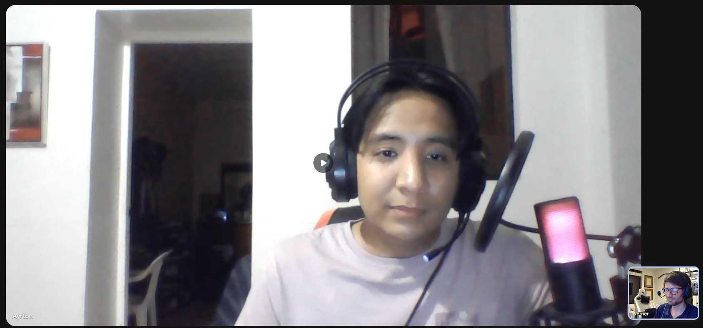 |
| Enlace de la grabación | [https://bit.ly/4yOxHbD](https://bit.ly/4yOxHbD)                                                           |         
| Inicio                 | 40:53                                                                                                      |
| Fin                    | 48:59                                                                                                      |

*Resumen:* Ayrton es un administrador de sede de 41 años que gestiona doce salas (cabinas, salas de reuniones y áreas abiertas) con unas ochenta personas por día. Reconoce el ruido como la queja más frecuente y el frío o calor como la segunda, pero no dispone de ningún dato objetivo: identifica la sala más ruidosa por impresión propia y ajusta el aire acondicionado por sensación. Ante la última queja por ruido ofreció cambiar de sala al cliente y no intervino la sala, al atribuirla a un evento puntual. Invirtió unos siete mil soles en paneles acústicos en la sala más reclamada, sin poder verificar el resultado ni saber si era la más ruidosa o solo la más usada. Una cabina se reserva muy poco y nunca investigó la causa. Desconoce el motivo de la mayoría de las bajas de clientes. Probó una aplicación de decibeles que se abandonó por no tener referencia interpretativa. Usaría el sistema desde el celular para atender alertas y desde la computadora para reportes, y decidiría por su cuenta un costo cercano a 100 soles mensuales. Su principal preocupación es la privacidad: pediría garantía escrita de que no se graba audio. Exige instalación sencilla, sin obra ni técnico.

**Entrevista #6**

| Campo | Contenido                                                                                                  |
| :---- |:-----------------------------------------------------------------------------------------------------------|
| Nombre y apellidos | Fiorella Grisel Cordova Pinchi                                                                             |
| Edad | 29                                                                                                         |
| Ocupación | Coordinadora administrativa; evalúa la apertura de un espacio de oficinas compartidas                      |
| Distrito | Pueblo Libre                                                                                               |
| Fecha | 16/09/2026                                                                                                 |
| Captura de la sesión |  |
| Enlace de la grabación | [https://bit.ly/4yOxHbD](https://bit.ly/4yOxHbD)                                                           |
| Inicio                 | 49:00                                                                                                       |
| Fin                    | 56:31                                                                                                      |

*Resumen:* Fiorella es una coordinadora administrativa de 29 años que evalúa junto a su hermano convertir una casa familiar en oficinas y dos salas de alquiler por horas, con una remodelación cotizada entre 40 y 45 mil soles. Visitó cinco locales haciéndose pasar por clienta y halló precios equivalentes pero experiencias dispares: descartó uno por la transferencia de ruido entre salas contiguas, que el personal atribuyó a una reunión puntual. Admite que no reclama cuando algo no le gusta y que un operador habituado al local deja de percibir el problema, de modo que no espera enterarse por sus clientes. Descartó una aplicación de medición sonora porque el valor numérico carecía de referencia interpretativa y reclama un indicador tipo semáforo. Prioriza el diagnóstico durante la obra sobre el monitoreo posterior, pues permite dirigir la partida de aislamiento de 6 mil soles. Asumiría hasta 60 soles mensuales y exige una garantía escrita de no grabación, verificable por el cliente.

### 2.2.3. Análisis de entrevistas.

**Contraste de Lean UX Assumptions con la evidencia recogida**

| # | Assumption | Evidencia recogida | Estado |
| :---- | :---- | :---- | :---- |
| 1 | El administrador reconoce el ruido y el confort térmico como factores que afectan la satisfacción de sus clientes | — | — |
| 2 | El administrador carece de datos objetivos sobre estas condiciones | — | — |
| 3 | El administrador actúa sobre una sala cuando recibe evidencia de un problema | — | — |
| 4 | El miembro valora conocer las condiciones de la sala antes de reservarla | — | — |
| 5 | Los miembros no formalizan la mayoría de los problemas de confort como queja | — | — |
| 6 | El administrador acepta el costo si es inferior al ingreso de unas pocas horas de reserva | — | — |
| 7 | La evidencia ambiental sirve como argumento comercial de diferenciación | — | — |
| 8 | El procesamiento del audio en el dispositivo elimina la objeción de privacidad | — | — |

## 2.3. Needfinding.

Dos necesidades no atendidas ordenan el análisis: el administrador no puede identificar objetivamente qué sala presenta problemas, y el miembro no dispone de información sobre las condiciones de la sala antes de reservarla.

### 2.3.1. User Personas.

Cada segmento se representa mediante un arquetipo que reúne sus características recurrentes: del análisis competitivo provienen las expectativas que los productos existentes ya instalaron en el mercado; de las entrevistas, los comportamientos y frustraciones que ninguna solución atiende hoy.

<em>Figura 2.</em> User Persona del Segmento 1 — Camila Rivas, miembro del coworking.

  

<em>Figura 3.</em> User Persona del Segmento 2 — Martín Salazar, administrador de sede de coworking.

  

Ambos arquetipos comparten el mismo entorno pero lo habitan desde posiciones opuestas: Camila padece una condición ambiental que no eligió y Martín administra un espacio cuya condición no puede medir. Esa asimetría define el alcance de la solución.

*Nota.* Elaboración propia.

### 2.3.2. User Task Matrix.

La User Task Matrix concentra las tareas que **miembros** y **administradores** ejecutan hoy para cumplir sus objetivos, con independencia de la plataforma.

| Tarea | Miembro/Usuario del coworking |  | Administrador/Gestor |  |
| :---- | :----: | :----: | :----: | :----: |
|  | **Frecuencia** | **Importancia** | **Frecuencia** | **Importancia** |
| Elegir una sala antes de reservar | Alta | Alta | — | — |
| Verificar las condiciones al ingresar a la sala | Alta | Media | — | — |
| Realizar trabajo de concentración o videollamadas | Alta | Alta | — | — |
| Cambiar de sala durante una sesión por disconfort | Baja | Alta | — | — |
| Reportar una molestia al personal del espacio | Baja | Media | — | — |
| Ajustar la climatización de una sala | Baja | Media | Alta | Media |
| Asignar una sala a un cliente según su actividad | — | — | Alta | Alta |
| Atender una queja sobre las condiciones de una sala | — | — | Media | Alta |
| Supervisar el estado ambiental de todas las salas | — | — | Alta | Alta |
| Identificar qué sala presenta problemas ambientales | — | — | Baja | Alta |
| Configurar los umbrales tolerables por tipo de sala | — | — | Baja | Alta |
| Decidir dónde invertir en acondicionamiento acústico | — | — | Baja | Alta |
| Revisar el histórico de condiciones de una sala | — | — | Baja | Media |

**Análisis de la matriz**

**Coincidencia principal.** Ambos segmentos ejecutan, desde lados opuestos de la relación comercial, una misma tarea de selección con alta frecuencia y alta importancia: el miembro **elige una sala antes de reservar** y el administrador **asigna una sala según la actividad del cliente**. Las dos dependen de un dato que hoy ninguno posee. Esta convergencia sugiere que un mismo indicador puede servir a ambos, y justifica exponerlo tanto en el panel de gestión como en el canal de reserva del miembro.

**Diferencia en el horizonte temporal.** El miembro opera en el **momento presente**: necesita saber si la sala sirve ahora para la llamada que tiene en diez minutos. El administrador opera en **dos horizontes simultáneos**: la supervisión continua de todas las salas —alta frecuencia— y las decisiones esporádicas de inversión en acondicionamiento —baja frecuencia, alta importancia—. Esa asimetría orienta el diseño hacia superficies distintas: una vista inmediata y ligera para el miembro, y para el administrador un panel de supervisión más un módulo de reportes históricos.

**Tareas de baja frecuencia y alta importancia.** Configurar umbrales por tipo de sala, identificar qué sala presenta problemas y decidir dónde invertir son decisiones esporádicas de alto impacto económico que hoy se toman sin evidencia. No requieren una interfaz de consulta continua, sino acceso al histórico acumulado.

**Hallazgo que condiciona el diseño.** La tarea **reportar una molestia al personal** registra baja frecuencia y solo media importancia para el miembro, lo que confirma cuantitativamente lo observado de forma cualitativa: el usuario tiende a no formalizar la queja, sino a no volver. Esperar a que el problema se reporte no es, por tanto, un mecanismo viable de detección, y refuerza la necesidad de una medición continua y automática.

**Tarea compartida con distinto peso.** Ajustar la climatización aparece en ambos segmentos, pero con frecuencias opuestas: alta para el administrador, que controla el sistema, y baja para el miembro, que rara vez tiene acceso a él. Esto indica que la acción correctiva debe dirigirse al administrador, mientras que al miembro le corresponde el canal de reporte.

*Nota.* Elaboración propia.

### 2.3.3. User Journey Mapping.

Los User Journey Maps se presentan en su versión **As-Is**: el recorrido de cada segmento en la situación actual, antes de la intervención de la plataforma. El end-to-end journey que se ilustra abarca desde la operación normal del local, cuando ninguna condición ha sido detectada, hasta el seguimiento posterior a una intervención correctiva, pasando por la aparición silenciosa del problema y su manifestación tardía como queja o como pérdida de reservas. Cada mapa se vincula con la ficha de User Persona correspondiente, elaborada en la misma herramienta.

<em>Figura 4.</em> Journey Map As-Is del Segmento 2 — Administrador de sede de coworking.

  

El recorrido evidencia el problema central que aborda la solución: entre la **aparición del problema** y su **manifestación** transcurre un intervalo durante el cual la condición ya afecta al miembro pero el administrador la desconoce por completo. Cuando finalmente se entera, lo hace a través de una queja tardía y sin detalle, o de una señal indirecta como la caída en las reservas de una sala.

La etapa de **diagnóstico e intervención** concentra las barreras de mayor impacto: sin medición, el administrador inspecciona a mano y ajusta la climatización por percepción, sin saber si su intervención mejora o empeora la condición. La etapa de **seguimiento** cierra el ciclo sin verificación, por lo que el problema tiende a repetirse.

<em>Figura 5.</em> Journey Map As-Is del Segmento 1 — Miembro del coworking.

  

En el recorrido del miembro el intervalo crítico se ubica entre la **llegada** y el **post-uso**. Descubre las condiciones de la sala cuando ya la reservó y no puede cambiarla, intenta trabajar en un entorno que no le sirve y, al no reportar la molestia, el operador nunca llega a conocer el motivo por el que esa sala deja de usarse.

Ambos recorridos convergen en el mismo punto ciego: el miembro sabe qué sala le falló pero no lo comunica, y el administrador percibe el efecto —una sala que se reserva menos— sin acceder a la causa. Esa asimetría de información es la que la solución busca cerrar.

*Nota.* Elaboración propia. Ambos recorridos corresponden a la versión **As-Is**: la situación actual, sin la solución implementada.

### 2.3.4. Empathy Mapping.

El equipo situó a cada User Persona en el centro del lienzo y fue completando, por turnos, lo que ese arquetipo dice, ve, hace y escucha en su jornada, junto con lo que necesita lograr y aquello que le duele o le beneficia. Las observaciones provienen del análisis competitivo y de la caracterización del problema, y se contrastarán con las entrevistas una vez completado el trabajo de campo.

<em>Figura 6.</em> Empathy Map del Segmento 1 — Camila Rivas, miembro del coworking.

  

<em>Figura 7.</em> Empathy Map del Segmento 2 — Martín Salazar, administrador de sede.

  

Ambos lienzos convergen en un mismo hallazgo: lo que el miembro siente y lo que el administrador observa describen el mismo problema desde dos lados que hoy no se comunican entre sí.

*Nota.* Elaboración propia.

## 2.4. Big Picture EventStorming.

El modelo recorre el flujo completo del dominio, desde la captura de una medición en el dispositivo instalado en la sala hasta la intervención del administrador sobre las condiciones detectadas.

El modelo se organiza en siete fases, que ordenan la línea temporal de izquierda a derecha:

| Fase | Alcance |
| :---- | :---- |
| 1. Captura en el dispositivo | El módulo IoT muestrea sonido, temperatura y humedad, y consolida las ventanas de medición |
| 2. Procesamiento en el borde | La capa Edge agrega por minuto y calcula los indicadores normalizados |
| 3. Alertas locales | Se evalúan los umbrales y se levantan las alertas sin depender de internet |
| 4. Sincronización con la nube | Los agregados se transmiten y, ante un fallo, quedan encolados |
| 5. Configuración y alta | Registro de locales, salas, dispositivos y umbrales |
| 6. Respuesta del administrador | Reconocimiento de la alerta, acción correctiva y cierre |
| 7. Analítica y participación del miembro | Tendencias, contexto meteorológico y reporte de disconfort |

*Nota.* Elaboración propia.

La notación del board emplea el siguiente código de color: **naranja** para los Domain Events, **azul** para los Commands, **amarillo** para los Actors, **rosa** para los External Systems, **morado** para las Policies, **verde** para los Read Models y **rojo** para los Hot Spots.

**Domain Events identificados**

| # | Domain Event | Descripción |
| :---- | :---- | :---- |
| 1 | `SensorMeasurementCaptured` | El dispositivo captura una muestra de nivel sonoro, temperatura y humedad |
| 2 | `AcousticWindowProcessed` | El dispositivo consolida las ventanas de muestreo en un nivel equivalente por segundo |
| 3 | `MeasurementBatchSent` | El dispositivo transmite un lote de mediciones agregadas a la capa Edge |
| 4 | `MeasurementBatchReceived` | La capa Edge recibe y valida el lote procedente del dispositivo |
| 5 | `MinuteAggregated` | La capa Edge consolida las mediciones del minuto para una sala |
| 6 | `AcousticIndicatorsCalculated` | Se calculan el nivel equivalente y los percentiles L10, L50 y L90 conforme a ISO 1996 |
| 7 | `ThermalComfortCalculated` | Se calculan los índices PMV y PPD conforme a ISO 7730 |
| 8 | `ThresholdExceeded` | Un indicador supera el umbral configurado para la sala |
| 9 | `AlertRaised` | Se genera una alerta asociada a la sala y al indicador afectado |
| 10 | `AggregateUploadedToCloud` | El agregado del minuto se transmite a la capa Cloud |
| 11 | `UploadQueuedForRetry` | La transmisión falla y el agregado queda encolado para reintento |
| 12 | `SiteRegistered` | Se registra un nuevo local en el sistema |
| 13 | `RoomRegistered` | Se registra una nueva sala dentro de un local |
| 14 | `RoomClassified` | Se asigna un tipo a la sala, lo que determina sus umbrales aplicables |
| 15 | `DeviceRegistered` | Se asocia un dispositivo a una sala |
| 16 | `DeviceWentOffline` | El broker notifica la desconexión del dispositivo mediante su testamento |
| 17 | `ThresholdConfigured` | El administrador define los umbrales de una sala |
| 18 | `ThresholdsSyncedToEdge` | La capa Edge descarga la configuración de umbrales vigente |
| 19 | `AlertAcknowledged` | El administrador toma conocimiento de una alerta |
| 20 | `CorrectiveActionTaken` | El administrador registra la intervención realizada sobre la sala |
| 21 | `AlertClosed` | La condición se normaliza y la alerta se cierra |
| 22 | `TrendAnalyzed` | Se calculan tendencias y correlaciones sobre el histórico de la sala |
| 23 | `WeatherObservationRetrieved` | Se obtiene la observación meteorológica externa para contextualizar las mediciones |
| 24 | `DiscomfortReported` | Un miembro reporta una molestia acústica o térmica desde la aplicación |
| 25 | `RoomComfortStateChanged` | La sala cambia de estado en el semáforo de confort (verde, amarillo o rojo) |

**Policies identificadas** — las reglas que gobiernan el dominio

| Policy | Regla |
| :---- | :---- |
| Cierre por marca de agua | *Cuando* llegan datos de un minuto posterior para esa sala, *entonces* se cierra el minuto anterior y se agrega. Nunca por reloj de pared. |
| Umbral por defecto | *Cuando* una sala no ha sido clasificada, *entonces* se le aplican los umbrales por defecto de una sala de concentración: por debajo de 45 dB y entre 20 °C y 23 °C. Una sala recién registrada nunca queda sin vigilancia. |
| Superación sostenida | *Cuando* un indicador permanece fuera del umbral durante 5 minutos continuos, *entonces* se levanta la alerta. Un pico momentáneo no alerta. |
| Reintento de subida | *Cuando* falla la transmisión al cloud, *entonces* el agregado queda encolado y se reintenta. Nunca se descarta. |
| Entrega at-least-once | *Cuando* la capa Edge no confirma la subida, *entonces* reintenta. La deduplicación es responsabilidad de quien recibe, por la pareja sala e instante. |
| Cierre de alerta | *Cuando* el indicador retorna al rango durante el tiempo sostenido, *entonces* la alerta se cierra automáticamente. |
| Descarte del audio | *Cuando* se calcula el nivel sonoro, *entonces* la muestra de audio se descarta en el propio dispositivo. Nunca se transmite. |

*Nota.* Elaboración propia.

**Read Models identificados** — la información que cada actor consulta

| Read Model | Consultado por |
| :---- | :---- |
| Semáforo de confort de la sala | Miembro, antes de reservar |
| Mapa de calor del local | Administrador, en supervisión continua |
| Serie por minuto de una sala | Administrador, durante el diagnóstico |
| Alertas abiertas | Administrador, en la operación diaria |
| Reporte histórico por sala | Administrador, para decidir inversiones |
| Estado de los dispositivos | Administrador y soporte técnico |

*Nota.* Elaboración propia.

**Hot Spots — puntos que requieren decisión de diseño**

| Hot Spot | Pregunta abierta |
| :---- | :---- |
| Cierre del minuto | ¿Cuándo se considera cerrado un minuto si el reloj del dispositivo no se ha sincronizado por NTP? |
| Duplicación de agregados | Si la capa Edge reintenta la subida ante un fallo, ¿quién asume la responsabilidad de deduplicar? |
| Umbrales por defecto | ¿Qué umbral se aplica a una sala recién registrada que aún no ha sido clasificada? |
| Ausencia de datos | ¿Cómo se distingue una sala genuinamente silenciosa de un dispositivo que dejó de reportar? |
| Privacidad | ¿Qué garantiza que el contenido de las conversaciones no pueda reconstruirse a partir de los datos transmitidos? |
| Alcance de la alerta | ¿Debe notificarse al miembro que ocupa la sala o únicamente al administrador del local? |
| Reporte subjetivo vs. medición | Si un miembro reporta disconfort pero la medición está dentro del umbral, ¿se descarta el reporte, se registra como discrepancia o se ajusta el umbral de esa sala? |

*Nota.* Elaboración propia. Cada hot spot marca una decisión que el modelo aún no resuelve y que condiciona el diseño de la solución.

<em>Figura 8.</em> Big Picture EventStorming del dominio, organizado en las siete fases de la línea temporal.

  

El modelo reúne 25 domain events distribuidos en las siete fases, junto con las policies que los gobiernan, los read models que cada actor consulta y los hot spots aún sin resolver.

## 2.5. Ubiquitous Language.

Los siguientes términos se emplean de forma consistente en el informe, en las conversaciones con el cliente y en la implementación. La documentación técnica y las interfaces del producto los utilizan en inglés, de modo que el vocabulario del código coincida con el del dominio.

| Término (inglés) | Término (español) | Definición |
| :---- | :---- | :---- |
| **Site** | Local | Establecimiento físico del operador que agrupa un conjunto de salas. Un operador puede administrar varios locales. |
| **Room** | Sala | Espacio delimitado dentro de un local, comercializado de forma independiente y sujeto a medición. |
| **Room Type** | Tipo de sala | Clasificación de una sala según su uso previsto —cabina de llamadas, sala de reuniones, área abierta— que determina los umbrales de confort aplicables. |
| **Device** | Dispositivo | Módulo IoT instalado en una sala que captura las mediciones. Se registra de forma independiente de la sala para preservar el histórico ante su reemplazo. |
| **Reading** | Lectura | Conjunto de valores capturados por un dispositivo en un instante determinado. |
| **Minute Aggregate** | Agregado por minuto | Registro consolidado que resume las mediciones de una sala durante un minuto. Es la unidad de información que se transmite a la nube. |
| **LAeq** | Nivel sonoro continuo equivalente | Nivel de presión sonora promediado energéticamente durante un intervalo, expresado en dB(A) conforme a la norma ISO 1996. No equivale al promedio aritmético de los niveles. |
| **L10 / L50 / L90** | Percentiles de nivel sonoro | Nivel superado durante el 10 %, 50 % y 90 % del tiempo de medición. L90 representa el ruido de fondo y L10 los picos intrusivos. |
| **PMV** | Voto medio estimado | Índice de sensación térmica de la norma ISO 7730, en una escala de −3 (frío) a +3 (calor). |
| **PPD** | Porcentaje de personas insatisfechas | Proporción estimada de ocupantes que manifestaría insatisfacción con las condiciones térmicas. Nunca desciende por debajo del 5 %. |
| **Threshold** | Umbral | Valor límite configurado para un indicador en una sala, cuya superación sostenida origina una alerta. |
| **Alert** | Alerta | Notificación generada al superarse un umbral, con severidad, sala e indicador asociados. |
| **Edge** | Borde | Capa de procesamiento local, alojada en el propio establecimiento, que agrega mediciones y evalúa alertas sin depender de la conexión a internet. |
| **Trend** | Tendencia | Evolución de un indicador a lo largo del tiempo para una sala determinada. |
| **Correlation** | Correlación | Medida estadística de la relación entre dos indicadores, considerada confiable a partir de un tamaño mínimo de muestra. |
| **Occupancy** | Ocupación | Proporción del tiempo durante el cual se detecta presencia en una sala. |
| **Comfort Index** | Índice de confort | Indicador consolidado que resume la condición acústica y térmica de una sala, presentado al miembro como semáforo de tres estados: verde (adecuada), amarillo (aceptable) y rojo (no recomendada). |
| **Comfort Range** | Rango de confort | Intervalo objetivo de una sala de concentración: nivel sonoro por debajo de **45 dB** y temperatura entre **20 °C y 23 °C**. Es el rango declarado como referencia para el trabajo de concentración y las videollamadas. |
| **Sustained Breach** | Superación sostenida | Condición que origina una alerta: el indicador permanece fuera del umbral durante un tiempo mínimo continuo —**5 minutos** por defecto— para evitar alertas por picos momentáneos. |
| **Discomfort Report** | Reporte de disconfort | Aviso que el miembro emite desde la aplicación cuando percibe una molestia acústica o térmica, y que se contrasta con la medición registrada en ese instante. |
| **Heatmap** | Mapa de calor | Representación del plano del local que colorea cada sala según su condición ambiental actual, destinada al panel del administrador. |

# Capítulo III: Requirements Specification

## 3.1. User Stories.

En esta sección se presentan las Epics y User Stories que reflejan las necesidades y expectativas de los miembros y administradores de los espacios de trabajo compartidos.

#### Epics

| Epic / Story ID | Título | Descripción | Criterios de aceptación |
|:----|:----|:----|:----|
| EP1 | Landing Page | Como visitante Quiero conocer la propuesta de valor, funcionalidades y modelo de contratación de ZenRoom Para evaluar si la solución resuelve la problemática de confort de mi espacio de trabajo | **Escenario 1: Presentar la propuesta de valor** Dado que soy un visitante en el sitio web Cuando accedo a la página principal Entonces veo el nombre del producto, un mensaje de propuesta de valor y una llamada a la acción, sin requerir registro  **Escenario 2: Conocer el problema que resuelve** Dado que estoy interesado en la solución Cuando reviso el contenido de la página principal Entonces comprendo la problemática del confort acústico y térmico en espacios de trabajo compartidos |
| EP2 | Gestión de Identidad y Acceso | Como administrador o miembro del coworking Quiero crear una cuenta e iniciar sesión en la plataforma Para acceder únicamente a las funciones correspondientes a mi rol | **Escenario 1: Registro de cuenta** Dado que soy un nuevo usuario Cuando completo el registro con datos válidos Entonces el sistema crea mi cuenta y habilita el acceso  **Escenario 2: Inicio de sesión con rol** Dado que ya tengo una cuenta registrada Cuando ingreso mis credenciales correctamente Entonces el sistema emite un token de acceso con mi rol y habilita únicamente las funciones que me corresponden |
| EP3 | Configuración del Espacio | Como administrador de coworking Quiero registrar locales, salas, tipos de sala, dispositivos y umbrales de confort Para que la plataforma refleje la estructura física de mi espacio y vigile cada sala desde su alta | **Escenario 1: Registro de locales y salas** Dado que soy un administrador autenticado Cuando registro un local y sus salas con datos válidos Entonces las salas quedan disponibles para el monitoreo y la configuración  **Escenario 2: Umbrales por defecto de una sala sin clasificar** Dado que registro una sala sin clasificar Cuando el sistema la incorpora Entonces la sala recibe los umbrales por defecto de una sala de concentración (nivel sonoro por debajo de 45 dB y temperatura entre 20 °C y 23 °C) y queda vigilada desde su alta |
| EP4 | Captura y Procesamiento en el Borde | Como developer Quiero que el módulo IoT y la capa Edge capturen, agreguen y evalúen las mediciones localmente Para mantener la vigilancia y las alertas del local sin depender de la conexión a internet | **Escenario 1: Agregación por minuto con indicadores normalizados** Dado que la capa Edge recibió las mediciones de un minuto para una sala Cuando el minuto cierra por la llegada de datos de un minuto posterior Entonces la Edge publica el agregado con los indicadores acústicos (LAeq, L10, L50, L90 conforme a ISO 1996) y térmicos (PMV, PPD conforme a ISO 7730)  **Escenario 2: Operación sin conexión** Dado que el enlace con la nube está caído Cuando la capa Edge procesa los agregados Entonces la evaluación de umbrales continúa operando en el local y los agregados quedan encolados para su retransmisión |
| EP5 | Servicios Cloud (API RESTful) | Como developer Quiero disponer de endpoints RESTful para la ingesta de agregados, la configuración del espacio, las mediciones, las alertas, los insights y los reportes de disconfort Para soportar la aplicación móvil y el panel de gestión web | **Escenario 1: Ingesta de agregados con deduplicación** Dado que la capa Edge envía un lote de agregados con credenciales válidas Cuando la API procesa la petición Entonces la API registra los agregados y deduplica los reenvíos por la pareja sala e instante  **Escenario 2: Manejo de errores estándar** Dado que un cliente consulta un recurso inexistente o envía datos inválidos Cuando la API procesa la petición Entonces la API responde con el código de estado correspondiente e identifica los campos rechazados |
| EP6 | Monitoreo de Confort en Tiempo Real | Como miembro o administrador del coworking Quiero consultar el estado ambiental actual de las salas Para elegir la sala adecuada antes de reservarla o supervisar la instalación de un vistazo | **Escenario 1: Semáforo de confort actualizado** Dado que existen salas instrumentadas con mediciones recientes Cuando el miembro consulta el mapa de salas Entonces cada sala presenta su estado de confort: verde (adecuada), amarillo (aceptable) o rojo (no recomendada)  **Escenario 2: Mapa de calor del local** Dado que el administrador consulta el mapa de calor de su local Cuando el sistema lo presenta Entonces cada sala aparece coloreada según su condición ambiental actual |
| EP7 | Gestión de Alertas | Como administrador de coworking Quiero recibir, reconocer y dar seguimiento a las alertas ambientales Para intervenir sobre las salas antes de que los problemas se manifiesten como quejas | **Escenario 1: Generación por superación sostenida** Dado que un indicador permanece fuera del umbral durante 5 minutos continuos Cuando el sistema evalúa la condición Entonces el sistema genera una alerta con la sala, el indicador y la severidad correspondientes  **Escenario 2: Ciclo de vida de la alerta** Dado que existe una alerta abierta Cuando el administrador la reconoce y registra su acción correctiva Entonces el sistema registra el responsable y el instante, y cierra la alerta automáticamente cuando la condición se normaliza |
| EP8 | Analítica e Insights | Como administrador de coworking Quiero analizar las tendencias históricas y la correlación con el clima exterior Para sustentar decisiones de inversión en acondicionamiento con evidencia | **Escenario 1: Tendencias por sala** Dado que una sala acumula suficiente histórico Cuando el administrador consulta sus tendencias para un período Entonces el sistema presenta la evolución de los indicadores acústicos y térmicos del período  **Escenario 2: Correlación con el clima exterior** Dado que existe histórico suficiente y la observación meteorológica externa está disponible Cuando el administrador solicita la correlación Entonces el sistema presenta la relación entre las condiciones interiores y el clima exterior |
| EP9 | Reportes de Disconfort | Como miembro del coworking Quiero reportar molestias acústicas o térmicas desde la aplicación Para que el administrador conozca el problema aunque la medición no lo refleje | **Escenario 1: Registro contrastado con la medición** Dado que el miembro envía un reporte con sala, tipo de molestia e instante válidos Cuando el sistema lo procesa Entonces el sistema registra el reporte y lo contrasta con la medición registrada en ese instante  **Escenario 2: Discrepancia entre percepción y medición** Dado que la medición del instante reportado se encuentra dentro del umbral Cuando el sistema registra el reporte Entonces el sistema lo marca como discrepancia entre percepción y medición |

#### User Stories

| Story ID | Título | Descripción | Criterios de Aceptación | Relacionado con Epic ID |
|:----|:----|:----|:----|:----|
| US01 | Comprender la propuesta de valor | Como visitante del segmento administrador, quiero comprender la propuesta de valor de ZenRoom al ingresar al sitio, para determinar si resuelve la problemática de confort de mi espacio de trabajo. | **Escenario 1: Presentación inicial del producto** Dado que el visitante accede al sitio web Cuando la página principal carga Entonces el sistema presenta el nombre del producto, un mensaje de propuesta de valor y una llamada a la acción dentro de los primeros elementos visibles  **Escenario 2: Problemática sin registro** Dado que el visitante permanece en la página principal Cuando revisa el contenido sin registrarse Entonces el sistema presenta la problemática del confort acústico y térmico en espacios de trabajo compartidos | 1 |
| US02 | Explorar funcionalidades del producto | Como visitante del segmento administrador, quiero explorar las funcionalidades de la solución, para evaluar qué aporta a la operación de mi local. | **Escenario 1: Descripción de las funcionalidades** Dado que el visitante navega a la sección de funcionalidades Cuando el contenido se presenta Entonces el sistema describe el monitoreo acústico y térmico por sala, las alertas y la analítica histórica  **Escenario 2: Detalle de una funcionalidad** Dado que el visitante selecciona una funcionalidad Cuando el sistema despliega su detalle Entonces el sistema presenta la descripción completa de la funcionalidad seleccionada | 1 |
| US03 | Conocer la aplicación móvil | Como visitante del segmento miembro, quiero conocer las capacidades de la aplicación móvil, para entender cómo me ayuda a encontrar una sala adecuada antes de reservar. | **Escenario 1: Capacidades de la aplicación** Dado que el visitante accede a la sección de la aplicación móvil Cuando el contenido se presenta Entonces el sistema describe el mapa de salas con el semáforo de confort y el histórico de tranquilidad por hora  **Escenario 2: Garantía de privacidad en la aplicación** Dado que el visitante revisa la sección de la aplicación móvil Cuando consulta el contenido Entonces el sistema indica que la aplicación no graba audio y solo muestra el nivel de ruido medido | 1 |
| US04 | Verificar el compromiso de privacidad | Como visitante, quiero conocer el tratamiento que la solución da a las conversaciones, para evaluar la privacidad antes de adoptar el producto. | **Escenario 1: Declaración de privacidad** Dado que el visitante accede a la sección de privacidad Cuando el contenido se presenta Entonces el sistema indica que el audio se procesa dentro del propio dispositivo y nunca se graba, almacena ni transmite  **Escenario 2: Accesibilidad permanente de la declaración** Dado que el visitante consulta cualquier sección del sitio Cuando revisa el contenido Entonces el sistema mantiene la declaración de privacidad accesible desde el pie de página | 1 |
| US05 | Consultar los planes disponibles | Como visitante del segmento administrador, quiero consultar los planes y el modelo de contratación, para estimar la inversión por sala antes de contactar al equipo comercial. | **Escenario 1: Presentación de los planes** Dado que el visitante accede a la sección de planes Cuando el contenido se presenta Entonces el sistema muestra los planes disponibles con sus características y condiciones de contratación  **Escenario 2: Comparación entre planes** Dado que el visitante compara los planes presentados Cuando revisa cada uno Entonces el sistema identifica qué funcionalidades incluye cada plan | 1 |
| US06 | Solicitar una demostración | Como visitante del segmento administrador, quiero solicitar una demostración del producto, para recibir un diagnóstico de las condiciones reales de mi local. | **Escenario 1: Solicitud registrada** Dado que el visitante completa el formulario de contacto con datos válidos Cuando envía la solicitud Entonces el sistema registra la solicitud y confirma su recepción  **Escenario 2: Solicitud con datos inválidos** Dado que el visitante envía el formulario con un correo con formato inválido o campos obligatorios vacíos Cuando confirma el envío Entonces el sistema informa el error, no registra la solicitud y conserva los datos ingresados | 1 |
| US07 | Resolver dudas frecuentes | Como visitante, quiero consultar las preguntas frecuentes del producto, para resolver dudas de instalación, costo y privacidad sin contactar al equipo comercial. | **Escenario 1: Agrupación por temática** Dado que el visitante accede a la sección de preguntas frecuentes Cuando el contenido se presenta Entonces el sistema agrupa las preguntas por temática (instalación, costo, privacidad y medición)  **Escenario 2: Respuesta desplegada** Dado que el visitante selecciona una pregunta Cuando el sistema despliega la respuesta Entonces el sistema muestra el texto completo de la respuesta correspondiente | 1 |
| US08 | Registrarse como administrador | Como administrador de coworking, quiero registrarme en la plataforma con los datos de mi organización, para acceder al panel de gestión de mi espacio. | **Escenario 1: Registro exitoso** Dado que el administrador envía un registro con datos válidos Cuando el sistema procesa la solicitud Entonces el sistema crea la cuenta, confirma el registro y habilita el acceso al panel de gestión  **Escenario 2: Registro rechazado** Dado que el administrador envía un registro con un correo ya registrado o con campos obligatorios incompletos Cuando el sistema procesa el registro Entonces el sistema rechaza el registro e informa la causa sin crear la cuenta | 2 |
| US09 | Iniciar sesión en la plataforma | Como administrador o miembro del coworking, quiero iniciar sesión con mis credenciales, para acceder únicamente a las funciones correspondientes a mi rol. | **Escenario 1: Inicio de sesión exitoso** Dado que el usuario envía credenciales válidas Cuando el sistema las verifica Entonces el sistema emite un token de acceso con el rol del usuario y habilita las funciones de su rol  **Escenario 2: Credenciales inválidas** Dado que el usuario envía credenciales inválidas Cuando el sistema las verifica Entonces el sistema rechaza el acceso sin revelar cuál credencial es incorrecta  **Escenario 3: Token expirado** Dado que el usuario presenta un token expirado Cuando solicita un recurso protegido Entonces el sistema rechaza la solicitud y exige una nueva autenticación | 2 |
| US10 | Gestionar cuentas de miembros | Como administrador de coworking, quiero invitar a los miembros de mi espacio y desactivar sus cuentas, para controlar quién consulta la información de mi local. | **Escenario 1: Invitación de un miembro** Dado que el administrador invita a un miembro con un correo válido Cuando el sistema procesa la invitación Entonces el miembro puede completar su registro y queda asociado al local del administrador  **Escenario 2: Desactivación de una cuenta** Dado que el administrador desactiva la cuenta de un miembro Cuando el miembro intenta acceder con su token Entonces el sistema rechaza sus solicitudes posteriores a la desactivación | 2 |
| US11 | Registrar locales y salas | Como administrador de coworking, quiero registrar mis locales y sus salas, para reflejar la estructura física de mi espacio en la plataforma. | **Escenario 1: Registro exitoso** Dado que el administrador registra un local y sus salas con datos válidos Cuando el sistema procesa el registro Entonces las salas quedan disponibles para las funciones de monitoreo y configuración  **Escenario 2: Umbrales por defecto** Dado que el administrador registra una sala sin clasificar Cuando el sistema la incorpora Entonces la sala recibe los umbrales por defecto de una sala de concentración y queda vigilada desde su alta  **Escenario 3: Nombre duplicado** Dado que el administrador registra una sala con un nombre ya existente en el mismo local Cuando el sistema procesa el registro Entonces el sistema rechaza la operación e informa la duplicidad | 3 |
| US12 | Clasificar salas por tipo | Como administrador de coworking, quiero clasificar cada sala según su uso previsto (cabina de llamadas, sala de reuniones o área abierta), para que se apliquen los umbrales de confort correspondientes a su actividad. | **Escenario 1: Asignación de tipo** Dado que el administrador asigna un tipo a una sala Cuando el sistema procesa la clasificación Entonces los umbrales del tipo quedan aplicados a las evaluaciones posteriores de esa sala  **Escenario 2: Cambio de tipo** Dado que el administrador cambia el tipo de una sala Cuando el sistema procesa el cambio Entonces los umbrales vigentes se actualizan para las evaluaciones siguientes sin alterar el histórico registrado | 3 |
| US13 | Registrar dispositivos y asociarlos a salas | Como administrador de coworking, quiero registrar cada dispositivo IoT y asociarlo a una sala, para habilitar la medición continua del ambiente. | **Escenario 1: Asociación exitosa** Dado que el administrador registra un dispositivo y lo asocia a una sala Cuando el sistema procesa el registro Entonces el dispositivo queda identificado y su sala habilitada para recibir mediciones  **Escenario 2: Reemplazo de dispositivo** Dado que el administrador reemplaza un dispositivo de una sala Cuando asocia el nuevo dispositivo Entonces el sistema preserva el histórico de mediciones de la sala  **Escenario 3: Dispositivo ya vinculado** Dado que el administrador intenta asociar un dispositivo ya vinculado a otra sala Cuando el sistema procesa la solicitud Entonces el sistema informa la situación actual antes de permitir el reasignado | 3 |
| US14 | Configurar umbrales de confort | Como administrador de coworking, quiero configurar los umbrales de nivel sonoro y temperatura de cada sala, para adaptar las alertas al uso real del espacio. | **Escenario 1: Configuración vigente** Dado que el administrador configura umbrales válidos para una sala Cuando el sistema los registra Entonces los umbrales rigen las evaluaciones posteriores y quedan disponibles para su descarga por la capa Edge  **Escenario 2: Configuración inválida** Dado que el administrador envía una configuración en la que el límite mínimo supera al máximo Cuando el sistema la valida Entonces el sistema rechaza la configuración e informa el error | 3 |
| US15 | Consultar el semáforo de confort de las salas | Como miembro del coworking, quiero ver el estado actual de cada sala en el semáforo de confort, para elegir una sala adecuada antes de reservarla. | **Escenario 1: Estado de confort por sala** Dado que existen salas instrumentadas con mediciones recientes Cuando el miembro consulta el mapa de salas Entonces el sistema presenta cada sala con su estado de confort: verde (adecuada), amarillo (aceptable) o rojo (no recomendada)  **Escenario 2: Actualización del estado** Dado que una sala cambia de estado de confort Cuando el miembro consulta nuevamente el mapa Entonces el sistema presenta el estado actualizado de esa sala  **Escenario 3: Sala sin datos recientes** Dado que una sala dejó de recibir datos recientes Cuando el miembro consulta el mapa Entonces el sistema distingue esa sala de una sala genuinamente en condición verde | 6 |
| US16 | Filtrar salas por condiciones ambientales | Como miembro del coworking, quiero filtrar las salas por nivel de ruido y temperatura, para encontrar rápidamente una sala que cumpla mis condiciones de trabajo. | **Escenario 1: Filtros aplicados** Dado que el miembro aplica filtros de ruido o temperatura Cuando el sistema procesa la consulta Entonces el sistema presenta únicamente las salas cuyas condiciones actuales cumplen los filtros  **Escenario 2: Sin coincidencias** Dado que ninguna sala cumple los filtros aplicados Cuando el sistema procesa la consulta Entonces el sistema informa que no existen coincidencias | 6 |
| US17 | Consultar el histórico de tranquilidad por hora | Como miembro del coworking, quiero consultar el comportamiento histórico de una sala por franjas horarias, para decidir el mejor momento de reservarla. | **Escenario 1: Comportamiento por hora** Dado que una sala acumula histórico Cuando el miembro consulta su comportamiento por hora Entonces el sistema presenta la evolución típica del nivel sonoro por franja horaria  **Escenario 2: Sin histórico suficiente** Dado que una sala carece de histórico suficiente Cuando el miembro la consulta Entonces el sistema informa que no existe información suficiente para esa sala | 6 |
| US18 | Visualizar el mapa de calor del local | Como administrador de coworking, quiero ver el estado ambiental actual de todas mis salas en el mapa de calor, para supervisar toda la instalación de un vistazo. | **Escenario 1: Condición por sala** Dado que el administrador consulta el mapa de calor de su local Cuando el sistema lo presenta Entonces cada sala aparece representada según su condición ambiental actual  **Escenario 2: Sala con dispositivo fuera de línea** Dado que un dispositivo de una sala está fuera de línea Cuando el administrador consulta el mapa Entonces el sistema distingue esa sala de las salas con medición activa | 6 |
| US19 | Consultar la serie por minuto de una sala | Como administrador de coworking, quiero consultar la serie por minuto de los indicadores de una sala, para diagnosticar un problema puntual con detalle. | **Escenario 1: Serie del rango consultado** Dado que el administrador consulta una sala con un rango temporal válido Cuando el sistema procesa la consulta Entonces el sistema presenta la serie por minuto con los indicadores acústicos y térmicos del rango  **Escenario 2: Rango inválido** Dado que el administrador consulta un rango temporal inválido Cuando el sistema procesa la consulta Entonces el sistema informa el error y no presenta resultados | 6 |
| US20 | Recibir alertas por superación sostenida | Como administrador de coworking, quiero recibir una alerta cuando un indicador supere el umbral de forma sostenida, para intervenir antes de que los clientes se quejen. | **Escenario 1: Alerta generada** Dado que un indicador de una sala permanece fuera del umbral durante 5 minutos continuos Cuando el sistema evalúa la condición Entonces el sistema genera una alerta con la sala, el indicador y la severidad correspondientes  **Escenario 2: Pico momentáneo** Dado que un indicador supera el umbral solo momentáneamente Cuando el sistema evalúa la condición Entonces el sistema no genera alerta | 7 |
| US21 | Reconocer alertas y registrar la acción correctiva | Como administrador de coworking, quiero tomar conocimiento de una alerta y registrar la intervención realizada, para dar seguimiento a la atención del problema. | **Escenario 1: Reconocimiento registrado** Dado que existe una alerta abierta Cuando el administrador la reconoce Entonces el sistema registra el reconocimiento con el responsable y el instante  **Escenario 2: Acción correctiva asociada** Dado que el administrador registra una acción correctiva sobre una alerta Cuando el sistema procesa la acción Entonces la intervención queda asociada a la alerta y consultable en su detalle | 7 |
| US22 | Cierre automático de alertas normalizadas | Como administrador de coworking, quiero que las alertas se cierren automáticamente cuando la condición se normalice, para operar únicamente con alertas vigentes. | **Escenario 1: Cierre automático** Dado que el indicador de una alerta abierta retorna al rango de forma sostenida Cuando el sistema evalúa la condición Entonces el sistema cierra la alerta automáticamente  **Escenario 2: Alerta fuera de la lista de abiertas** Dado que una alerta se encuentra cerrada Cuando el administrador consulta las alertas abiertas Entonces la alerta cerrada no figura en la lista | 7 |
| US23 | Detección de dispositivos fuera de línea | Como administrador de coworking, quiero enterarme cuando un dispositivo deje de reportar, para distinguir una sala silenciosa de un fallo de medición. | **Escenario 1: Desconexión notificada** Dado que el broker notifica la desconexión de un dispositivo Cuando el sistema procesa la notificación Entonces el sistema marca el dispositivo como fuera de línea e informa al administrador  **Escenario 2: Sala sin datos vigentes** Dado que una sala dejó de recibir datos de su dispositivo Cuando el administrador consulta su estado Entonces el sistema la presenta sin datos vigentes y no como una sala en silencio | 7 |
| US24 | Consultar tendencias históricas por sala | Como administrador de coworking, quiero consultar la evolución de los indicadores de cada sala a lo largo del tiempo, para sustentar decisiones de inversión en acondicionamiento. | **Escenario 1: Tendencias del período** Dado que una sala acumula suficiente histórico Cuando el administrador consulta sus tendencias para un período Entonces el sistema presenta la evolución de los indicadores acústicos y térmicos del período  **Escenario 2: Datos insuficientes** Dado que el período consultado no alcanza el mínimo de datos Cuando el sistema procesa la consulta Entonces el sistema informa que no existe información suficiente | 8 |
| US25 | Correlacionar condiciones interiores con el clima exterior | Como administrador de coworking, quiero correlacionar las condiciones de mis salas con el clima exterior, para identificar fallas reales de aislamiento en mis instalaciones. | **Escenario 1: Correlación presentada** Dado que existe histórico suficiente y la observación meteorológica externa está disponible Cuando el administrador solicita la correlación Entonces el sistema presenta la relación entre las condiciones interiores y el clima exterior  **Escenario 2: Servicio meteorológico no disponible** Dado que el servicio meteorológico externo no responde Cuando el sistema procesa la consulta Entonces el sistema informa la falta de contexto meteorológico y mantiene operativas las demás funciones | 8 |
| US26 | Generar reportes históricos por sala | Como administrador de coworking, quiero generar un reporte histórico por sala, para evidenciar las condiciones del espacio ante clientes o dirección. | **Escenario 1: Reporte generado** Dado que el administrador solicita un reporte de una sala para un período con datos Cuando el sistema lo genera Entonces el reporte incluye los indicadores del período y la comparación contra los umbrales configurados  **Escenario 2: Exportación del reporte** Dado que el reporte fue generado Cuando el administrador lo requiere Entonces el sistema permite exportarlo para su distribución | 8 |
| US27 | Reportar una molestia ambiental | Como miembro del coworking, quiero reportar una molestia acústica o térmica desde la aplicación, para que el administrador conozca el problema aunque la medición no lo refleje. | **Escenario 1: Reporte registrado** Dado que el miembro envía un reporte con la sala, el tipo de molestia y el instante Cuando el sistema lo procesa Entonces el sistema registra el reporte y lo contrasta con la medición registrada en ese instante  **Escenario 2: Reporte marcado como discrepancia** Dado que la medición del instante reportado se encuentra dentro del umbral Cuando el sistema registra el reporte Entonces el sistema lo marca como discrepancia entre percepción y medición  **Escenario 3: Reporte incompleto** Dado que el reporte carece de campos obligatorios Cuando el sistema lo valida Entonces el sistema rechaza el envío e informa el error | 9 |
| US28 | Consultar los reportes de disconfort del local | Como administrador de coworking, quiero consultar los reportes de disconfort de mi local, para priorizar las intervenciones según la experiencia real de los miembros. | **Escenario 1: Reportes presentados** Dado que existen reportes de disconfort en el local Cuando el administrador los consulta Entonces el sistema presenta cada reporte con su sala, tipo de molestia, instante y la medición contrastada  **Escenario 2: Filtrado de reportes** Dado que el administrador filtra los reportes por sala o por estado de discrepancia Cuando el sistema procesa el filtro Entonces el sistema presenta únicamente los reportes que cumplen el criterio | 9 |
| US29 | Consultar la ocupación de una sala | Como miembro del coworking, quiero conocer la cantidad de personas presentes en una sala, para elegir un espacio adecuado para mi actividad. | **Escenario 1: Ocupación disponible** Dado que una sala dispone de una medición vigente de ocupación Cuando el miembro consulta el estado de la sala Entonces el sistema informa la cantidad de personas detectadas  **Escenario 2: Actualización de ocupación** Dado que cambia la cantidad de personas presentes en una sala Cuando el sistema recibe una nueva medición válida Entonces el sistema actualiza la cantidad de personas registrada  **Escenario 3: Ocupación no disponible** Dado que una sala no dispone de una medición vigente de ocupación Cuando el miembro consulta el estado de la sala Entonces el sistema informa que la ocupación no está disponible | 6 |
| US30 | Consultar las condiciones ambientales actuales | Como miembro del coworking, quiero consultar las condiciones ambientales actuales de una sala, para determinar si el espacio es adecuado para mi actividad. | **Escenario 1: Mediciones disponibles** Dado que una sala dispone de mediciones recientes Cuando el miembro consulta sus condiciones ambientales Entonces el sistema informa el nivel sonoro, la temperatura y la humedad registrados  **Escenario 2: Datos no vigentes** Dado que una medición supera el período establecido de vigencia Cuando el miembro consulta las condiciones de la sala Entonces el sistema identifica la medición como no vigente  **Escenario 3: Sin mediciones** Dado que una sala no dispone de mediciones registradas Cuando el miembro consulta sus condiciones Entonces el sistema informa que no existen datos disponibles | 6 |
| US31 | Consultar el detalle de una sala | Como miembro del coworking, quiero consultar el detalle de una sala, para evaluar sus condiciones antes de utilizarla. | **Escenario 1: Información completa** Dado que la sala dispone de mediciones vigentes Cuando el miembro consulta su detalle Entonces el sistema informa sus indicadores acústicos, térmicos, de humedad y ocupación  **Escenario 2: Información parcial** Dado que uno de los indicadores no dispone de una medición vigente Cuando el miembro consulta el detalle Entonces el sistema identifica dicho indicador como no disponible | 6 |
| US32 | Consultar salas según ocupación | Como miembro del coworking, quiero consultar las salas según su nivel de ocupación, para seleccionar un espacio compatible con mi actividad. | **Escenario 1: Condición de ocupación** Dado que existen salas con información vigente de ocupación Cuando el miembro establece una condición de ocupación Entonces el sistema presenta las salas que cumplen dicha condición  **Escenario 2: Sin coincidencias** Dado que ninguna sala cumple la condición de ocupación Cuando el sistema procesa la consulta Entonces el sistema informa que no existen salas coincidentes | 6 |
| US33 | Supervisar la ocupación del local | Como administrador de coworking, quiero conocer la cantidad de personas presentes en las salas de mi local, para supervisar el uso de los espacios. | **Escenario 1: Ocupación registrada** Dado que las salas disponen de mediciones vigentes de ocupación Cuando el administrador consulta el estado del local Entonces el sistema informa la cantidad de personas registrada para cada sala  **Escenario 2: Cambio de ocupación** Dado que cambia la cantidad de personas de una sala Cuando el sistema recibe una nueva medición Entonces el sistema actualiza la ocupación registrada  **Escenario 3: Datos no vigentes** Dado que una sala deja de recibir mediciones dentro del período establecido Cuando el administrador consulta su ocupación Entonces el sistema identifica la información como no vigente | 6 |
| US34 | Consultar el estado de los dispositivos | Como administrador de coworking, quiero conocer el estado operativo de los dispositivos IoT, para detectar fallas de medición en las salas. | **Escenario 1: Dispositivo operativo** Dado que un dispositivo continúa enviando mediciones válidas Cuando el sistema verifica su estado Entonces el sistema identifica el dispositivo como operativo  **Escenario 2: Dispositivo desconectado** Dado que un dispositivo deja de enviar información durante el período establecido Cuando el sistema verifica su estado Entonces el sistema identifica el dispositivo como fuera de línea  **Escenario 3: Dispositivo recuperado** Dado que un dispositivo fuera de línea vuelve a enviar mediciones válidas Cuando el sistema recibe la nueva comunicación Entonces el sistema actualiza el estado del dispositivo como operativo | 7 |
| US35 | Consultar el estado de conectividad de una sala | Como administrador de coworking, quiero conocer si una sala recibe mediciones correctamente, para distinguir un problema ambiental de una falla de comunicación. | **Escenario 1: Comunicación activa** Dado que el dispositivo asociado a la sala envía mediciones vigentes Cuando el administrador consulta el estado de la sala Entonces el sistema identifica la comunicación como activa  **Escenario 2: Comunicación interrumpida** Dado que el dispositivo deja de reportar durante el período establecido Cuando el sistema evalúa su estado Entonces el sistema identifica la comunicación como interrumpida | 7 |
| US36 | Consultar el historial de alertas | Como administrador de coworking, quiero consultar las alertas ocurridas en mis salas, para identificar problemas recurrentes y evaluar su atención. | **Escenario 1: Historial disponible** Dado que existen alertas registradas para un local Cuando el administrador consulta el historial Entonces el sistema informa las alertas con su sala, indicador, período y estado  **Escenario 2: Sin alertas** Dado que un local no tiene alertas registradas para el período consultado Cuando el administrador consulta el historial Entonces el sistema informa que no existen alertas | 7 |
| US37 | Consultar acciones correctivas realizadas | Como administrador de coworking, quiero consultar las acciones correctivas realizadas sobre las alertas, para verificar cómo se atendieron los problemas ambientales. | **Escenario 1: Acción registrada** Dado que una alerta tiene una acción correctiva registrada Cuando el administrador consulta su historial Entonces el sistema informa la acción, el responsable y el instante registrado  **Escenario 2: Sin acción registrada** Dado que una alerta no tiene una acción correctiva asociada Cuando el administrador consulta su información Entonces el sistema informa que no existe una acción registrada | 7 |
| US38 | Comparar condiciones entre salas | Como administrador de coworking, quiero comparar las condiciones ambientales de mis salas, para identificar cuáles requieren atención prioritaria. | **Escenario 1: Comparación disponible** Dado que varias salas tienen mediciones vigentes Cuando el administrador solicita una comparación Entonces el sistema permite determinar las diferencias entre sus indicadores ambientales  **Escenario 2: Datos insuficientes** Dado que una sala no dispone de mediciones suficientes Cuando el sistema realiza la comparación Entonces el sistema identifica la ausencia de datos suficientes para esa sala | 8 |
| US39 | Consultar el historial de ocupación | Como administrador de coworking, quiero consultar la evolución de la ocupación de una sala, para conocer cómo se utiliza el espacio a lo largo del tiempo. | **Escenario 1: Histórico disponible** Dado que una sala dispone de registros históricos de ocupación Cuando el administrador consulta un período determinado Entonces el sistema informa la evolución de la ocupación durante el período  **Escenario 2: Histórico insuficiente** Dado que una sala no tiene suficientes registros para el período solicitado Cuando el administrador consulta el histórico Entonces el sistema informa que los datos disponibles son insuficientes | 8 |
| US40 | Consultar el estado general del local | Como administrador de coworking, quiero conocer el estado ambiental general de mi local, para identificar rápidamente las salas que requieren atención. | **Escenario 1: Salas con mediciones vigentes** Dado que las salas cuentan con mediciones vigentes Cuando el administrador consulta el estado general del local Entonces el sistema determina el estado ambiental de cada sala  **Escenario 2: Salas fuera de condición** Dado que una o más salas presentan indicadores fuera de sus umbrales Cuando el sistema determina el estado general Entonces el sistema identifica las salas que requieren atención | 6 |
| TS1 | Captura de mediciones en el dispositivo | Como developer, quiero que el dispositivo capture muestras de sonido, temperatura y humedad y consolide las ventanas de muestreo, para disponer de mediciones estables por sala. | **Escenario 1: Ventana de muestreo consolidada** Dado que el dispositivo opera instalado en una sala Cuando completa una ventana de muestreo Entonces el dispositivo calcula el nivel sonoro de la ventana y descarta la muestra de audio en el propio dispositivo  **Escenario 2: El audio nunca se transmite** Dado que el dispositivo procesa cualquier muestra de audio Cuando calcula el nivel sonoro Entonces ningún contenido de audio se transmite fuera del dispositivo | 4 |
| TS2 | Recepción y validación de lotes en la Edge | Como developer, quiero que la capa Edge reciba y valide los lotes de mediciones enviados por el dispositivo, para asegurar la calidad del dato antes de agregarlo. | **Escenario 1: Lote válido** Dado que el dispositivo envía un lote de mediciones con formato válido Cuando la capa Edge lo recibe Entonces la Edge responde con confirmación de recepción y consolida las mediciones para su agregación  **Escenario 2: Lote inválido** Dado que el dispositivo envía un lote con campos ausentes o valores fuera de rango físico Cuando la capa Edge lo valida Entonces la Edge rechaza el lote, informa el error y no lo incorpora a la agregación | 4 |
| TS3 | Agregación por minuto y cálculo de indicadores | Como developer, quiero que la capa Edge consolide el agregado por minuto y calcule los indicadores normalizados, para producir LAeq y percentiles L10, L50 y L90 conforme a ISO 1996, y PMV y PPD conforme a ISO 7730. | **Escenario 1: Cierre del minuto por marca de agua** Dado que la Edge recibió las mediciones de un minuto para una sala Cuando el minuto cierra por la llegada de datos de un minuto posterior Entonces la Edge publica el agregado con los indicadores acústicos y térmicos calculados conforme a las normas  **Escenario 2: Minuto sin cerrar** Dado que un minuto no completó el cierre por marca de agua Cuando el sistema evalúa su estado Entonces la Edge no publica el agregado hasta que el minuto queda cerrado | 4 |
| TS4 | Evaluación local de alertas | Como developer, quiero que la capa Edge evalúe los umbrales y levante las alertas localmente, para mantener la vigilancia del local sin depender de la conexión a internet. | **Escenario 1: Alerta local por superación sostenida** Dado que la Edge mantiene los umbrales sincronizados de una sala Cuando un indicador permanece fuera del umbral durante 5 minutos continuos Entonces la Edge levanta la alerta en el local sin requerir conexión con la nube  **Escenario 2: Pico momentáneo** Dado que un indicador supera el umbral solo de forma momentánea Cuando la Edge evalúa la condición Entonces la Edge no levanta alerta  **Escenario 3: Evaluación sin conexión** Dado que el enlace con la nube está caído Cuando la Edge procesa los agregados Entonces la evaluación de umbrales continúa operando en el local | 4 |
| TS5 | Cola de retransmisión y deduplicación | Como developer, quiero que la capa Edge encole los agregados ante fallos de transmisión y los retransmita, para no perder información ante cortes de conectividad. | **Escenario 1: Encolado ante fallo** Dado que falla la transmisión de un agregado hacia la nube Cuando la Edge detecta el fallo Entonces el agregado queda encolado y se retransmite automáticamente  **Escenario 2: Deduplicación del reenvío** Dado que una retransmisión duplica un agregado ya registrado Cuando la nube lo recibe Entonces el receptor deduplica el agregado por la pareja sala e instante sin duplicar el registro | 4 |
| TS6 | Ingesta de agregados desde la Edge | Como developer, quiero exponer un endpoint de ingesta de agregados por minuto, para consolidar en la nube la información producida por las capas Edge de los locales. | **Escenario 1: Ingesta exitosa** Dado que la capa Edge envía una petición con credenciales válidas y un lote de agregados bien formado Cuando la API procesa la petición Entonces la API responde con estado 202, confirma la aceptación y registra los agregados  **Escenario 2: Entrega at-least-once** Dado que la petición reenvía un agregado ya registrado Cuando la API lo procesa Entonces la API deduplica por la pareja sala e instante y no genera registros duplicados  **Escenario 3: Credenciales inválidas** Dado que la petición presenta credenciales inválidas Cuando la API la procesa Entonces la API responde con estado 401 sin procesar el lote  **Escenario 4: Lote inválido** Dado que el lote presenta campos ausentes o valores fuera de rango Cuando la API lo valida Entonces la API responde con estado 400 e identifica los campos rechazados | 5 |
| TS7 | Autenticación y emisión de tokens | Como developer, quiero exponer los endpoints de registro y autenticación con emisión de token y roles, para proteger los recursos de la plataforma según el rol del emisor. | **Escenario 1: Registro exitoso** Dado que un cliente envía un registro con datos válidos Cuando la API procesa la petición Entonces la API crea la cuenta y responde con estado 201  **Escenario 2: Autenticación exitosa** Dado que un cliente envía credenciales válidas Cuando la API las verifica Entonces la API responde con estado 200 y un token de acceso que declara el rol del usuario  **Escenario 3: Credenciales o token inválidos** Dado que un cliente envía credenciales inválidas o un token expirado Cuando la API procesa la petición Entonces la API responde con estado 401 | 5 |
| TS8 | Gestión de locales, salas y dispositivos | Como developer, quiero exponer los endpoints de administración de locales, salas, tipos de sala y dispositivos, para soportar la configuración del espacio desde el panel de gestión. | **Escenario 1: Creación exitosa** Dado que un administrador autenticado envía una petición de creación con datos válidos Cuando la API la procesa Entonces la API responde con estado 201, el recurso creado y este queda disponible para su consulta  **Escenario 2: Recurso inexistente** Dado que un cliente consulta un recurso inexistente Cuando la API procesa la petición Entonces la API responde con estado 404  **Escenario 3: Petición no autorizada o inválida** Dado que una petición carece de token o presenta datos inválidos Cuando la API la procesa Entonces la API responde con el estado 401 o 400 correspondiente sin alterar los datos | 5 |
| TS9 | Configuración y sincronización de umbrales | Como developer, quiero exponer los endpoints de configuración de umbrales y su versión vigente, para que las capas Edge descarguen la configuración que rige la evaluación local. | **Escenario 1: Configuración vigente** Dado que un administrador autenticado registra una configuración de umbrales válida Cuando la API la procesa Entonces la API la marca como vigente y queda disponible para su descarga por la Edge de ese local  **Escenario 2: Descarga por la capa Edge** Dado que la capa Edge solicita la configuración vigente de sus salas Cuando la API procesa la petición Entonces la API responde con estado 200 y los umbrales vigentes por sala  **Escenario 3: Configuración inválida** Dado que la configuración enviada incumple las reglas de validación Cuando la API la valida Entonces la API responde con estado 400 sin modificar la configuración vigente | 5 |
| TS10 | Consulta de mediciones y series por minuto | Como developer, quiero exponer los endpoints de consulta de agregados por sala y rango temporal, para soportar el semáforo de confort, el mapa de calor y las vistas de diagnóstico. | **Escenario 1: Consulta exitosa** Dado que un cliente autenticado consulta una sala existente con un rango temporal válido Cuando la API procesa la petición Entonces la API responde con estado 200 y la serie de agregados por minuto dentro del rango solicitado  **Escenario 2: Rango temporal inválido** Dado que la consulta presenta un rango temporal inválido Cuando la API la valida Entonces la API responde con estado 400  **Escenario 3: Sala inexistente o ajena** Dado que la consulta referencia una sala inexistente o ajena al local del solicitante Cuando la API la procesa Entonces la API responde con estado 404 | 5 |
| TS11 | Gestión de alertas | Como developer, quiero exponer los endpoints de consulta, reconocimiento y cierre de alertas, para soportar el flujo de atención desde el panel de gestión. | **Escenario 1: Alertas abiertas** Dado que un administrador autenticado consulta las alertas abiertas de su local Cuando la API procesa la petición Entonces la API responde con estado 200 y las alertas abiertas con su sala, indicador y severidad  **Escenario 2: Reconocimiento registrado** Dado que el administrador reconoce una alerta abierta Cuando la API procesa la petición Entonces la API registra el reconocimiento con el responsable y el instante  **Escenario 3: Cierre por normalización** Dado que el indicador de una alerta retorna al rango de forma sostenida Cuando la API procesa la normalización Entonces la API actualiza el estado de la alerta a cerrada | 5 |
| TS12 | Cálculo de tendencias y correlaciones | Como developer, quiero exponer los endpoints de tendencias históricas y correlación con el clima exterior, para soportar la analítica de decisiones del administrador. | **Escenario 1: Tendencias con suficiente histórico** Dado que un administrador autenticado solicita las tendencias de una sala con suficiente histórico Cuando la API procesa la petición Entonces la API responde con estado 200 y la evolución de los indicadores del período  **Escenario 2: Datos insuficientes** Dado que la sala no alcanza el mínimo de datos para el período solicitado Cuando la API procesa la petición Entonces la API responde indicando que no existe información suficiente  **Escenario 3: Servicio meteorológico no disponible** Dado que la API solicita la observación meteorológica externa para contextualizar las mediciones Cuando el servicio externo no responde Entonces la API responde indicando la falta de contexto meteorológico sin degradar el resto de la respuesta | 5 |
| TS13 | Registro y consulta de reportes de disconfort | Como developer, quiero exponer los endpoints de registro y consulta de reportes de disconfort, para capturar la percepción de los miembros y contrastarla con la medición. | **Escenario 1: Registro exitoso** Dado que un miembro autenticado envía un reporte con sala, tipo de molestia e instante válidos Cuando la API lo procesa Entonces la API responde con estado 201, registra el reporte y lo contrasta con la medición registrada en ese instante  **Escenario 2: Reporte como discrepancia** Dado que el reporte indica una molestia cuya medición se encuentra dentro del umbral Cuando la API lo registra Entonces la API almacena el reporte marcado como discrepancia entre percepción y medición  **Escenario 3: Reporte inválido** Dado que el reporte carece de campos obligatorios Cuando la API lo valida Entonces la API responde con estado 400 sin registrarlo | 5 |
| TS14 | Generación de histogramas en el dispositivo | Como developer, quiero que el dispositivo genere histogramas de las muestras acústicas, para reducir el volumen de datos enviados hacia la capa Edge. | **Escenario 1: Histograma generado** Dado que el dispositivo recibe muestras acústicas durante una ventana de medición Cuando finaliza la ventana de muestreo Entonces el dispositivo genera un histograma con la distribución de las mediciones  **Escenario 2: Muestras de audio descartadas** Dado que el dispositivo ha calculado el histograma correspondiente Cuando finaliza el procesamiento de la ventana Entonces el dispositivo descarta las muestras de audio utilizadas para el cálculo | 4 |
| TS15 | Transmisión periódica de histogramas | Como developer, quiero que el dispositivo transmita los histogramas cada 10 segundos a la capa Edge, para reducir el consumo de ancho de banda respecto al envío de datos crudos. | **Escenario 1: Transmisión cada 10 segundos** Dado que el dispositivo dispone de un histograma generado Cuando transcurren 10 segundos desde la última transmisión Entonces el dispositivo publica el histograma correspondiente hacia la capa Edge  **Escenario 2: Datos agregados** Dado que el dispositivo realiza una transmisión Cuando genera el mensaje de datos Entonces el mensaje contiene el histograma y las mediciones ambientales requeridas y no contiene audio crudo | 4 |
| TS16 | Recepción de histogramas mediante broker | Como developer, quiero que la capa Edge reciba los histogramas mediante un broker de mensajería, para centralizar las mediciones antes de procesarlas. | **Escenario 1: Mensaje válido** Dado que un dispositivo publica un histograma válido en el canal correspondiente Cuando la Edge recibe el mensaje Entonces la Edge acepta el mensaje y asocia los datos con el dispositivo y la sala correspondiente  **Escenario 2: Mensaje inválido** Dado que el mensaje no contiene los campos requeridos Cuando la Edge procesa el mensaje Entonces la Edge rechaza el mensaje y registra la causa del rechazo | 4 |
| TS17 | Fusión de histogramas en la Edge | Como developer, quiero que la capa Edge fusione los histogramas recibidos de una misma sala y período, para producir una distribución consolidada antes del cálculo de indicadores. | **Escenario 1: Histogramas de una sala** Dado que la Edge recibe varios histogramas correspondientes a una misma sala y período Cuando procesa los histogramas Entonces la Edge los fusiona en una distribución consolidada  **Escenario 2: Histogramas de diferentes salas** Dado que la Edge recibe histogramas correspondientes a distintas salas Cuando procesa los datos Entonces la Edge mantiene las distribuciones separadas por sala | 4 |
| TS18 | Consolidación de mediciones por minuto | Como developer, quiero que la Edge consolide los histogramas recibidos durante un minuto, para generar un único agregado por sala antes de enviarlo a la nube. | **Escenario 1: Minuto consolidado** Dado que la Edge ha recibido los histogramas correspondientes al período de una sala Cuando finaliza el período de un minuto Entonces la Edge genera un agregado único para esa sala y minuto  **Escenario 2: Datos incompletos** Dado que el período contiene datos incompletos Cuando la Edge consolida el minuto Entonces la Edge genera el agregado disponible e identifica la condición de datos incompletos | 4 |
| TS19 | Cálculo de indicadores acústicos desde histogramas | Como developer, quiero calcular los indicadores acústicos a partir de los histogramas consolidados, para evitar transmitir y almacenar muestras acústicas individuales. | **Escenario 1: Histograma válido** Dado que existe un histograma consolidado de una sala Cuando la Edge calcula los indicadores acústicos Entonces la Edge obtiene el LAeq y los percentiles L10, L50 y L90 definidos por el sistema  **Escenario 2: Histograma insuficiente** Dado que el histograma no contiene información suficiente para el cálculo Cuando la Edge intenta calcular los indicadores Entonces la Edge rechaza el cálculo y registra la causa | 4 |
| TS20 | Procesamiento local ante pérdida de conectividad | Como developer, quiero que la capa Edge continúe procesando mediciones y evaluando alertas cuando no existe conexión con la nube, para mantener la vigilancia del local. | **Escenario 1: Conexión con la nube interrumpida** Dado que la Edge pierde la conexión con la nube Cuando recibe nuevas mediciones Entonces la Edge continúa procesando los datos y evaluando los umbrales localmente  **Escenario 2: Recuperación de conexión** Dado que existen agregados pendientes de sincronización Cuando se recupera la conexión con la nube Entonces la Edge transmite los agregados pendientes según el mecanismo de reintento configurado | 4 |
| TS21 | Procesamiento de mediciones de humedad y ocupación | Como developer, quiero que la plataforma procese las mediciones de humedad y ocupación asociadas a cada sala, para mantener actualizada la información ambiental y de uso. | **Escenario 1: Datos válidos** Dado que la Edge recibe mediciones válidas de humedad y ocupación Cuando procesa el agregado Entonces la Edge almacena los valores asociados a la sala y al instante correspondiente  **Escenario 2: Valor inválido** Dado que una medición contiene un valor fuera del rango permitido Cuando la Edge valida el dato Entonces la Edge rechaza la medición inválida y conserva los datos válidos restantes | 4 |
| TS22 | Actualización del estado de ocupación | Como developer, quiero actualizar el estado de ocupación de cada sala a partir de las mediciones recibidas, para proporcionar información vigente a los consumidores de la plataforma. | **Escenario 1: Nueva medición** Dado que una sala recibe una nueva medición válida de ocupación Cuando la API procesa el dato Entonces la API actualiza el estado de ocupación de la sala  **Escenario 2: Medición duplicada** Dado que la API recibe nuevamente una medición ya registrada Cuando procesa la solicitud Entonces la API evita crear un registro duplicado | 5 |
| TS23 | Consulta del estado actual de una sala | Como developer, quiero exponer un endpoint para consultar el estado actual de una sala, para permitir que los consumidores obtengan sus indicadores ambientales y de ocupación. | **Escenario 1: Sala existente** Dado que un cliente autenticado consulta una sala existente Cuando la API procesa la petición Entonces la API responde con estado 200 y los indicadores vigentes de la sala  **Escenario 2: Sala inexistente** Dado que un cliente consulta una sala inexistente Cuando la API procesa la petición Entonces la API responde con estado 404  **Escenario 3: Cliente no autenticado** Dado que un cliente no autenticado solicita información protegida Cuando la API procesa la petición Entonces la API responde con estado 401 sin entregar los datos | 5 |
| TS24 | Consulta del estado de los dispositivos | Como developer, quiero exponer un endpoint para consultar el estado de los dispositivos IoT, para permitir la detección de dispositivos fuera de línea. | **Escenario 1: Dispositivos registrados** Dado que existen dispositivos asociados a un local Cuando un cliente autorizado consulta su estado Entonces la API responde con estado 200 y el estado operativo de cada dispositivo  **Escenario 2: Local inexistente** Dado que se solicita el estado de un local inexistente Cuando la API procesa la petición Entonces la API responde con estado 404 | 5 |
| TS25 | Registro de eventos de procesamiento | Como developer, quiero registrar los eventos relevantes del procesamiento de mediciones, para facilitar la trazabilidad y el diagnóstico de fallos del sistema. | **Escenario 1: Procesamiento exitoso** Dado que la Edge procesa correctamente un lote de mediciones Cuando finaliza el procesamiento Entonces la Edge registra el evento con la sala y el período correspondiente  **Escenario 2: Error de procesamiento** Dado que ocurre un error durante el procesamiento Cuando el sistema detecta el error Entonces el sistema registra el evento con la causa correspondiente | 4 |

## 3.2. Impact Mapping.

El Impact Mapping conecta las metas del negocio con las funcionalidades que se construyen, pasando por las personas que pueden hacerlas posibles y por el cambio de comportamiento que se espera de ellas. Se elabora a partir de las fichas de User Persona de la sección 2.3.1, y su lectura es siempre la misma cadena de preguntas: **por qué** perseguimos esta meta, **quién** puede ayudarnos a alcanzarla, **cómo** tendría que comportarse de forma distinta, y **qué** podemos construir para provocar ese cambio.

<em>Figura 9.</em> Impact Map de la solución ZenRoom, elaborado en UXPressia.

  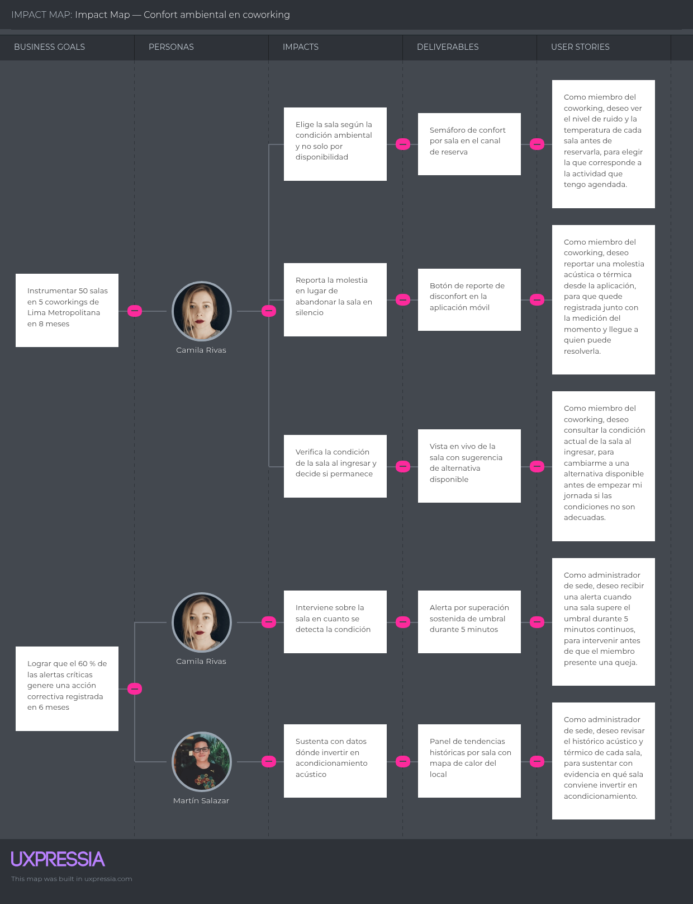

### Business Goals

Las metas se enuncian siguiendo los criterios SMART, de modo que cada una indica qué se mide, cuánto y en qué plazo. Se toma como origen del plazo la puesta en operación de la primera sede instalada.

| ID | Business Goal (SMART) | Específico | Medible | Plazo |
|:---|:---|:---|:---|:---|
| **BG1** | Instalar ZenRoom en 15 sedes de coworking de Lima Metropolitana durante los primeros 12 meses de operación. | Sedes con al menos una sala instrumentada | Número de sedes con contrato activo | 12 meses |
| **BG2** | Reducir en un 40 % las quejas por disconfort acústico y térmico en las sedes instaladas, dentro de los 6 meses siguientes a su instalación. | Quejas registradas por la administración de cada sede | Comparación contra la línea base del mes previo a la instalación | 6 meses |
| **BG3** | Lograr que el 60 % de los miembros de las sedes instaladas consulte las condiciones de una sala antes de reservarla, en un plazo de 8 meses. | Consultas previas a la reserva | Proporción de reservas precedidas por una consulta | 8 meses |
| **BG4** | Incrementar en un 25 % la tasa de ocupación de las salas peor valoradas de cada sede, en los 6 meses posteriores a la primera intervención correctiva. | Salas identificadas como problemáticas por la propia medición | Reservas por sala antes y después de la intervención | 6 meses |

### Mapa de impacto

| Business Goal | Actor (User Persona) | Impact — ¿cómo tendría que comportarse? | Deliverable — ¿qué construimos? | User Stories |
|:---|:---|:---|:---|:---|
| **BG1** | Martín Salazar, administrador de sede | Que reconozca el problema como medible y no como una percepción subjetiva, y solicite una demostración | Landing Page con la propuesta de valor, el modelo de contratación y un formulario de contacto | US01, US02, US05, US06, US07 |
| **BG1** | Martín Salazar | Que confíe en que la solución no graba conversaciones | Declaración del compromiso de privacidad en el Landing Page y en las aplicaciones, sustentada en el procesamiento en el borde | US04 |
| **BG2** | Martín Salazar | Que actúe sobre una sala cuando la condición aparece, y no cuando llega la queja | Panel con semáforo de confort por sala, mapa de calor del local y alertas por superación sostenida | US15, US16, US18, US20, US21, US22 |
| **BG2** | Martín Salazar | Que distinga el ruido de fondo permanente de los picos aislados, porque exigen intervenciones distintas | Indicadores acústicos normalizados según ISO 1996 y confort térmico según ISO 7730 | US19, US30, US31 |
| **BG2** | Camila Rivas, miembro del coworking | Que informe de una molestia en el momento en que la sufre, en lugar de abandonar la sala | Registro de reportes de disconfort desde la aplicación móvil, contrastado con la medición del instante | US27, US28 |
| **BG3** | Camila Rivas | Que consulte el estado de una sala antes de reservarla, en lugar de descubrirlo al ocuparla | Consulta de condiciones actuales y del histórico de tranquilidad por franja horaria | US17, US29, US30, US32, US40 |
| **BG4** | Martín Salazar | Que identifique la causa de que una sala se reserve menos, en lugar de atribuirla a la casualidad | Analítica de tendencias, correlación entre ruido y ocupación, y contraste con el clima exterior | US24, US25, US26, US38, US39 |
| **BG4** | Martín Salazar | Que verifique si su intervención mejoró la sala, en lugar de suponerlo | Comparación entre salas y series históricas por periodo, con el tamaño de muestra que las respalda | US26, US36, US37, US38 |

La cadena se lee en las dos direcciones, y esa es su utilidad: de la meta a la funcionalidad para decidir qué construir, y de la funcionalidad a la meta para justificar por qué. Una historia que no se deja rastrear hasta un Business Goal es candidata a salir del alcance; una meta sin historias que la sostengan señala una funcionalidad que falta.

## 3.3. Product Backlog.

El Product Backlog reúne las 65 historias del catálogo anterior —40 de usuario y 25 técnicas— estimadas y ordenadas. El orden lo determina **el valor para el negocio**, no la dependencia técnica ni la comodidad de construcción, y se sostiene en la cadena trazada en el Impact Mapping: cada historia ocupa su posición por la meta a la que contribuye.

Tres criterios explican el orden resultante. Las historias del **Landing Page abren el backlog**, porque es el único producto que genera captación y debe estar disponible desde el primer sprint. A continuación se sitúa la **cadena de telemetría completa**, desde la captura en el dispositivo hasta la primera consulta útil, porque sin un dato que mostrar ninguna otra funcionalidad tiene sentido. La **autenticación aparece después**, cuando ya existe algo que proteger: anteponerla ordenaría el backlog por dependencia técnica y no por valor, que es precisamente lo que el enunciado señala como incorrecto.

La estimación se expresa en Story Points de la sucesión 1, 2, 3, 5 y 8. Mide esfuerzo y complejidad relativos, no horas: una historia de 8 no cuesta ocho veces una de 1, sino que arrastra incertidumbre suficiente como para no poder descomponerse con confianza. Las historias del firmware y del cálculo estadístico concentran las estimaciones altas, porque combinan trabajo sobre hardware o matemática con una verificación costosa.

| # Orden | User Story Id | Título | Descripción | Story Points |
|:---|:---|:---|:---|:---|
| 1 | US01 | Comprender la propuesta de valor | Como visitante del segmento administrador, quiero comprender la propuesta de valor de ZenRoom al ingresar al sitio, para determinar si resuelve la problemática de confort de mi espacio de trabajo. | 1 |
| 2 | US02 | Explorar funcionalidades del producto | Como visitante del segmento administrador, quiero explorar las funcionalidades de la solución, para evaluar qué aporta a la operación de mi local. | 1 |
| 3 | US04 | Verificar el compromiso de privacidad | Como visitante, quiero conocer el tratamiento que la solución da a las conversaciones, para evaluar la privacidad antes de adoptar el producto. | 2 |
| 4 | US05 | Consultar los planes disponibles | Como visitante del segmento administrador, quiero consultar los planes y el modelo de contratación, para estimar la inversión por sala antes de contactar al equipo comercial. | 1 |
| 5 | US07 | Resolver dudas frecuentes | Como visitante, quiero consultar las preguntas frecuentes del producto, para resolver dudas de instalación, costo y privacidad sin contactar al equipo comercial. | 1 |
| 6 | US06 | Solicitar una demostración | Como visitante del segmento administrador, quiero solicitar una demostración del producto, para recibir un diagnóstico de las condiciones reales de mi local. | 2 |
| 7 | US03 | Conocer la aplicación móvil | Como visitante del segmento miembro, quiero conocer las capacidades de la aplicación móvil, para entender cómo me ayuda a encontrar una sala adecuada antes de reservar. | 1 |
| 8 | TS1 | Captura de mediciones en el dispositivo | Como developer, quiero que el dispositivo capture muestras de sonido, temperatura y humedad y consolide las ventanas de muestreo, para disponer de mediciones estables por sala. | 8 |
| 9 | TS14 | Generación de histogramas en el dispositivo | Como developer, quiero que el dispositivo genere histogramas de las muestras acústicas, para reducir el volumen de datos enviados hacia la capa Edge. | 5 |
| 10 | TS15 | Transmisión periódica de histogramas | Como developer, quiero que el dispositivo transmita los histogramas cada 10 segundos a la capa Edge, para reducir el consumo de ancho de banda respecto al envío de datos crudos. | 3 |
| 11 | TS2 | Recepción y validación de lotes en la Edge | Como developer, quiero que la capa Edge reciba y valide los lotes de mediciones enviados por el dispositivo, para asegurar la calidad del dato antes de agregarlo. | 5 |
| 12 | TS16 | Recepción de histogramas mediante broker | Como developer, quiero que la capa Edge reciba los histogramas mediante un broker de mensajería, para centralizar las mediciones antes de procesarlas. | 3 |
| 13 | TS17 | Fusión de histogramas en la Edge | Como developer, quiero que la capa Edge fusione los histogramas recibidos de una misma sala y período, para producir una distribución consolidada antes del cálculo de indicadores. | 5 |
| 14 | TS3 | Agregación por minuto y cálculo de indicadores | Como developer, quiero que la capa Edge consolide el agregado por minuto y calcule los indicadores normalizados, para producir LAeq y percentiles L10, L50 y L90 conforme a ISO 1996, y PMV y PPD conforme a ISO 7730. | 8 |
| 15 | TS19 | Cálculo de indicadores acústicos desde histogramas | Como developer, quiero calcular los indicadores acústicos a partir de los histogramas consolidados, para evitar transmitir y almacenar muestras acústicas individuales. | 5 |
| 16 | TS18 | Consolidación de mediciones por minuto | Como developer, quiero que la Edge consolide los histogramas recibidos durante un minuto, para generar un único agregado por sala antes de enviarlo a la nube. | 5 |
| 17 | TS21 | Procesamiento de mediciones de humedad y ocupación | Como developer, quiero que la plataforma procese las mediciones de humedad y ocupación asociadas a cada sala, para mantener actualizada la información ambiental y de uso. | 3 |
| 18 | TS5 | Cola de retransmisión y deduplicación | Como developer, quiero que la capa Edge encole los agregados ante fallos de transmisión y los retransmita, para no perder información ante cortes de conectividad. | 5 |
| 19 | TS25 | Registro de eventos de procesamiento | Como developer, quiero registrar los eventos relevantes del procesamiento de mediciones, para facilitar la trazabilidad y el diagnóstico de fallos del sistema. | 2 |
| 20 | TS6 | Ingesta de agregados desde la Edge | Como developer, quiero exponer un endpoint de ingesta de agregados por minuto, para consolidar en la nube la información producida por las capas Edge de los locales. | 5 |
| 21 | TS8 | Gestión de locales, salas y dispositivos | Como developer, quiero exponer los endpoints de administración de locales, salas, tipos de sala y dispositivos, para soportar la configuración del espacio desde el panel de gestión. | 5 |
| 22 | US11 | Registrar locales y salas | Como administrador de coworking, quiero registrar mis locales y sus salas, para reflejar la estructura física de mi espacio en la plataforma. | 3 |
| 23 | US12 | Clasificar salas por tipo | Como administrador de coworking, quiero clasificar cada sala según su uso previsto (cabina de llamadas, sala de reuniones o área abierta), para que se apliquen los umbrales de confort correspondientes a su actividad. | 2 |
| 24 | US13 | Registrar dispositivos y asociarlos a salas | Como administrador de coworking, quiero registrar cada dispositivo IoT y asociarlo a una sala, para habilitar la medición continua del ambiente. | 3 |
| 25 | TS10 | Consulta de mediciones y series por minuto | Como developer, quiero exponer los endpoints de consulta de agregados por sala y rango temporal, para soportar el semáforo de confort, el mapa de calor y las vistas de diagnóstico. | 5 |
| 26 | TS23 | Consulta del estado actual de una sala | Como developer, quiero exponer un endpoint para consultar el estado actual de una sala, para permitir que los consumidores obtengan sus indicadores ambientales y de ocupación. | 3 |
| 27 | US15 | Consultar el semáforo de confort de las salas | Como miembro del coworking, quiero ver el estado actual de cada sala en el semáforo de confort, para elegir una sala adecuada antes de reservarla. | 5 |
| 28 | US30 | Consultar las condiciones ambientales actuales | Como miembro del coworking, quiero consultar las condiciones ambientales actuales de una sala, para determinar si el espacio es adecuado para mi actividad. | 3 |
| 29 | US31 | Consultar el detalle de una sala | Como miembro del coworking, quiero consultar el detalle de una sala, para evaluar sus condiciones antes de utilizarla. | 3 |
| 30 | US40 | Consultar el estado general del local | Como administrador de coworking, quiero conocer el estado ambiental general de mi local, para identificar rápidamente las salas que requieren atención. | 3 |
| 31 | US08 | Registrarse como administrador | Como administrador de coworking, quiero registrarme en la plataforma con los datos de mi organización, para acceder al panel de gestión de mi espacio. | 2 |
| 32 | US09 | Iniciar sesión en la plataforma | Como administrador o miembro del coworking, quiero iniciar sesión con mis credenciales, para acceder únicamente a las funciones correspondientes a mi rol. | 2 |
| 33 | TS7 | Autenticación y emisión de tokens | Como developer, quiero exponer los endpoints de registro y autenticación con emisión de token y roles, para proteger los recursos de la plataforma según el rol del emisor. | 5 |
| 34 | US10 | Gestionar cuentas de miembros | Como administrador de coworking, quiero invitar a los miembros de mi espacio y desactivar sus cuentas, para controlar quién consulta la información de mi local. | 3 |
| 35 | US16 | Filtrar salas por condiciones ambientales | Como miembro del coworking, quiero filtrar las salas por nivel de ruido y temperatura, para encontrar rápidamente una sala que cumpla mis condiciones de trabajo. | 3 |
| 36 | US19 | Consultar la serie por minuto de una sala | Como administrador de coworking, quiero consultar la serie por minuto de los indicadores de una sala, para diagnosticar un problema puntual con detalle. | 3 |
| 37 | US18 | Visualizar el mapa de calor del local | Como administrador de coworking, quiero ver el estado ambiental actual de todas mis salas en el mapa de calor, para supervisar toda la instalación de un vistazo. | 5 |
| 38 | US17 | Consultar el histórico de tranquilidad por hora | Como miembro del coworking, quiero consultar el comportamiento histórico de una sala por franjas horarias, para decidir el mejor momento de reservarla. | 5 |
| 39 | US14 | Configurar umbrales de confort | Como administrador de coworking, quiero configurar los umbrales de nivel sonoro y temperatura de cada sala, para adaptar las alertas al uso real del espacio. | 3 |
| 40 | TS9 | Configuración y sincronización de umbrales | Como developer, quiero exponer los endpoints de configuración de umbrales y su versión vigente, para que las capas Edge descarguen la configuración que rige la evaluación local. | 5 |
| 41 | TS4 | Evaluación local de alertas | Como developer, quiero que la capa Edge evalúe los umbrales y levante las alertas localmente, para mantener la vigilancia del local sin depender de la conexión a internet. | 5 |
| 42 | US20 | Recibir alertas por superación sostenida | Como administrador de coworking, quiero recibir una alerta cuando un indicador supere el umbral de forma sostenida, para intervenir antes de que los clientes se quejen. | 5 |
| 43 | US21 | Reconocer alertas y registrar la acción correctiva | Como administrador de coworking, quiero tomar conocimiento de una alerta y registrar la intervención realizada, para dar seguimiento a la atención del problema. | 3 |
| 44 | US22 | Cierre automático de alertas normalizadas | Como administrador de coworking, quiero que las alertas se cierren automáticamente cuando la condición se normalice, para operar únicamente con alertas vigentes. | 5 |
| 45 | TS11 | Gestión de alertas | Como developer, quiero exponer los endpoints de consulta, reconocimiento y cierre de alertas, para soportar el flujo de atención desde el panel de gestión. | 5 |
| 46 | US27 | Reportar una molestia ambiental | Como miembro del coworking, quiero reportar una molestia acústica o térmica desde la aplicación, para que el administrador conozca el problema aunque la medición no lo refleje. | 3 |
| 47 | US28 | Consultar los reportes de disconfort del local | Como administrador de coworking, quiero consultar los reportes de disconfort de mi local, para priorizar las intervenciones según la experiencia real de los miembros. | 3 |
| 48 | TS13 | Registro y consulta de reportes de disconfort | Como developer, quiero exponer los endpoints de registro y consulta de reportes de disconfort, para capturar la percepción de los miembros y contrastarla con la medición. | 5 |
| 49 | TS22 | Actualización del estado de ocupación | Como developer, quiero actualizar el estado de ocupación de cada sala a partir de las mediciones recibidas, para proporcionar información vigente a los consumidores de la plataforma. | 3 |
| 50 | US29 | Consultar la ocupación de una sala | Como miembro del coworking, quiero conocer la cantidad de personas presentes en una sala, para elegir un espacio adecuado para mi actividad. | 2 |
| 51 | US32 | Consultar salas según ocupación | Como miembro del coworking, quiero consultar las salas según su nivel de ocupación, para seleccionar un espacio compatible con mi actividad. | 3 |
| 52 | US33 | Supervisar la ocupación del local | Como administrador de coworking, quiero conocer la cantidad de personas presentes en las salas de mi local, para supervisar el uso de los espacios. | 3 |
| 53 | US24 | Consultar tendencias históricas por sala | Como administrador de coworking, quiero consultar la evolución de los indicadores de cada sala a lo largo del tiempo, para sustentar decisiones de inversión en acondicionamiento. | 5 |
| 54 | TS12 | Cálculo de tendencias y correlaciones | Como developer, quiero exponer los endpoints de tendencias históricas y correlación con el clima exterior, para soportar la analítica de decisiones del administrador. | 8 |
| 55 | US25 | Correlacionar condiciones interiores con el clima exterior | Como administrador de coworking, quiero correlacionar las condiciones de mis salas con el clima exterior, para identificar fallas reales de aislamiento en mis instalaciones. | 8 |
| 56 | US26 | Generar reportes históricos por sala | Como administrador de coworking, quiero generar un reporte histórico por sala, para evidenciar las condiciones del espacio ante clientes o dirección. | 5 |
| 57 | US38 | Comparar condiciones entre salas | Como administrador de coworking, quiero comparar las condiciones ambientales de mis salas, para identificar cuáles requieren atención prioritaria. | 5 |
| 58 | US39 | Consultar el historial de ocupación | Como administrador de coworking, quiero consultar la evolución de la ocupación de una sala, para conocer cómo se utiliza el espacio a lo largo del tiempo. | 3 |
| 59 | US34 | Consultar el estado de los dispositivos | Como administrador de coworking, quiero conocer el estado operativo de los dispositivos IoT, para detectar fallas de medición en las salas. | 3 |
| 60 | TS24 | Consulta del estado de los dispositivos | Como developer, quiero exponer un endpoint para consultar el estado de los dispositivos IoT, para permitir la detección de dispositivos fuera de línea. | 3 |
| 61 | US23 | Detección de dispositivos fuera de línea | Como administrador de coworking, quiero enterarme cuando un dispositivo deje de reportar, para distinguir una sala silenciosa de un fallo de medición. | 5 |
| 62 | US35 | Consultar el estado de conectividad de una sala | Como administrador de coworking, quiero conocer si una sala recibe mediciones correctamente, para distinguir un problema ambiental de una falla de comunicación. | 3 |
| 63 | TS20 | Procesamiento local ante pérdida de conectividad | Como developer, quiero que la capa Edge continúe procesando mediciones y evaluando alertas cuando no existe conexión con la nube, para mantener la vigilancia del local. | 5 |
| 64 | US36 | Consultar el historial de alertas | Como administrador de coworking, quiero consultar las alertas ocurridas en mis salas, para identificar problemas recurrentes y evaluar su atención. | 3 |
| 65 | US37 | Consultar acciones correctivas realizadas | Como administrador de coworking, quiero consultar las acciones correctivas realizadas sobre las alertas, para verificar cómo se atendieron los problemas ambientales. | 3 |

**Total estimado: 246 Story Points** distribuidos en 65 historias.

> **Tablero del Product Backlog.** El enunciado exige una captura y la URL pública del backlog en la herramienta de gestión indicada. El equipo debe crear el tablero y enlazarlo aquí; la tabla anterior es la fuente que debe volcarse en él, y el orden de esta columna es el que debe reproducir.

# Capítulo IV: Solution Software Design

## 4.1. Strategic-Level Domain-Driven Design.

En esta sección se describe el procedimiento con el que el equipo identificó y delimitó los bounded contexts de la plataforma. Partiendo del Big Picture EventStorming del apartado 2.4, se aplicaron el EventStorming a nivel de diseño, el Candidate Context Discovery, el modelado de los flujos de mensajes y el Bounded Context Canvas de cada contexto. El resultado se recoge en el context map y se traduce en la arquitectura de la solución.

### 4.1.1. Design-Level EventStorming.

El equipo trabajó sobre un único board, añadiendo una capa por paso y dejando constancia de cada una antes de continuar. La secuencia recorrió nueve pasos.

**Paso 1: Collect Domain Events**

Se recogieron treinta eventos del dominio sobre post-its naranjas, desde la captura de una muestra en el sensor hasta la revocación de una credencial.

<em>Figura 10.</em> Los treinta domain events recogidos sin orden.

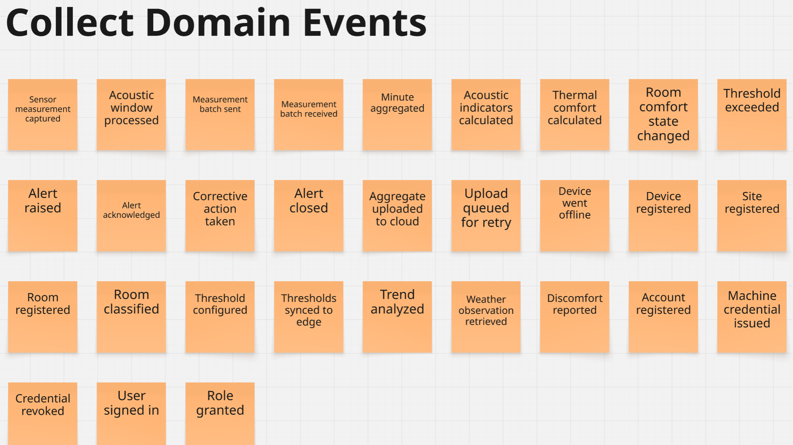

**Paso 2: Timeline**

Los eventos se ordenaron cronológicamente y quedaron agrupados en cuatro tramos: la estructura del local y su telemetría, la política de alertas, la analítica y la identidad.

<em>Figura 11.</em> Línea temporal del área de Monitoring, que concentra la estructura del local y la telemetría.

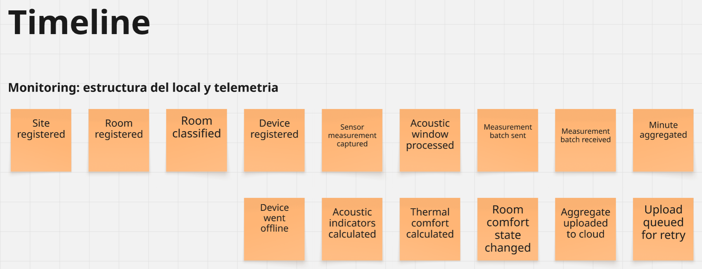

<em>Figura 12.</em> Línea temporal del área de Alerting.

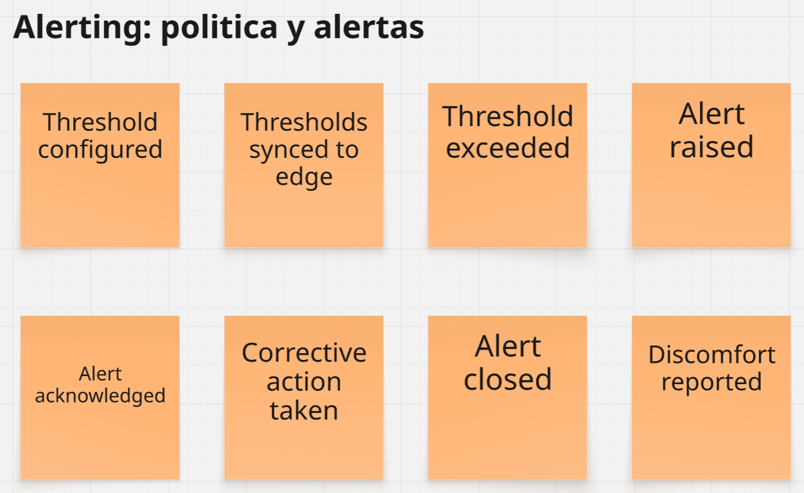

<em>Figura 13.</em> Línea temporal de Insights e IAM.

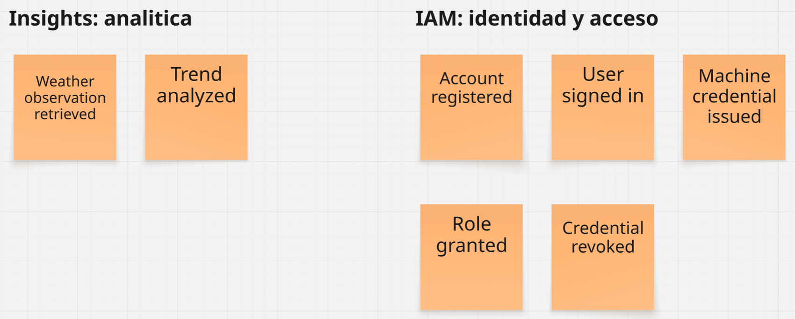

**Paso 3: Pain and Pivotal Points**

Se marcaron cuatro pivotal events: Minute aggregated, Threshold exceeded, Room classified y Trend analyzed. Los pain points detectados fueron seis: no se distingue una sala silenciosa de un dispositivo caído, el reintento del Edge puede duplicar un agregado, una sala nueva sin clasificar quedaría sin vigilancia, un miembro puede reportar disconfort con la medición dentro de rango, el reloj sin sincronizar desordena el minuto y la privacidad del audio debe poder demostrarse.

<em>Figura 14.</em> Pivotal events y pain points del área de Monitoring.

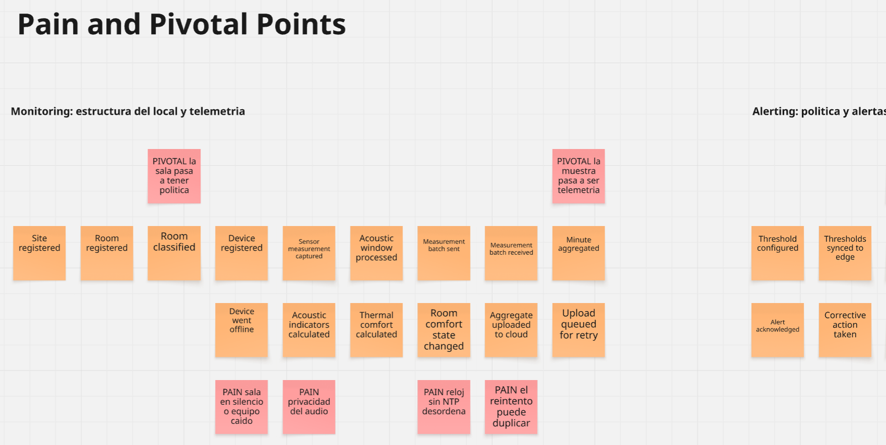

<em>Figura 15.</em> Pivotal events y pain points de Alerting, Insights e IAM.

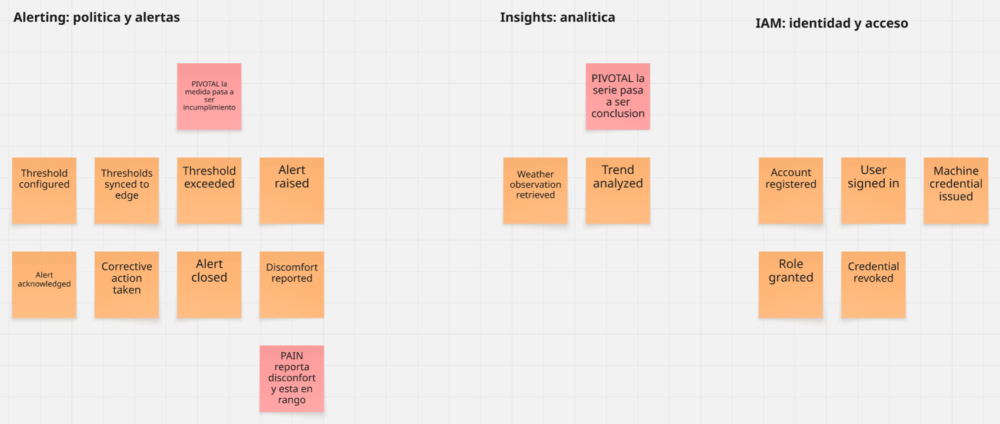

**Paso 4: Commands**

Se incorporaron los comandos sobre post-its azules, cada uno junto al evento que produce. El dispositivo IoT aparece como actor no humano: ejecuta Send measurement batch sin intervención de nadie, de modo que su autenticación no puede ser la de una persona.

<em>Figura 16.</em> Cada comando junto al evento que produce, y los actores que los ejecutan.

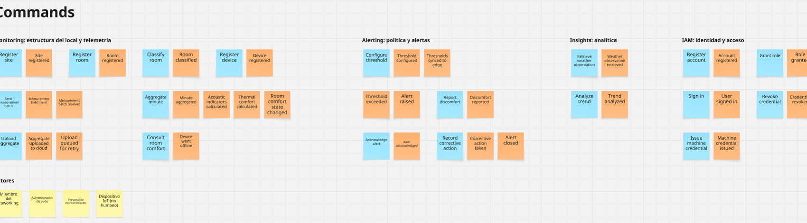

<em>Figura 17.</em> Detalle del área de Monitoring, donde se aprecia el emparejamiento entre cada comando y su evento.

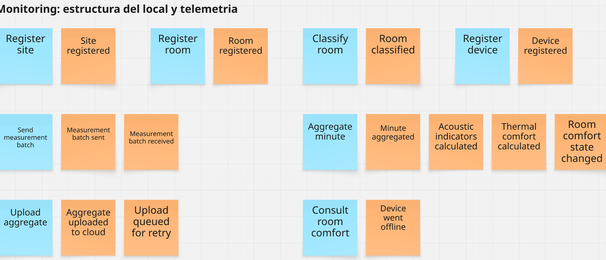

<em>Figura 18.</em> Detalle de Alerting, Insights e IAM con el mismo emparejamiento.

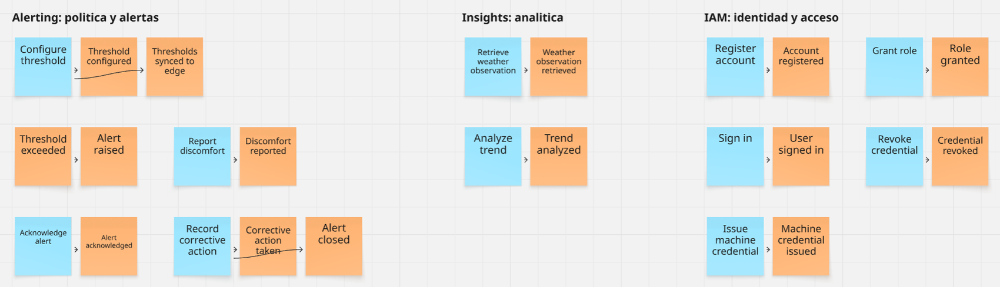

**Paso 5: Policies**

Se establecieron las políticas sobre post-its morados. Cuatro de ellas resuelven un pain point del paso anterior: el cierre por marca de agua corrige el reloj sin sincronizar, la entrega at-least-once absorbe la duplicación del reintento, el umbral por defecto cubre la sala recién registrada y el descarte del audio en el propio dispositivo sostiene la garantía de privacidad.

<em>Figura 19.</em> Políticas de Monitoring, intercaladas entre el evento que las dispara y el que producen.

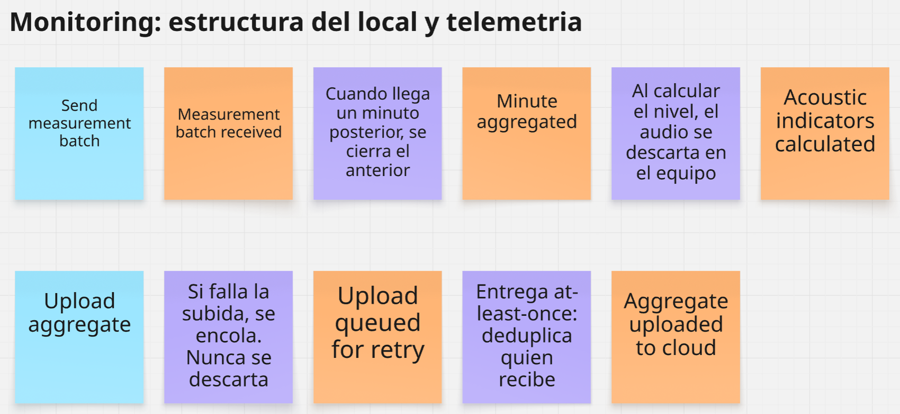

<em>Figura 20.</em> Políticas de Alerting, entre el evento que las dispara y el que producen.

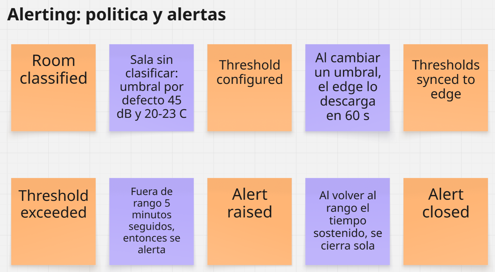

<em>Figura 21.</em> Políticas de Insights e IAM.

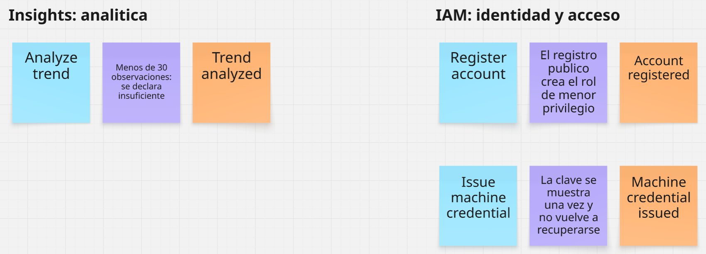

**Paso 6: Read Models**

Se identificaron seis read models sobre post-its verdes, desde el semáforo que consulta el miembro antes de reservar hasta el reporte histórico que sustenta una decisión de inversión. Cada uno tiene un actor que lo mira y una decisión que depende de él.

<em>Figura 22.</em> Read models de Monitoring, bajo los eventos que los alimentan.

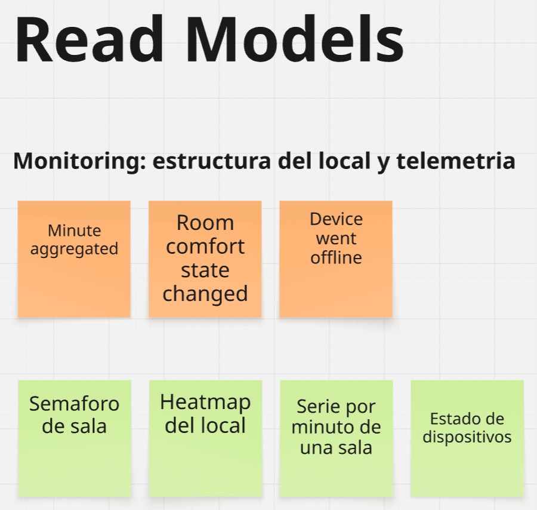

<em>Figura 23.</em> Read models de Alerting e Insights.

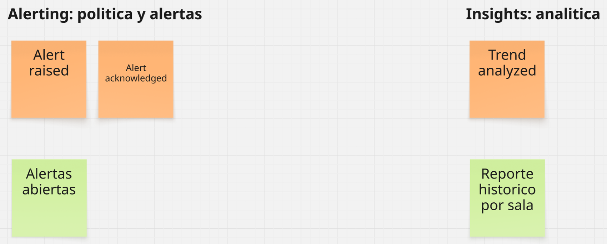

**Paso 7: External Systems**

Se señalaron tres sistemas externos sobre post-its rosados: el proveedor meteorológico, el broker MQTT y el servicio de notificaciones. Cada uno marca un punto de la frontera donde hará falta un adaptador que traduzca su lenguaje al propio.

<em>Figura 24.</em> Sistemas externos en los puntos de integración de Monitoring.

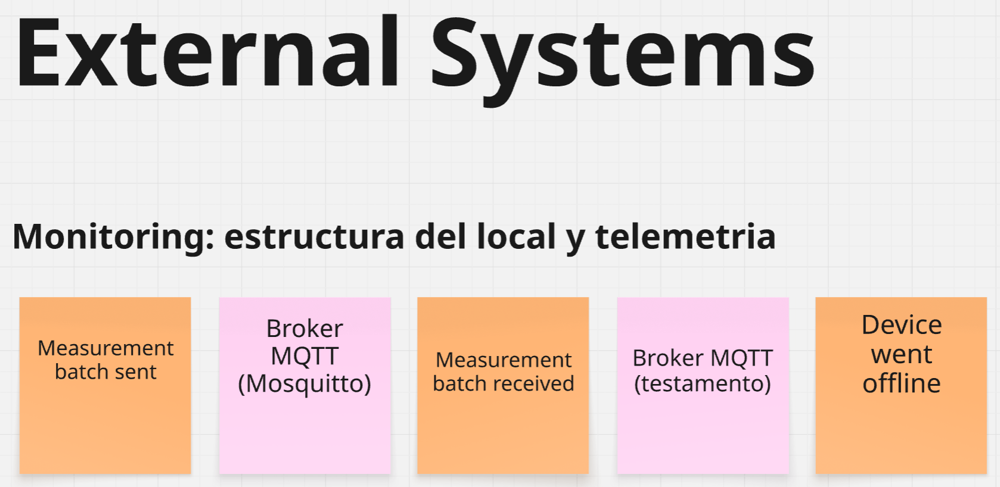

<em>Figura 25.</em> Sistemas externos de Alerting e Insights.

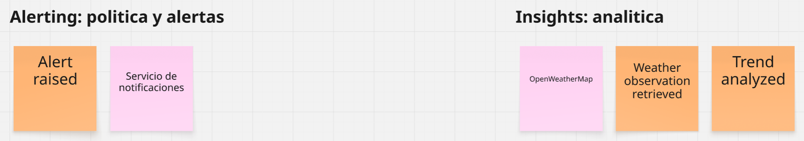

**Paso 8: Aggregates**

Resultaron ocho agregados sobre post-its amarillos: Site, Room, Device, RoomReading, Threshold, Alert, Analysis y Account. Los cuatro primeros comparten la estructura física del local como raíz, y por eso terminan juntos en el paso siguiente.

<em>Figura 26.</em> Los agregados de Monitoring rotulando los eventos que encapsulan.

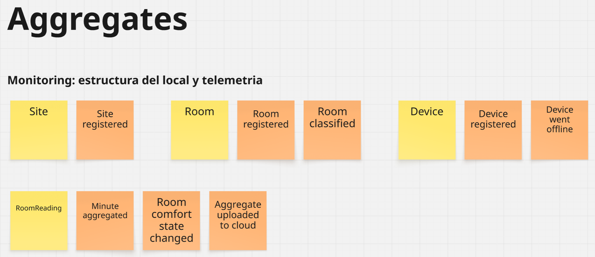

<em>Figura 27.</em> Los agregados de Alerting, Insights e IAM.

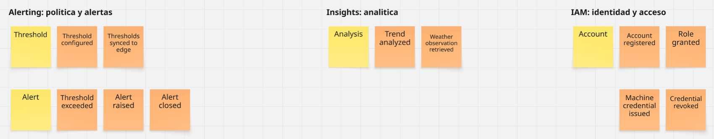

**Paso 9: Bounded Contexts**

Por último se trazaron las fronteras sobre los agregados, siguiendo los pivotal events del paso 3, y se unieron los contextos que dependen entre sí. El resultado son cuatro bounded contexts: Monitoring e Insights como núcleo, Alerting como soporte e IAM como subdominio genérico. Alerting e Insights dependen de Monitoring a través de una capa anticorrupción, los tres aceptan el modelo de autorización de IAM, y los sistemas externos quedan fuera de toda frontera.

<em>Figura 28.</em> Los cuatro bounded contexts con su clasificación estratégica y las relaciones que los unen.

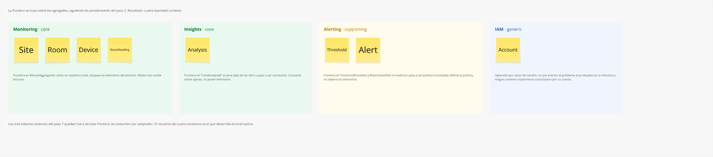

<em>Figura 29.</em> Detalle del bounded context Monitoring con los agregados, comandos, eventos, políticas y read models que encierra.

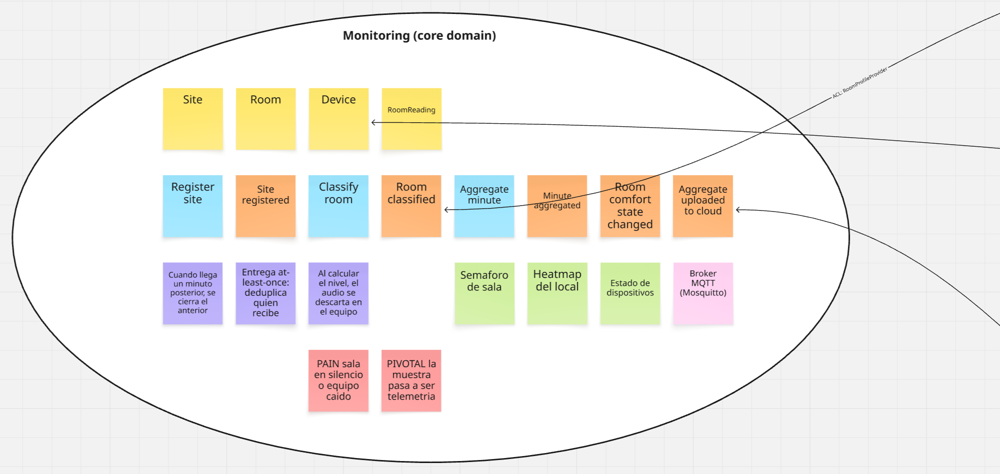

<em>Figura 30.</em> Detalle del bounded context Alerting.

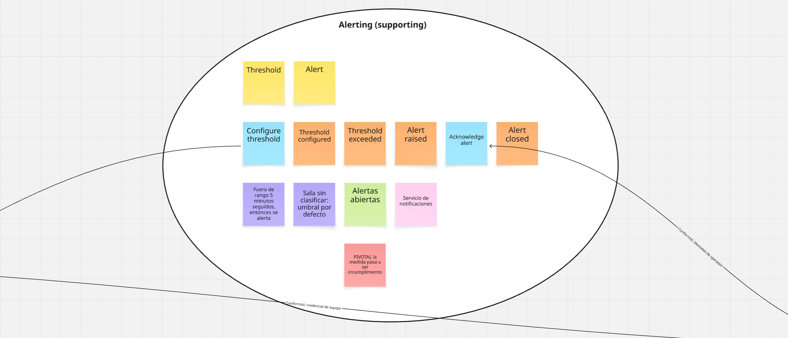

<em>Figura 31.</em> Detalle del bounded context Insights.

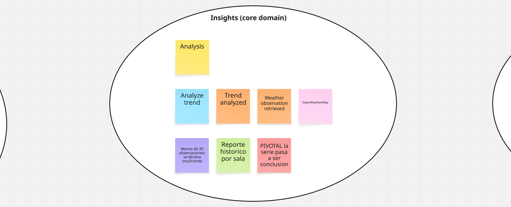

<em>Figura 32.</em> Detalle del bounded context IAM.

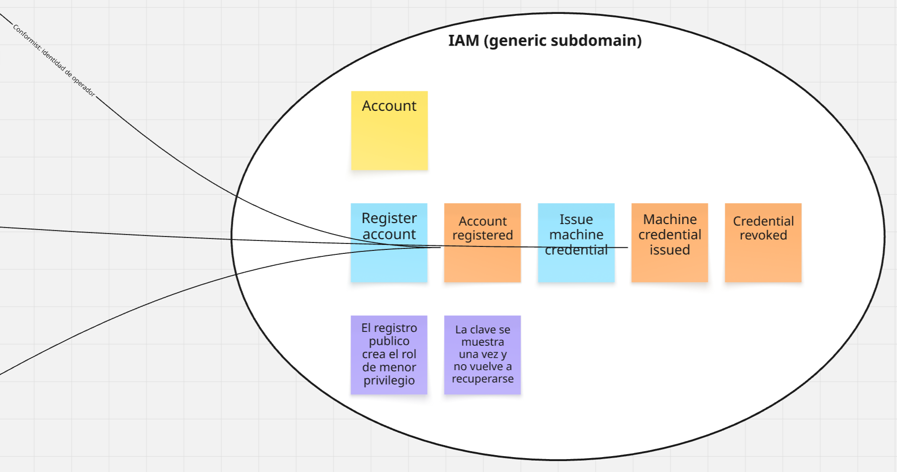

#### <i>**4.1.1.1 Candidate Context Discovery.**</i>

A partir del EventStorming refinado, el equipo realizó una sesión de Candidate Context Discovery aplicando las tres técnicas de forma encadenada, de modo que las tres coincidieran antes de dar una frontera por buena.

La identificación empezó revisando el modelo del apartado anterior, con la atención puesta en los pivotal events y en los agregados, y sobre esa base se detectaron las agrupaciones naturales de comandos, eventos y políticas que operan sobre la misma entidad.

<em>Figura 33.</em> Agrupaciones naturales: los comandos, eventos y políticas que operan sobre cada entidad.

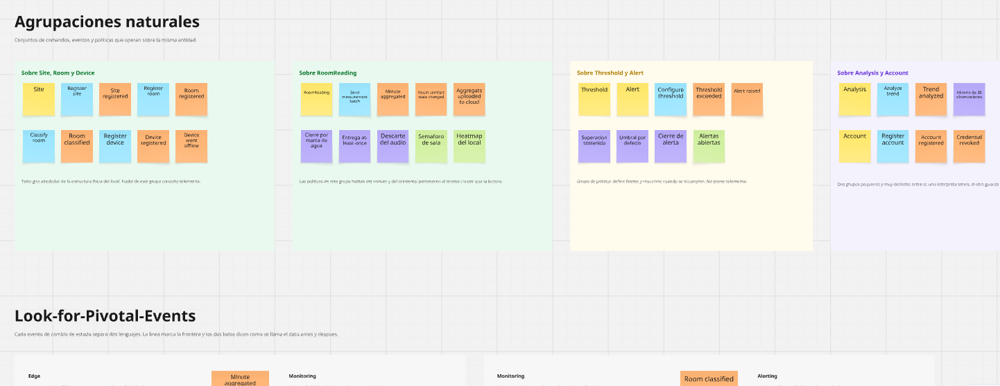

**1. Start-with-Value**

Se empezó clasificando por aporte al negocio. Monitoring es core porque sin medición objetiva no hay producto que vender, e Insights también lo es porque es lo que separa la solución de un termómetro con memoria. Alerting es supporting, ya que resulta necesario para que la medición sirva de algo pero no es donde reside la ventaja competitiva. IAM es un subdominio genérico, con el problema ya resuelto en la industria. Esa clasificación es la que rotula cada frontera en la Figura 28.

**2. Start-with-Simple**

Para no perderse en la complejidad se descompuso el recorrido en seis pasos secuenciales, que son medir, agregar, comparar con la política, avisar, responder y explicar, y se preguntó a quién corresponde cada uno. Medir y agregar pertenecen a quien posee la estructura del local; comparar y avisar dependen de una política que alguien configura por separado; explicar necesita historia acumulada y no el instante. Son tres responsabilidades que no cambian por las mismas razones, y en las Figuras 11, 12 y 13 ya aparecen separadas por áreas.

**3. Look-for-Pivotal-Events**

Los pivotal events marcados en el paso 3 se leyeron como fronteras, citando en cada caso los dos lados que separan:

- Minute aggregated es la frontera entre el Edge y Monitoring: antes es muestra cruda y después es telemetría del dominio.
- Room classified es la frontera entre Monitoring y Alerting, porque la sala pasa a tener una política aplicable.
- Threshold exceeded es la frontera entre Alerting y Monitoring, ya que la medición pasa a ser política incumplida.
- Trend analyzed es la frontera entre Monitoring e Insights: la serie deja de ser dato y pasa a ser conclusión.

Los cuatro quedan marcados sobre la línea temporal en la Figura 14. Para decidir si cada uno separa de verdad dos contextos, se comprobó cómo se llama el dato a cada lado de la frontera.

<em>Figura 34.</em> Cada pivotal event con el nombre que recibe el dato antes y después de cruzar la frontera.

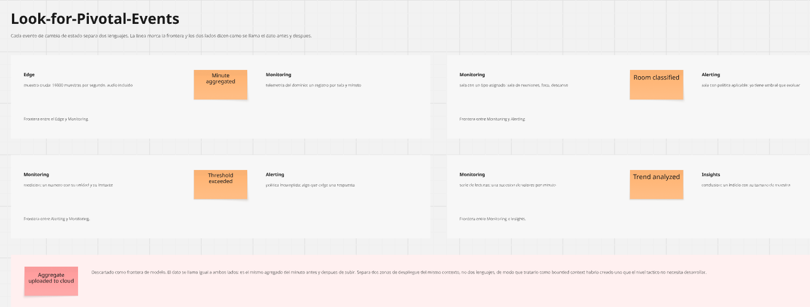

El evento Aggregate uploaded to cloud se descartó como frontera de modelo. Separa dos zonas de despliegue del mismo contexto y no dos lenguajes distintos, de modo que tratarlo como bounded context habría creado uno que el nivel táctico no necesita desarrollar.

**Agrupamientos y consolidación**

El primer agrupamiento reunió lo evidente: IAM alrededor de Account, y Alerting alrededor de Threshold y Alert. Son los dos contextos cuya responsabilidad no se discute, y cerrarlos primero deja a la vista lo que todavía falta por repartir.

<em>Figura 35.</em> Primer agrupamiento: IAM y Alerting cerrados, y los agregados que quedan sin repartir.

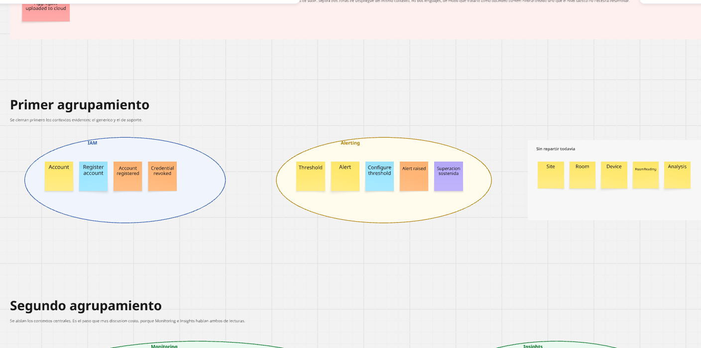

El segundo aisló los contextos centrales y fue el que más discusión costó, porque Monitoring e Insights hablan ambos de lecturas. Se separaron por dos razones: cambian por motivos distintos, uno por cómo se captura el dato y otro por cómo se interpreta, y además Insights puede estar caído sin que la medición se detenga.

<em>Figura 36.</em> Segundo agrupamiento: Monitoring e Insights separados pese a compartir el vocabulario de las lecturas.

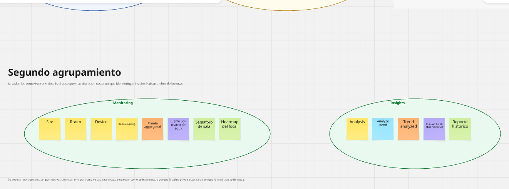

El resultado de ambas rondas es el que encierra cada frontera en la Figura 28.

La consolidación final deja cuatro bounded contexts, que son Monitoring, Insights, Alerting e IAM, y coinciden exactamente con los que desarrolla el nivel táctico en el apartado 4.2.

#### <i>**4.1.1.2 Domain Message Flows Modeling.**</i>

La colaboración entre los cuatro contextos se modeló con Domain Storytelling, en tres escenarios: el principal de operación, el de instalación y el de fallo. Cada diagrama lleva su propia leyenda de notación.

**Escenario 1. Disconfort acústico en una sala**

<em>Figura 37.</em> Domain Storytelling del escenario de disconfort acústico.

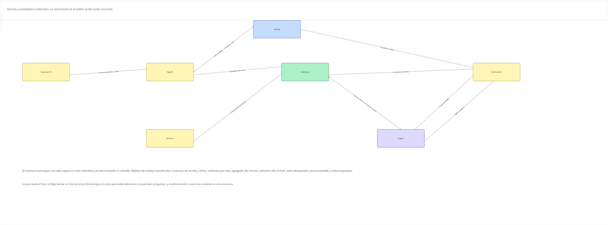

El flujo deja ver tres decisiones de reparto. La primera es que el Edge evalúa los umbrales y no el cloud: consulta los límites y decide localmente, de modo que una caída de internet no deja la sala sin vigilancia. La segunda es que Monitoring es el único que recibe telemetría y el único al que los demás preguntan, lo que lo convierte en el proveedor del que dependen Alerting e Insights. La tercera es que el administrador recorre tres contextos en una sola tarea, porque ve el estado, entiende la causa y ajusta la política, y esa continuidad obliga a que las fronteras sean invisibles para él aunque sean estrictas por dentro.

**Escenario 2. Alta de un local y sus salas**

<em>Figura 38.</em> Domain Storytelling del escenario de instalación de un local.

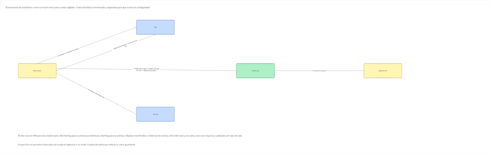

La instalación recorre los tres contextos que el administrador toca: IAM para las credenciales propias y la clave de máquina del dispositivo, Monitoring para la estructura del local y Alerting para la política. El paso de clasificar cada sala es el que evita el pain point de la sala sin vigilancia, y si se omite la política de umbral por defecto la cubre igualmente, lo que hace que el sistema nunca quede ciego por un olvido durante la instalación.

**Escenario 3. Pérdida de conexión del Edge**

<em>Figura 39.</em> Domain Storytelling del escenario de pérdida de conexión del Edge.

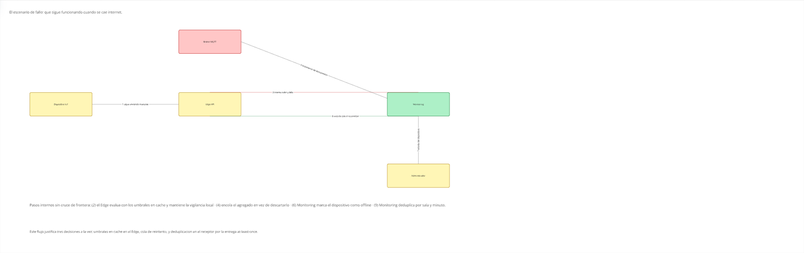

Este escenario justifica tres decisiones de diseño a la vez. El Edge conserva los umbrales en caché y mantiene la vigilancia local mientras no hay internet; el agregado que no consigue subir se encola en lugar de descartarse; y, como la entrega es at-least-once, la deduplicación por sala y minuto corresponde a quien recibe. El testamento de desconexión del broker es lo que permite distinguir una sala silenciosa de un dispositivo caído, que era el primero de los pain points sin resolver.

#### <i>**4.1.1.3 Bounded Context Canvases.**</i>

Cada contexto se diseñó con su propio Bounded Context Canvas. Los cuatro se presentan por orden de importancia para el negocio, primero como canvas y después como tabla de detalle.

**Bounded Context: Monitoring** (core domain)

<em>Figura 40.</em> Bounded Context Canvas de Monitoring.

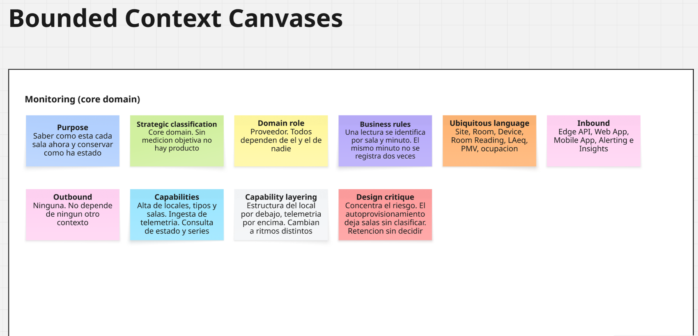

| Elemento | Contenido |
|---|---|
| **Propósito** | Saber cómo está cada sala ahora mismo, y conservar el registro de cómo ha estado. |
| **Clasificación estratégica** | Core domain. Es la razón por la que el producto existe: sin medición objetiva no hay nada que vender. |
| **Rol de dominio** | Proveedor de la estructura del local y de la telemetría. Todos los demás contextos dependen de él; él no depende de ninguno. |
| **Lenguaje ubicuo** | Site, Room, Room Type, Device, Room Reading, LAeq, L10, L90, PMV, PPD, ocupación, calidad del dato. |
| **Reglas de negocio** | Una lectura se identifica por sala y minuto, y el mismo minuto no se registra dos veces. Una sala desconocida se da de alta sola cuando un dispositivo reporta por ella. Un minuto incompleto se guarda, pero no es fiable para promediar. Sustituir un dispositivo no altera el historial de la sala. |
| **Capacidades** | Alta y clasificación de locales, tipos y salas · ingesta de telemetría · consulta del estado actual y de series históricas. |
| **Estratificación de capacidades** | Estructura del local por debajo y telemetría por encima: cambian a ritmos distintos, de modo que la ingesta puede evolucionar sin tocar el alta de salas. |
| **Dependencias entrantes** | Edge API (telemetría) · Web App y Mobile App (consulta) · Alerting e Insights (a través de la fachada). |
| **Dependencias salientes** | Ninguna. |
| **Crítica del diseño** | Al ser el proveedor del que dependen todos, concentra el riesgo: un cambio en su modelo de sala obliga a revisar las dos capas anticorrupción que lo traducen. El autoprovisionamiento facilita la instalación, pero genera salas sin clasificar que solo una persona puede resolver, de modo que el sistema acumula trabajo pendiente si nadie lo atiende. La tabla de lecturas crece un registro por sala y minuto, y su política de retención está sin decidir. |

**Bounded Context: Insights** (core domain)

<em>Figura 41.</em> Bounded Context Canvas de Insights.

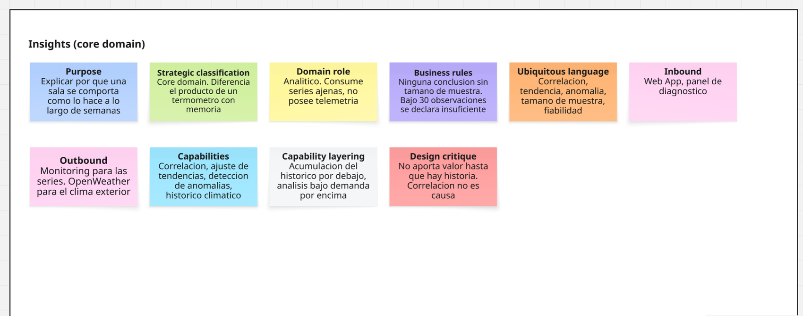

| Elemento | Contenido |
|---|---|
| **Propósito** | Explicar por qué una sala se comporta como lo hace, a lo largo de semanas. |
| **Clasificación estratégica** | Core domain. Es lo que diferencia el producto de un termómetro con memoria. |
| **Rol de dominio** | Analítico. Consume series ajenas y produce conclusiones, sin poseer telemetría propia. |
| **Lenguaje ubicuo** | Correlación, tendencia, deriva térmica, anomalía, tamaño de muestra, fiabilidad, observación meteorológica. |
| **Reglas de negocio** | Ninguna conclusión se emite sin el tamaño de muestra que la respalda. Por debajo de treinta observaciones el resultado se declara insuficiente en lugar de estimarse. Si el servicio meteorológico externo no responde, el resto del análisis se entrega igual. |
| **Capacidades** | Correlación entre variables · ajuste de tendencias · detección de anomalías · acumulación del histórico climático exterior. |
| **Estratificación de capacidades** | La acumulación del histórico va por debajo y el análisis bajo demanda por encima, lo que permite cambiar el cálculo sin rehacer lo ya acumulado. |
| **Dependencias entrantes** | Web App (panel de diagnóstico). |
| **Dependencias salientes** | Monitoring (series de lecturas) · OpenWeather (clima exterior). |
| **Crítica del diseño** | No aporta valor hasta que existe historia suficiente, por lo que un local recién instalado ve el contexto vacío durante semanas. La correlación con el exterior depende de que el muestreo periódico haya venido acumulando observaciones: si el proveedor estuvo caído, el hueco no se recupera hacia atrás. Correlación no es causa, y los resultados deben presentarse como indicios y no como diagnósticos. |

**Bounded Context: Alerting** (supporting)

<em>Figura 42.</em> Bounded Context Canvas de Alerting.

| Elemento | Contenido |
|---|---|
| **Propósito** | Convertir la política de confort del negocio en límites que una máquina pueda evaluar. |
| **Clasificación estratégica** | Supporting. Necesario para que la medición sirva de algo, pero no es donde reside la ventaja competitiva. |
| **Rol de dominio** | Definidor de política. Publica umbrales y los resuelve por sala; no observa la telemetría. |
| **Lenguaje ubicuo** | Umbral, valor de aviso, valor crítico, minutos sostenidos, métrica, tipo de sala. |
| **Reglas de negocio** | El valor de aviso siempre es inferior al crítico. Un umbral se configura por tipo de sala, nunca por sala individual. Superar el límite un instante no basta: debe sostenerse el tiempo configurado. La configuración es idempotente. |
| **Capacidades** | Configuración de umbrales por tipo · resolución de umbrales aplicables a cada sala. |
| **Estratificación de capacidades** | Definir la política va por debajo y resolverla para cada sala por encima, de forma que el catálogo de umbrales evoluciona sin tocar la evaluación. |
| **Dependencias entrantes** | Web App (configuración) · Edge API (consulta para evaluar). |
| **Dependencias salientes** | Monitoring (qué salas existen y de qué tipo son). |
| **Crítica del diseño** | El contexto está incompleto: hoy define y publica umbrales, pero no evalúa ni emite alertas, de modo que su nombre promete más de lo que cumple. Al no existir clave foránea hacia Monitoring, borrar un tipo de sala dejaría umbrales huérfanos, y corresponde al caso de uso de borrado cubrirlo. Configurar solo por tipo de sala es lo que el negocio pide hoy, pero impide la excepción de una sala concreta. |

**Bounded Context: IAM** (generic subdomain)

<em>Figura 43.</em> Bounded Context Canvas de IAM.

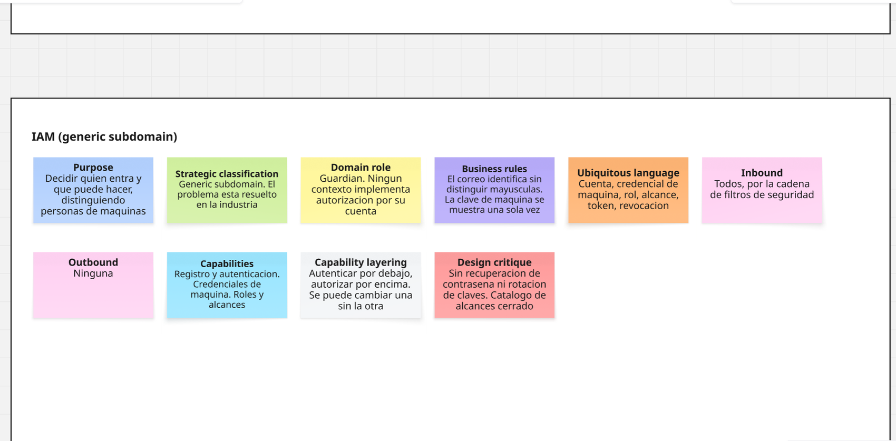

| Elemento | Contenido |
|---|---|
| **Propósito** | Decidir quién entra y qué puede hacer, distinguiendo personas de máquinas. |
| **Clasificación estratégica** | Generic subdomain. El problema está resuelto en la industria; no se innova aquí. |
| **Rol de dominio** | Guardián. Ningún otro contexto implementa autorización por su cuenta. |
| **Lenguaje ubicuo** | Cuenta, credencial de máquina, rol, alcance, token, revocación. |
| **Reglas de negocio** | El correo identifica una cuenta sin distinguir mayúsculas. El registro público siempre crea cuentas con el rol de menor privilegio. La clave de una máquina se muestra una sola vez y no vuelve a ser recuperable. Una credencial revocada se rechaza indicando la revocación, no como si no existiera. |
| **Capacidades** | Registro y autenticación de personas · emisión y verificación de credenciales de máquina · concesión de roles y alcances. |
| **Estratificación de capacidades** | Autenticar va por debajo y autorizar por encima, lo que permite cambiar el mecanismo de acceso sin rehacer el modelo de roles. |
| **Dependencias entrantes** | Todos los contextos, a través de la cadena de filtros de seguridad. |
| **Dependencias salientes** | Ninguna. |
| **Crítica del diseño** | No contempla recuperación de contraseña ni rotación de credenciales de máquina, dos necesidades que aparecerán en cuanto el sistema salga de pruebas. El catálogo de alcances es cerrado y ampliarlo exige modificar código, lo que basta con dos alcances pero no escalaría. Al ser un subdominio genérico, conviene vigilar que no absorba reglas que pertenecen a otros contextos. |

### 4.1.2. Context Mapping.

El context map recoge las relaciones estructurales entre los cuatro bounded contexts y con el servicio externo, indicando para cada una el patrón de Domain-Driven Design que la gobierna y quién manda en el contrato.

<em>Figura 44.</em> Context map de la solución, con el patrón que gobierna cada relación.

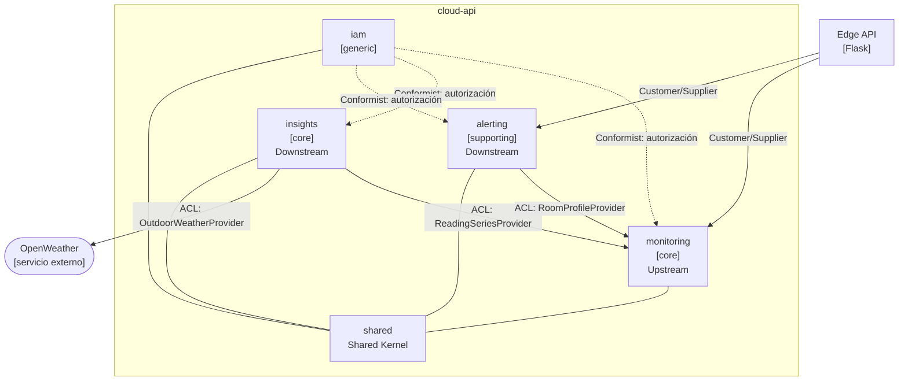
```mermaid
flowchart TB
    subgraph nube["cloud-api"]
        mon["monitoring<br/>[core]<br/>Upstream"]
        ins["insights<br/>[core]<br/>Downstream"]
        ale["alerting<br/>[supporting]<br/>Downstream"]
        iam["iam<br/>[generic]"]
        sha["shared<br/>Shared Kernel"]
    end
    ow(["OpenWeather<br/>[servicio externo]"])
    edge["Edge API<br/>[Flask]"]

    ins -->|"ACL: ReadingSeriesProvider"| mon
    ale -->|"ACL: RoomProfileProvider"| mon
    ins -->|"ACL: OutdoorWeatherProvider"| ow
    edge -->|"Customer/Supplier"| mon
    edge -->|"Customer/Supplier"| ale
    iam -.->|"Conformist: autorización"| mon
    iam -.->|"Conformist: autorización"| ins
    iam -.->|"Conformist: autorización"| ale
    mon --- sha
    ins --- sha
    ale --- sha
    iam --- sha
```

**Anti-corruption Layer.** Es el patrón que protege las tres dependencias salientes. Insights y Alerting no conocen el modelo de Monitoring: declaran puertos con su propio vocabulario —`ReadingSeriesProvider` pide una serie de `ReadingPoint`, `RoomProfileProvider` pide una lista de `RoomProfile`— y un único componente traduce. La sala de Monitoring tiene aforo, planta, superficie y última lectura; en Alerting una sala es un código y un tipo, y nada más. Esa reducción es la que impide que un cambio en el modelo del proveedor se propague a sus consumidores. El mismo patrón aísla a Insights de OpenWeather: `OutdoorWeatherProvider` expresa la necesidad de clima exterior, y el adaptador absorbe el formato del proveedor.

**Customer/Supplier.** La relación entre el Edge y el cloud es de cliente y proveedor con contrato negociado: el Edge consume los umbrales que publica Alerting y entrega telemetría a Monitoring en un formato acordado. Monitoring es el *upstream* de toda la solución —quien define el contrato— y tanto el Edge como los dos contextos analíticos son *downstream*.

**Conformist.** Los contextos de negocio no negocian con IAM: aceptan su modelo de roles y alcances tal como es, aplicado por la cadena de filtros de seguridad antes de que la petición llegue a un controlador. Ninguno implementa autorización propia ni traduce el modelo de identidad, y por eso la relación es de conformidad y no de anti-corrupción: aquí no hay nada de lo que protegerse, porque IAM es un subdominio genérico cuyo modelo no aporta ambigüedad al dominio.

**Shared Kernel.** El paquete `shared` es el único código que los cuatro contextos comparten deliberadamente, y se mantiene reducido a propósito: el catálogo de errores, la excepción de dominio, la clasificación de errores en tipos, la base de auditoría de las entidades y el manejador global de excepciones. Es un núcleo compartido y no una biblioteca de utilidades, lo que significa que modificarlo obliga a comprobar los cuatro contextos, y por eso todo lo que puede vivir en un solo contexto vive allí.

**Alternativas consideradas y por qué se descartaron.** El reparto actual no fue el primero: se llegó a él descartando otros tres, y conviene dejar constancia de cada uno porque las razones siguen vigentes.

*¿Y si Monitoring e Insights fueran un solo contexto?* Ambos trabajan sobre las mismas lecturas, de modo que unirlos evitaría la capa anticorrupción y una traducción. Se descartó porque responden a preguntas con horizontes distintos —una es el estado de ahora, la otra el patrón de tres semanas— y esa diferencia arrastra todo lo demás: Monitoring optimiza la escritura continua y la consulta del último minuto, mientras que Insights recorre series largas y tolera latencia. Unirlos obligaría a un solo modelo a servir a dos cargas opuestas, y el producto vende las dos cosas por separado.

*¿Y si `Threshold` viviera en Monitoring?* Fue así al principio. Se movió a Alerting porque un umbral existe únicamente para disparar una alerta: sin ese contexto no significa nada, y tenerlo junto a la telemetría mezclaba la medición con la política sobre la medición. El cambio se hizo cuando todavía era barato —nada lo usaba, ni caso de uso ni endpoint—; con la pantalla de administración ya construida encima habría costado mucho más.

*¿Y si se duplicara el tipo de sala en Alerting para romper la dependencia?* Eliminaría la única dependencia saliente del contexto y lo dejaría autónomo. Se descartó porque obligaría a mantener sincronizadas dos copias de la misma clasificación, y una discrepancia entre ellas se manifestaría como umbrales que no se aplican, un fallo silencioso y difícil de diagnosticar. Se prefirió pagar la dependencia y aislarla con la capa anticorrupción, que es reducida: un puerto con un solo método.

*¿Y si se añadieran más contextos?* Cuatro es el techo que el equipo consideró sensato. Cada bounded context obliga a repetir por completo el diseño táctico —cuatro capas, tres diagramas y su esquema propio—, de modo que dividir más aumenta el coste de documentación y de mantenimiento sin que el dominio lo pida. Un quinto contexto tendría que justificarse por una frontera de negocio real, no por conveniencia técnica.

**La frontera es física, no solo conceptual.** Cada contexto tiene su propio esquema de PostgreSQL y su propia migración de Flyway con historial independiente, de modo que todos empiezan por `V1` y evolucionan sin coordinarse. No existe ninguna clave foránea que cruce de un esquema a otro: los contextos se referencian por identificador y cada uno responde de su integridad. La contrapartida queda anotada como deuda: borrar un tipo de sala dejaría umbrales huérfanos en Alerting, y es el caso de uso de borrado el que deberá cubrirlo.

### 4.1.3. Software Architecture.

La arquitectura de software se representa aplicando el modelo C4, que describe el sistema en niveles de detalle decrecientes: el panorama de sistemas, el contexto del sistema con sus usuarios y sistemas externos, la descomposición en containers desplegables y, por último, el despliegue sobre la infraestructura. El nivel de componentes se presenta dentro de cada bounded context, en la sección 4.2.

La solución es distribuida por exigencia del problema, no por elección de estilo: el procesamiento se reparte entre el dispositivo, una capa de borde dentro del local y la nube, porque el micrófono muestrea a 16 kHz y transmitir esas muestras sería, además de inviable en ancho de banda, grabar conversaciones de personas que no han dado su consentimiento.

#### <i>**4.1.3.1. Software Architecture System Landscape Diagram.**</i>

El panorama sitúa la solución entre los actores del negocio y los sistemas con los que convive.

<em>Figura 45.</em> System Landscape Diagram de la solución ZenRoom.

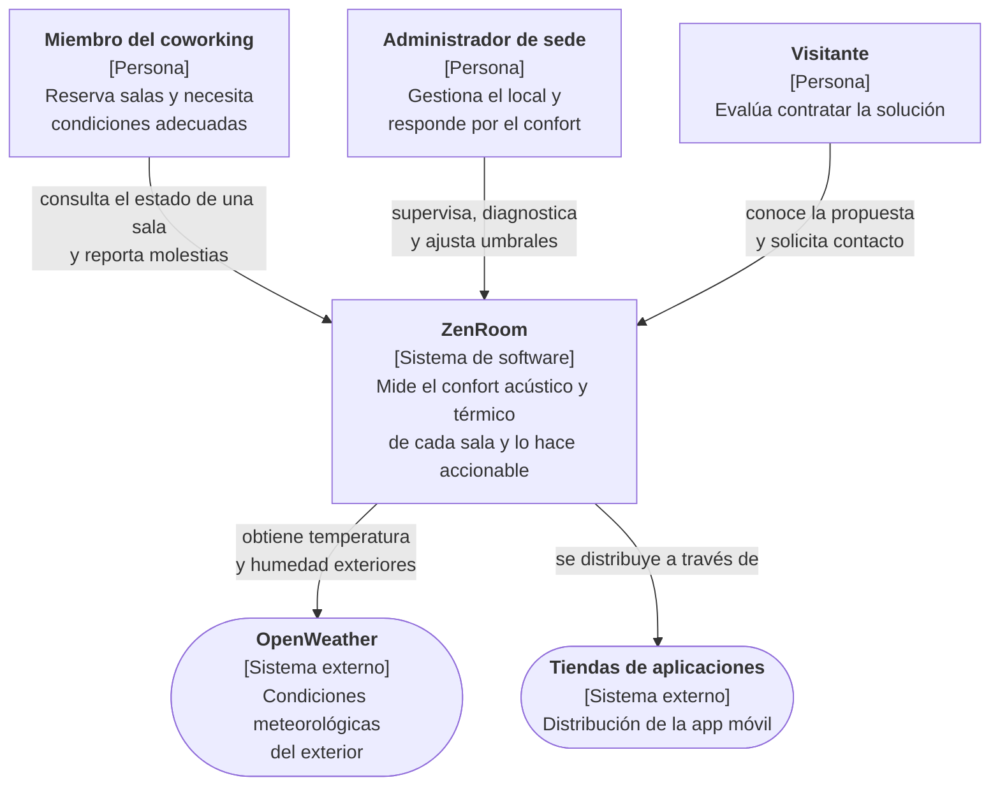
```mermaid
flowchart TB
    miembro["<b>Miembro del coworking</b><br/>[Persona]<br/>Reserva salas y necesita<br/>condiciones adecuadas"]
    admin["<b>Administrador de sede</b><br/>[Persona]<br/>Gestiona el local y<br/>responde por el confort"]
    visitante["<b>Visitante</b><br/>[Persona]<br/>Evalúa contratar la solución"]

    sistema["<b>ZenRoom</b><br/>[Sistema de software]<br/>Mide el confort acústico y térmico<br/>de cada sala y lo hace accionable"]

    ow(["<b>OpenWeather</b><br/>[Sistema externo]<br/>Condiciones meteorológicas<br/>del exterior"])
    stores(["<b>Tiendas de aplicaciones</b><br/>[Sistema externo]<br/>Distribución de la app móvil"])

    miembro -->|"consulta el estado de una sala<br/>y reporta molestias"| sistema
    admin -->|"supervisa, diagnostica<br/>y ajusta umbrales"| sistema
    visitante -->|"conoce la propuesta<br/>y solicita contacto"| sistema
    sistema -->|"obtiene temperatura<br/>y humedad exteriores"| ow
    sistema -->|"se distribuye a través de"| stores
```

Los tres actores se corresponden con los segmentos objetivo del capítulo I. El visitante no es un usuario del producto sino del Landing Page, y se incluye porque la conversión forma parte del alcance evaluado. OpenWeather es el servicio externo de terceros que la arquitectura de la solución exige consumir, y sostiene la correlación entre temperatura interior y exterior.

#### <i>**4.1.3.2. Software Architecture Context Level Diagrams.**</i>

El diagrama de contexto muestra el sistema como una única caja, rodeado de quienes lo usan y de aquello con lo que se comunica, sin revelar todavía su estructura interna.

<em>Figura 46.</em> Software Architecture Context Level Diagram.

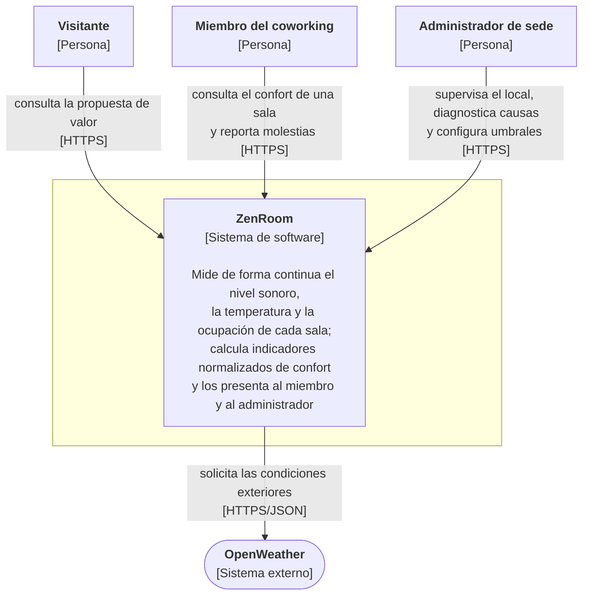
```mermaid
flowchart TB
    miembro["<b>Miembro del coworking</b><br/>[Persona]"]
    admin["<b>Administrador de sede</b><br/>[Persona]"]
    visitante["<b>Visitante</b><br/>[Persona]"]

    subgraph limite[" "]
        sistema["<b>ZenRoom</b><br/>[Sistema de software]<br/><br/>Mide de forma continua el nivel sonoro,<br/>la temperatura y la ocupación de cada sala;<br/>calcula indicadores normalizados de confort<br/>y los presenta al miembro y al administrador"]
    end

    ow(["<b>OpenWeather</b><br/>[Sistema externo]"])

    visitante -->|"consulta la propuesta de valor<br/>[HTTPS]"| sistema
    miembro -->|"consulta el confort de una sala<br/>y reporta molestias [HTTPS]"| sistema
    admin -->|"supervisa el local, diagnostica causas<br/>y configura umbrales [HTTPS]"| sistema
    sistema -->|"solicita las condiciones exteriores<br/>[HTTPS/JSON]"| ow
```

Desde fuera, el sistema es una sola cosa que responde a tres preguntas: si una sala está en condiciones ahora, por qué no lo está cuando falla, y qué hay que cambiar para que deje de fallar. El único sistema externo del que depende es el proveedor meteorológico, y esa dependencia es degradable: si no responde, la solución sigue funcionando y solo pierde la correlación con el exterior.

#### <i>**4.1.3.2. Software Architecture Container Level Diagrams.**</i>

El diagrama de containers descompone el sistema en las unidades que se despliegan por separado, con la tecnología de cada una y el protocolo por el que se comunican.

<em>Figura 47.</em> Software Architecture Container Level Diagram.

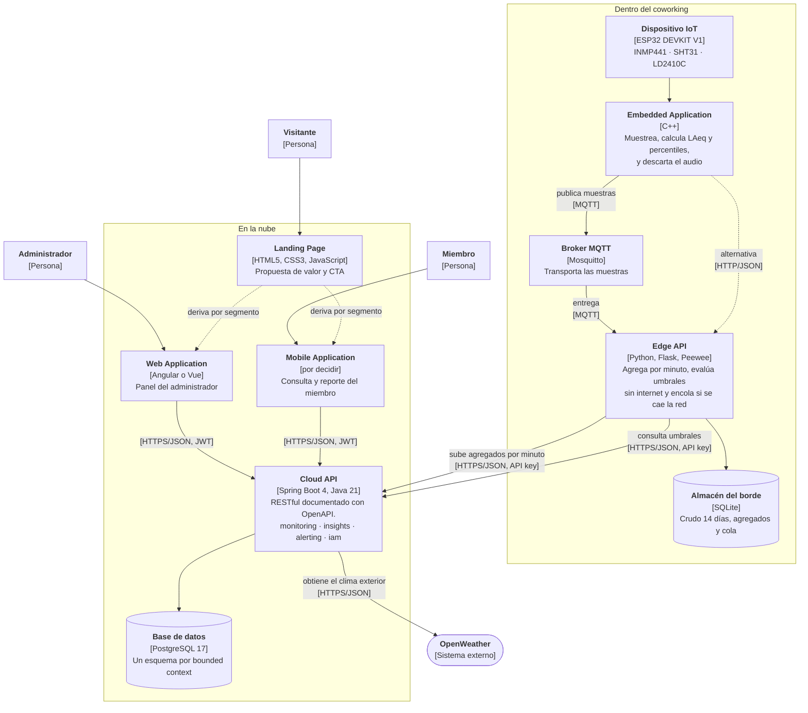
```mermaid
flowchart TB
    miembro["<b>Miembro</b><br/>[Persona]"]
    admin["<b>Administrador</b><br/>[Persona]"]
    visitante["<b>Visitante</b><br/>[Persona]"]

    subgraph local["Dentro del coworking"]
        disp["<b>Dispositivo IoT</b><br/>[ESP32 DEVKIT V1]<br/>INMP441 · SHT31 · LD2410C"]
        emb["<b>Embedded Application</b><br/>[C++]<br/>Muestrea, calcula LAeq y percentiles,<br/>y descarta el audio"]
        broker["<b>Broker MQTT</b><br/>[Mosquitto]<br/>Transporta las muestras"]
        edge["<b>Edge API</b><br/>[Python, Flask, Peewee]<br/>Agrega por minuto, evalúa umbrales<br/>sin internet y encola si se cae la red"]
        sqlite[("<b>Almacén del borde</b><br/>[SQLite]<br/>Crudo 14 días, agregados y cola")]
    end

    subgraph cloud["En la nube"]
        api["<b>Cloud API</b><br/>[Spring Boot 4, Java 21]<br/>RESTful documentado con OpenAPI.<br/>monitoring · insights · alerting · iam"]
        db[("<b>Base de datos</b><br/>[PostgreSQL 17]<br/>Un esquema por bounded context")]
        web["<b>Web Application</b><br/>[Angular o Vue]<br/>Panel del administrador"]
        mobile["<b>Mobile Application</b><br/>[por decidir]<br/>Consulta y reporte del miembro"]
        landing["<b>Landing Page</b><br/>[HTML5, CSS3, JavaScript]<br/>Propuesta de valor y CTA"]
    end

    ow(["<b>OpenWeather</b><br/>[Sistema externo]"])

    disp --> emb
    emb -->|"publica muestras<br/>[MQTT]"| broker
    broker -->|"entrega<br/>[MQTT]"| edge
    emb -.->|"alternativa<br/>[HTTP/JSON]"| edge
    edge --> sqlite
    edge -->|"sube agregados por minuto<br/>[HTTPS/JSON, API key]"| api
    edge -->|"consulta umbrales<br/>[HTTPS/JSON, API key]"| api
    api --> db
    api -->|"obtiene el clima exterior<br/>[HTTPS/JSON]"| ow
    web -->|"[HTTPS/JSON, JWT]"| api
    mobile -->|"[HTTPS/JSON, JWT]"| api
    admin --> web
    miembro --> mobile
    visitante --> landing
    landing -.->|"deriva por segmento"| web
    landing -.->|"deriva por segmento"| mobile
```

El reparto entre las tres capas responde a tres restricciones distintas. El **dispositivo** calcula los indicadores acústicos en el propio microcontrolador porque el audio no puede salir de la sala. El **Edge** agrega por minuto y evalúa los umbrales localmente, de modo que una caída de internet no deja el local sin vigilancia, y encola lo que no ha podido subir. El **cloud** guarda la historia larga y resuelve lo que exige varias salas o varias semanas, que es donde vive la analítica.

La entrega entre el Edge y el cloud es *at-least-once*: la cola reintenta hasta confirmar, de modo que el mismo minuto puede llegar repetido y el cloud lo deduplica por sala e instante. Esa decisión traslada la complejidad al servidor a cambio de que el borde pueda ser simple y tolerante a fallos.

El transporte entre el dispositivo y el Edge admite MQTT a través de Mosquitto y, como alternativa, HTTP directo. La segunda vía existe porque el simulador del dispositivo la usa y porque permite depurar sin levantar el broker.

#### <i>**4.1.3.3. Software Architecture Deployment Diagrams.**</i>

El diagrama de despliegue muestra sobre qué infraestructura se ejecuta cada container en el entorno de desarrollo y pruebas, tal como lo define la composición de contenedores del repositorio `cloud-api`.

<em>Figura 48.</em> Software Architecture Deployment Diagram del entorno de desarrollo.

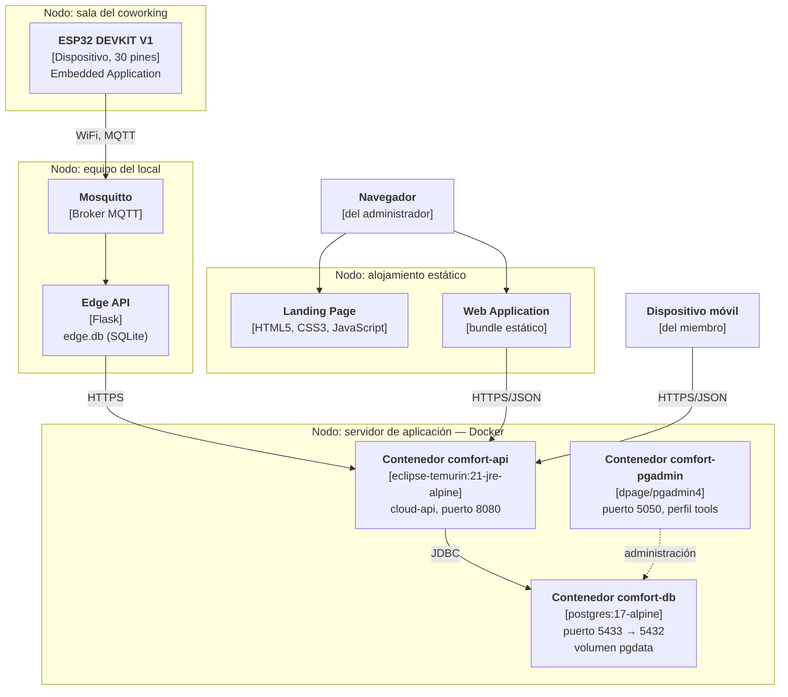
```mermaid
flowchart TB
    subgraph sala["Nodo: sala del coworking"]
        esp["<b>ESP32 DEVKIT V1</b><br/>[Dispositivo, 30 pines]<br/>Embedded Application"]
    end

    subgraph servidor["Nodo: equipo del local"]
        mosq["<b>Mosquitto</b><br/>[Broker MQTT]"]
        flask["<b>Edge API</b><br/>[Flask]<br/>edge.db (SQLite)"]
    end

    subgraph host["Nodo: servidor de aplicación — Docker"]
        cont_api["<b>Contenedor comfort-api</b><br/>[eclipse-temurin:21-jre-alpine]<br/>cloud-api, puerto 8080"]
        cont_db["<b>Contenedor comfort-db</b><br/>[postgres:17-alpine]<br/>puerto 5433 → 5432<br/>volumen pgdata"]
        cont_adm["<b>Contenedor comfort-pgadmin</b><br/>[dpage/pgadmin4]<br/>puerto 5050, perfil tools"]
    end

    subgraph cdn["Nodo: alojamiento estático"]
        land["<b>Landing Page</b><br/>[HTML5, CSS3, JavaScript]"]
        webapp["<b>Web Application</b><br/>[bundle estático]"]
    end

    nav["<b>Navegador</b><br/>[del administrador]"]
    disp_mov["<b>Dispositivo móvil</b><br/>[del miembro]"]

    esp -->|"WiFi, MQTT"| mosq
    mosq --> flask
    flask -->|"HTTPS"| cont_api
    cont_api -->|"JDBC"| cont_db
    cont_adm -.->|"administración"| cont_db
    nav --> land
    nav --> webapp
    webapp -->|"HTTPS/JSON"| cont_api
    disp_mov -->|"HTTPS/JSON"| cont_api
```

La aplicación se empaqueta con un `Dockerfile` de dos etapas: la primera compila con el JDK 21 y resuelve las dependencias en una capa separada del código fuente, de modo que un cambio en el código no obliga a volver a descargarlas; la segunda parte de una imagen de solo ejecución y copia únicamente el artefacto, ejecutándolo con un usuario sin privilegios. La memoria se limita por porcentaje del contenedor en lugar de por un valor fijo, para que la misma imagen sirva en máquinas distintas.

La base de datos expone el puerto 5433 en la máquina anfitriona para no chocar con una instalación local de PostgreSQL, y persiste en un volumen con nombre. El contenedor de administración queda tras un perfil de Docker Compose, de modo que no se levanta salvo que se pida expresamente. El arranque de la aplicación depende de que la base de datos supere su comprobación de salud, porque Flyway aplica las migraciones de los cuatro esquemas antes de que la aplicación acepte peticiones.

## 4.2. Tactical-Level Domain-Driven Design

El diseño táctico desarrolla cada bounded context por dentro: las clases que representan su modelo, la organización en capas y los diagramas que las describen. La solución aplica una arquitectura por capas con inversión de dependencias, de modo que el dominio no conoce ni la persistencia ni el transporte: declara puertos, y la infraestructura los implementa.

Cada contexto se presenta en su propia sección, en el orden de importancia establecido en el context map, y todas siguen la misma estructura: las cuatro capas, el diagrama de componentes y los diagramas de nivel de código.

### 4.2.1. Bounded Context: Alerting

Es el contexto encargado de traducir la política de confort en vigilancia accionable: administra los umbrales configurables por tipo de sala (nivel sonoro, temperatura, ocupación, PPD) y los resuelve sala por sala para que la capa Edge pueda evaluarlos sin conocer la taxonomía de tipos que maneja Monitoring. No almacena telemetría ni la interpreta; solo decide, a partir de un valor y de cuánto tiempo se sostiene, cuándo una condición deja de ser tolerable.

#### <i>**4.2.1.1. Domain Layer.**</i>

Este contexto concentra las reglas de configuración y evaluación de los umbrales que disparan alertas sobre la telemetría de las salas.

**Entities:**

* `Threshold`: Entidad raíz que representa un límite configurable para una métrica de un tipo de sala, con propiedades `id`, `roomTypeId`, `metric`, `warnValue`, `criticalValue`, `sustainedMinutes` y `enabled`. Expone comportamiento de negocio propio: `isBreachedBy(value)` determina si una medida supera el valor de aviso, e `isCriticalFor(value)` si supera el valor crítico.

**Value Objects:**

* `ThresholdMetric`: Enum cerrado de las magnitudes sobre las que se puede configurar un umbral (`LAEQ`, `L10`, `PPD`, `OCCUPIED_PCT`, `TEMP_C`), con conversión a/desde su representación persistida en minúsculas.
* `RoomProfile`: Representación mínima de una sala (código y tipo) usada exclusivamente dentro de este contexto; es la traducción anticorrupción de lo que Monitoring expone como sala.

**Aggregates:**

* En este contexto no existe un agregado envolvente distinto de la entidad raíz: `Threshold` actúa a la vez como entidad y como raíz de agregado, dado que no tiene entidades ni value objects hijos que requieran una consistencia transaccional adicional.

**Domain Services:**

* No se define ningún servicio de dominio propio; la lógica de evaluación vive en los métodos del propio `Threshold`.

**Repositories (Interfaces):**

* `ThresholdRepository`: Puerto de persistencia con `save`, `findEnabledByRoomTypeId` y `findByRoomTypeIdAndMetric`.
* `RoomProfileProvider`: Puerto de salida que declara la necesidad de conocer las salas y su tipo, sin saber que quien la satisface es Monitoring (capa anticorrupción).

**Domain Errors:**

* `AlertingError`: Catálogo de errores del contexto (`UNKNOWN_THRESHOLD_METRIC`, `INVALID_THRESHOLD_RANGE`).

#### <i>**4.2.1.2. Interface Layer.**</i>

Controllers:

* `ThresholdsController`: Expone `/api/v1/room-types/{roomTypeId}/thresholds` para configurar (`PUT /{metric}`, protegido a `ADMIN`) y listar (`GET`, `ADMIN`/`MEMBER`) los umbrales de un tipo de sala.
* `RoomThresholdsController`: Expone `GET /api/v1/room-thresholds`, resuelto por sala (no por tipo) para que el Edge pueda consultar sin conocer la taxonomía de tipos; protegido con el scope de máquina `SCOPE_thresholds:read`.

#### <i>**4.2.1.3. Application Layer.**</i>

**Command Services:**

* `ConfigureThresholdUseCaseImpl`: Crea o reajusta el umbral de una métrica para un tipo de sala; la operación es idempotente.

**Query Services:**

* `ListThresholdsUseCaseImpl`: Lista los umbrales activos de un tipo de sala.
* `ResolveRoomThresholdsUseCaseImpl`: Traduce los umbrales configurados por tipo a los umbrales aplicables por sala concreta, cacheando por tipo para no repetir consultas.

**Outbound Services (ACL):**

* `ExternalMonitoringService`: Único punto del contexto que conoce a Monitoring; implementa `RoomProfileProvider` traduciendo las salas del otro contexto a `RoomProfile`.

#### <i>**4.2.1.4. Infrastructure Layer.**</i>

**Persistence/Repositories:**

* `ThresholdRepositoryImpl`: Implementación JPA de `ThresholdRepository`, apoyada en `ThresholdEntity`, `ThresholdMapper` y `ThresholdJpaRepository`.

**Configuration:**

* `AlertingErrorCatalogConfiguration`: Publica el catálogo `AlertingError` como bean `ErrorCatalogSource` para que los códigos de error del contexto sean resolubles globalmente.

#### <i>**4.2.1.5. Bounded Context Software Architecture Component Level Diagrams.**</i>

La solución despliega un único container para los servicios en la nube —la aplicación `cloud-api`, construida con Spring Boot 4 sobre Java 21—, dentro del cual cada bounded context ocupa su propio paquete y no comparte clases con los demás. El diagrama descompone ese container en los componentes de Alerting, agrupados por la capa a la que pertenecen, e indica para cada uno su tecnología y su responsabilidad.

<em>Figura 49.</em> Diagrama de componentes del bounded context Alerting dentro del container cloud-api.

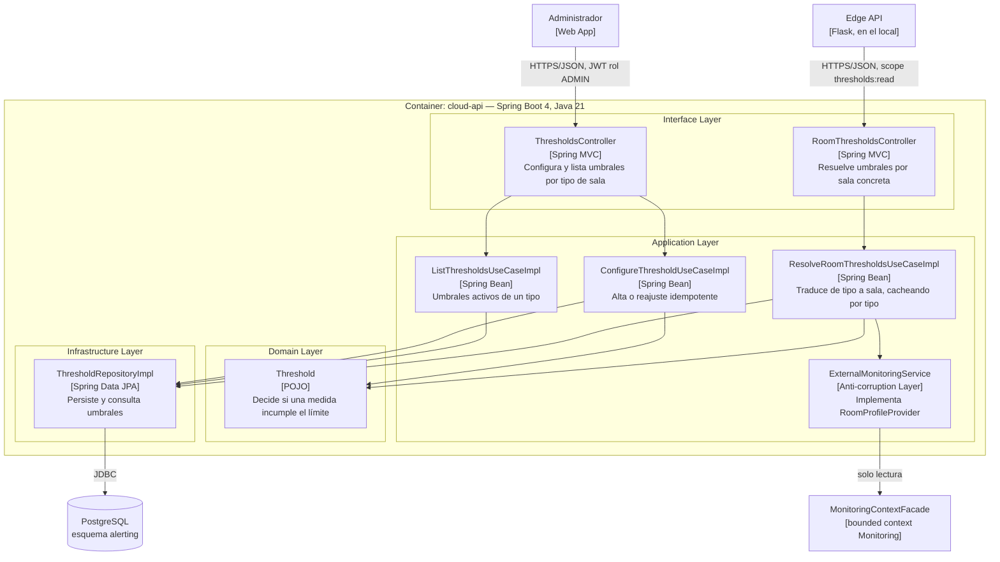
```mermaid
flowchart TB
    admin["Administrador<br/>[Web App]"]
    edge["Edge API<br/>[Flask, en el local]"]

    subgraph cont["Container: cloud-api — Spring Boot 4, Java 21"]
        direction TB
        subgraph il["Interface Layer"]
            tc["ThresholdsController<br/>[Spring MVC]<br/>Configura y lista umbrales por tipo de sala"]
            rtc["RoomThresholdsController<br/>[Spring MVC]<br/>Resuelve umbrales por sala concreta"]
        end
        subgraph al["Application Layer"]
            cfg["ConfigureThresholdUseCaseImpl<br/>[Spring Bean]<br/>Alta o reajuste idempotente"]
            lst["ListThresholdsUseCaseImpl<br/>[Spring Bean]<br/>Umbrales activos de un tipo"]
            rsv["ResolveRoomThresholdsUseCaseImpl<br/>[Spring Bean]<br/>Traduce de tipo a sala, cacheando por tipo"]
            acl["ExternalMonitoringService<br/>[Anti-corruption Layer]<br/>Implementa RoomProfileProvider"]
        end
        subgraph dl["Domain Layer"]
            th["Threshold<br/>[POJO]<br/>Decide si una medida incumple el límite"]
        end
        subgraph inf["Infrastructure Layer"]
            repo["ThresholdRepositoryImpl<br/>[Spring Data JPA]<br/>Persiste y consulta umbrales"]
        end
    end

    mon["MonitoringContextFacade<br/>[bounded context Monitoring]"]
    db[("PostgreSQL<br/>esquema alerting")]

    admin -->|"HTTPS/JSON, JWT rol ADMIN"| tc
    edge -->|"HTTPS/JSON, scope thresholds:read"| rtc
    tc --> cfg
    tc --> lst
    rtc --> rsv
    cfg --> th
    rsv --> th
    rsv --> acl
    acl -->|"solo lectura"| mon
    cfg --> repo
    lst --> repo
    rsv --> repo
    repo -->|"JDBC"| db
```

El contexto expone dos controladores porque atiende a dos consumidores con necesidades distintas. El administrador configura umbrales **por tipo de sala**, que es como se razona el negocio: todas las cabinas de llamadas comparten límite. El Edge, en cambio, evalúa **por sala concreta** y no conoce la taxonomía de tipos, de modo que `ResolveRoomThresholdsUseCaseImpl` hace la traducción y cachea por tipo para no repetir la consulta una vez por sala. `ExternalMonitoringService` es el único componente que conoce la existencia de Monitoring, y lo hace a través de su fachada, nunca de sus repositorios.

#### <i>**4.2.1.6. Bounded Context Software Architecture Code Level Diagrams.**</i>

El nivel de código detalla la implementación del contexto en dos diagramas: el de clases del Domain Layer, que describe el modelo y sus relaciones, y el de base de datos, que describe cómo se persiste.

##### <i>**4.2.1.6.1. Bounded Context Domain Layer Class Diagrams.**</i>

El diagrama recoge las clases del Domain Layer de Alerting, con sus atributos, sus métodos y el ámbito de cada miembro. La entidad `Threshold` concentra el comportamiento —decidir si una medida incumple— y el resto del modelo son value objects, comandos y los puertos que el dominio declara para no depender de la infraestructura ni de otros contextos.

<em>Figura 50.</em> Diagrama de clases del Domain Layer del bounded context Alerting.

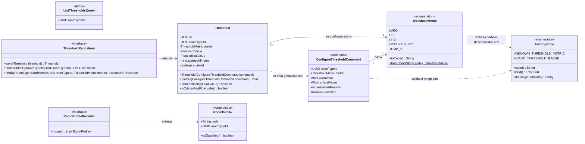
```mermaid
classDiagram
    direction LR

    class Threshold {
        -UUID id
        -UUID roomTypeId
        -ThresholdMetric metric
        -float warnValue
        -Float criticalValue
        -int sustainedMinutes
        -boolean enabled
        +Threshold(ConfigureThresholdCommand command)
        +handle(ConfigureThresholdCommand command) void
        +isBreachedBy(Float value) boolean
        +isCriticalFor(Float value) boolean
    }

    class ThresholdMetric {
        <<enumeration>>
        LAEQ
        L10
        PPD
        OCCUPIED_PCT
        TEMP_C
        +toCode() String
        +fromCode(String code)$ ThresholdMetric
    }

    class RoomProfile {
        <<value object>>
        +String code
        +UUID roomTypeId
        +isClassified() boolean
    }

    class ConfigureThresholdCommand {
        <<command>>
        +UUID roomTypeId
        +ThresholdMetric metric
        +float warnValue
        +Float criticalValue
        +int sustainedMinutes
        +boolean enabled
    }

    class ListThresholdsQuery {
        <<query>>
        +UUID roomTypeId
    }

    class AlertingError {
        <<enumeration>>
        UNKNOWN_THRESHOLD_METRIC
        INVALID_THRESHOLD_RANGE
        +code() String
        +kind() ErrorKind
        +messageTemplate() String
    }

    class ThresholdRepository {
        <<interface>>
        +save(Threshold threshold) Threshold
        +findEnabledByRoomTypeId(UUID roomTypeId) List~Threshold~
        +findByRoomTypeIdAndMetric(UUID roomTypeId, ThresholdMetric metric) Optional~Threshold~
    }

    class RoomProfileProvider {
        <<interface>>
        +rooms() List~RoomProfile~
    }

    Threshold "0..*" --> "1" ThresholdMetric : se configura sobre
    ConfigureThresholdCommand "1" --> "1" ThresholdMetric : indica
    Threshold ..> ConfigureThresholdCommand : se crea y reajusta con
    ConfigureThresholdCommand ..> AlertingError : valida el rango con
    ThresholdMetric ..> AlertingError : rechaza códigos desconocidos con
    ThresholdRepository ..> Threshold : persiste
    RoomProfileProvider ..> RoomProfile : entrega
```

`Threshold` es a la vez entidad y raíz de agregado: no contiene entidades hijas, y su identidad y su tipo de sala son inmutables, porque cambiar cualquiera de los dos significa que el umbral es otro. Los métodos `isBreachedBy` e `isCriticalFor` responden únicamente por el valor; la comprobación de que el incumplimiento se sostenga durante `sustainedMinutes` no vive en la entidad, ya que un umbral conoce su propio límite pero no la serie temporal que lo pone a prueba.

Los dos puertos de salida separan responsabilidades distintas. `ThresholdRepository` abstrae la persistencia del propio contexto. `RoomProfileProvider`, en cambio, declara una necesidad que satisface otro contexto: Alerting necesita saber qué salas existen y de qué tipo son, y lo expresa con `RoomProfile`, un vocabulario reducido a lo que aquí significa algo. La sala de Monitoring tiene aforo, planta y superficie; ninguno de esos atributos interviene en la evaluación de un umbral, y copiarlos convertiría la capa anticorrupción en un trámite.

##### <i>**4.2.1.6.2. Bounded Context Database Design Diagram.**</i>

El bounded context persiste en el esquema Alerting de PostgreSQL, con una única tabla. Los umbrales viven en la base de datos y no en el código para que la administración pueda ajustarlos desde la aplicación web sin volver a desplegar el servicio.

<em>Figura 51.</em> Diagrama de base de datos del bounded context Alerting.

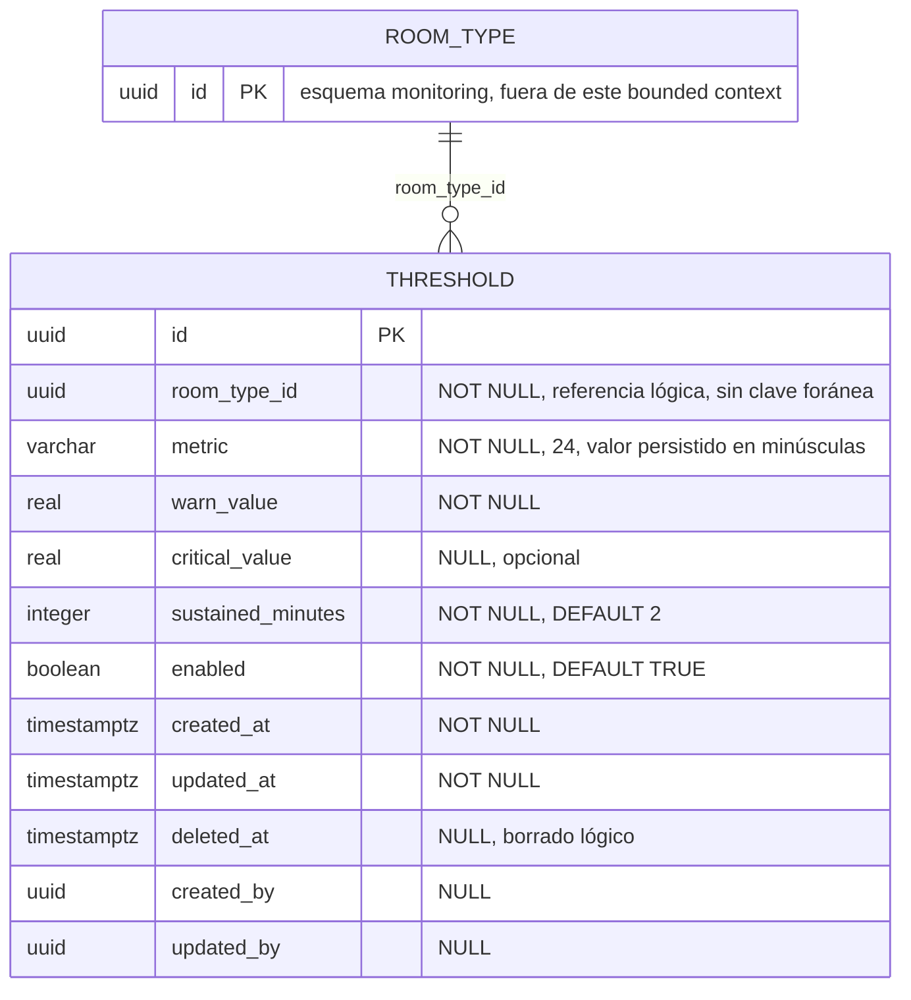
```mermaid
erDiagram
    ROOM_TYPE ||--o{ THRESHOLD : "room_type_id"

    ROOM_TYPE {
        uuid id PK "esquema monitoring, fuera de este bounded context"
    }

    THRESHOLD {
        uuid id PK
        uuid room_type_id "NOT NULL, referencia lógica, sin clave foránea"
        varchar metric "NOT NULL, 24, valor persistido en minúsculas"
        real warn_value "NOT NULL"
        real critical_value "NULL, opcional"
        integer sustained_minutes "NOT NULL, DEFAULT 2"
        boolean enabled "NOT NULL, DEFAULT TRUE"
        timestamptz created_at "NOT NULL"
        timestamptz updated_at "NOT NULL"
        timestamptz deleted_at "NULL, borrado lógico"
        uuid created_by "NULL"
        uuid updated_by "NULL"
    }
```

La columna `room_type_id` es la única referencia de la tabla y **no lleva clave foránea**, a diferencia del resto del modelo de datos de la solución. La tabla a la que apunta, `room_type`, pertenece al esquema Monitoring, y declarar una restricción física entre ambos esquemas ataría los dos bounded contexts a nivel de base de datos: cualquier cambio en la estructura de salas obligaría a coordinar un despliegue conjunto, y el límite entre contextos dejaría de ser real. La integridad se mantiene en la capa de aplicación, a través del puerto `RoomProfileProvider` descrito en el Domain Layer, que es la única vía por la que este contexto conoce las salas.

El par `room_type_id` y `metric` identifica un umbral de forma única en la práctica: el caso de uso de configuración es idempotente y reajusta el umbral existente en lugar de crear uno nuevo. Las columnas de auditoría —`created_at`, `updated_at`, `deleted_at`, `created_by` y `updated_by`— las gestiona Spring Data JPA Auditing, razón por la cual no llevan valor por defecto en el esquema, y `deleted_at` implementa el borrado lógico que preserva el histórico de configuración.

### 4.2.2. Bounded Context: IAM

Gestiona la identidad y el acceso de los dos tipos de consumidores de la plataforma: las personas (administradores y miembros del coworking, autenticados por email y contraseña con emisión de JWT) y las máquinas (el Edge de cada local, autenticado mediante API keys con *scopes* como `readings:write` o `thresholds:read`). Es el contexto que hace cumplir la separación de responsabilidades entre quien configura el sistema y quien únicamente sube o consume telemetría.

#### <i>**4.2.2.1. Domain Layer.**</i>

Contiene las reglas de identidad, autenticación y credenciales de acceso, tanto para personas como para máquinas (el Edge).

**Aggregates:**

* `User`: Representa una persona con acceso al sistema, con `id`, `email`, `passwordHash`, `displayName`, `active` y `roles`. Encapsula `ensureCanSignIn()`, que lanza error de negocio si la cuenta está desactivada.
* `ApiCredential`: Representa la credencial de una máquina (el Edge), con `id`, `code`, `tokenHash`, `active` y `scopes`. Encapsula `ensureUsable()`, que rechaza credenciales revocadas.

**Value Objects:**

* `Role`: Enum de lo que puede hacer una persona (`MEMBER`, `ADMIN`).
* `Scope`: Enum de lo que puede hacer una máquina (`READINGS_WRITE`, `THRESHOLDS_READ`).
* `IssuedToken`: Token recién emitido junto a su tiempo de expiración en segundos.

**Domain Services (Ports out):**

* `PasswordHasher`: Contrato para cifrar y comparar contraseñas en tiempo constante.
* `ApiKeyHasher`: Contrato para generar claves de máquina y reducirlas a un hash determinista (indexable, sin sal).
* `TokenIssuer`: Contrato para emitir la credencial (JWT) con la que un usuario demuestra su identidad en peticiones subsecuentes.

**Repositories (Interfaces):**

* `UserRepository`: `save`, `findById`, `findByEmail`, `existsByEmail`.
* `ApiCredentialRepository`: `save`, `findByTokenHash`, `existsByCode`.

**Domain Errors:**

* `IamError`: Catálogo de errores (`EMAIL_ALREADY_USED`, `USER_NOT_FOUND`, `INVALID_CREDENTIALS`, `ACCOUNT_DISABLED`, `CREDENTIAL_CODE_ALREADY_USED`, `CREDENTIAL_REVOKED`, `UNKNOWN_SCOPE`).

#### <i>**4.2.2.2. Interface Layer.**</i>

**Controllers:**

* `AuthController`: Expone `POST /api/v1/auth/login`; el mismo error de credenciales cubre email inexistente o contraseña incorrecta, para no revelar qué cuentas existen.
* `UsersController`: Expone `POST /api/v1/users` para el registro público, que siempre crea la cuenta con rol `MEMBER`.
* `CredentialsController`: Expone `POST /api/v1/credentials`, protegido a `ADMIN`, para emitir credenciales de máquina; la clave en claro se devuelve una única vez.

#### <i>**4.2.2.3. Application Layer.**</i>

**Command Services:**

* `RegisterUserUseCaseImpl`: Registra una cuenta, validando unicidad de correo y delegando el hash de la contraseña.
* `CreateApiCredentialUseCaseImpl`: Genera y persiste una credencial de máquina con sus scopes.

**Query/Authentication Services:**

* `AuthenticateUserUseCaseImpl`: Valida email y contraseña y emite el `IssuedToken` (login).
* `AuthenticateApiKeyUseCaseImpl`: Resuelve el dueño de una API key a partir de su hash, filtrando credenciales inactivas.

#### <i>**4.2.2.4. Infrastructure Layer.**</i>

**Persistence/Repositories:**

* `UserRepositoryImpl` / `ApiCredentialRepositoryImpl`: Implementaciones JPA sobre `UserEntity`/`ApiCredentialEntity`, con sus respectivos mappers y repositorios Spring Data.

**External/Security Services:**

* `BCryptPasswordHasher`: Implementación de `PasswordHasher` sobre BCrypt.
* `Sha256ApiKeyHasher`: Implementación determinista de `ApiKeyHasher` para claves de máquina.
* `JwtTokenIssuer`: Implementación de `TokenIssuer`, emite JWT firmados (RS256) con claims de email, nombre y roles.
* `ApiKeyAuthenticationFilter`, `SecurityConfiguration`, `JwtConfiguration`: Configuración de Spring Security para autenticar tanto usuarios (JWT) como máquinas (API key) sobre la misma cadena de filtros.

**Configuration:**

* `IamErrorCatalogConfiguration`: Publica el catálogo `IamError`.

#### <i>**4.2.2.5. Bounded Context Software Architecture Component Level Diagrams.**</i>

La solución despliega un único container para los servicios en la nube —la aplicación `cloud-api`, construida con Spring Boot 4 sobre Java 21—, dentro del cual cada bounded context ocupa su propio paquete y no comparte clases con los demás. El diagrama descompone ese container en los componentes de IAM, agrupados por la capa a la que pertenecen, e indica para cada uno su tecnología y su responsabilidad.

<em>Figura 52.</em> Diagrama de componentes del bounded context IAM dentro del container cloud-api.

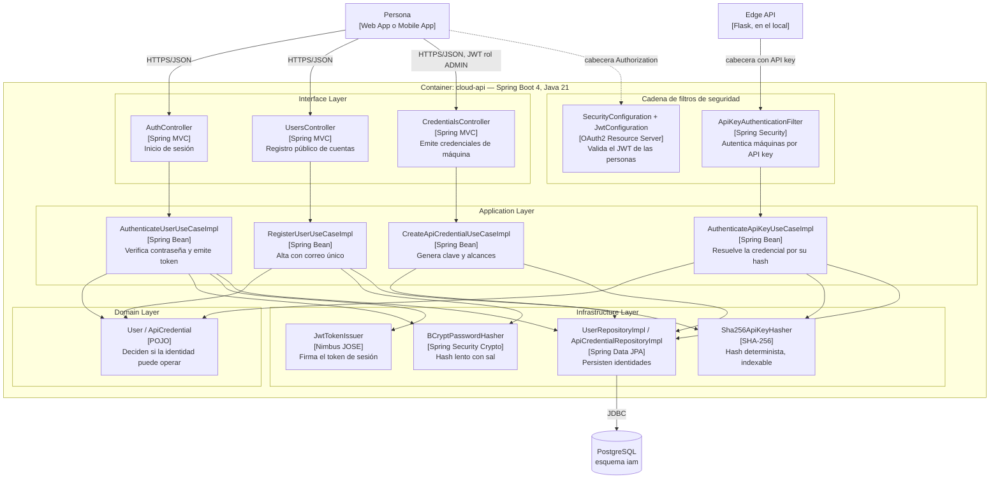
```mermaid
flowchart TB
    persona["Persona<br/>[Web App o Mobile App]"]
    maquina["Edge API<br/>[Flask, en el local]"]

    subgraph cont["Container: cloud-api — Spring Boot 4, Java 21"]
        direction TB
        subgraph sec["Cadena de filtros de seguridad"]
            filt["ApiKeyAuthenticationFilter<br/>[Spring Security]<br/>Autentica máquinas por API key"]
            cfgsec["SecurityConfiguration + JwtConfiguration<br/>[OAuth2 Resource Server]<br/>Valida el JWT de las personas"]
        end
        subgraph il["Interface Layer"]
            auth["AuthController<br/>[Spring MVC]<br/>Inicio de sesión"]
            users["UsersController<br/>[Spring MVC]<br/>Registro público de cuentas"]
            creds["CredentialsController<br/>[Spring MVC]<br/>Emite credenciales de máquina"]
        end
        subgraph al["Application Layer"]
            reg["RegisterUserUseCaseImpl<br/>[Spring Bean]<br/>Alta con correo único"]
            autu["AuthenticateUserUseCaseImpl<br/>[Spring Bean]<br/>Verifica contraseña y emite token"]
            autk["AuthenticateApiKeyUseCaseImpl<br/>[Spring Bean]<br/>Resuelve la credencial por su hash"]
            crea["CreateApiCredentialUseCaseImpl<br/>[Spring Bean]<br/>Genera clave y alcances"]
        end
        subgraph dl["Domain Layer"]
            usr["User / ApiCredential<br/>[POJO]<br/>Deciden si la identidad puede operar"]
        end
        subgraph inf["Infrastructure Layer"]
            bcrypt["BCryptPasswordHasher<br/>[Spring Security Crypto]<br/>Hash lento con sal"]
            sha["Sha256ApiKeyHasher<br/>[SHA-256]<br/>Hash determinista, indexable"]
            jwt["JwtTokenIssuer<br/>[Nimbus JOSE]<br/>Firma el token de sesión"]
            repos["UserRepositoryImpl / ApiCredentialRepositoryImpl<br/>[Spring Data JPA]<br/>Persisten identidades"]
        end
    end

    db[("PostgreSQL<br/>esquema iam")]

    persona -->|"HTTPS/JSON"| auth
    persona -->|"HTTPS/JSON"| users
    persona -->|"HTTPS/JSON, JWT rol ADMIN"| creds
    maquina -->|"cabecera con API key"| filt
    persona -.->|"cabecera Authorization"| cfgsec
    filt --> autk
    auth --> autu
    users --> reg
    creds --> crea
    reg --> usr
    autu --> usr
    autk --> usr
    reg --> bcrypt
    autu --> bcrypt
    autu --> jwt
    crea --> sha
    autk --> sha
    reg --> repos
    autu --> repos
    autk --> repos
    crea --> repos
    repos -->|"JDBC"| db
```

Los dos caminos de autenticación conviven en la misma cadena de filtros y terminan en el mismo modelo de dominio, pero no comparten mecanismo de verificación. La persona presenta correo y contraseña una vez y recibe un token firmado que acompaña a las peticiones siguientes; la máquina presenta su clave en cada petición, y por eso su hash debe ser determinista e indexable. Esa asimetría es la que justifica que `BCryptPasswordHasher` y `Sha256ApiKeyHasher` sean componentes distintos y no dos usos de uno solo.

#### <i>**4.2.2.6. Bounded Context Software Architecture Code Level Diagrams.**</i>

El nivel de código detalla la implementación del contexto en dos diagramas: el de clases del Domain Layer, que describe el modelo y sus relaciones, y el de base de datos, que describe cómo se persiste.

##### <i>**4.2.2.6.1. Bounded Context Domain Layer Class Diagrams.**</i>

El Domain Layer de IAM modela dos identidades que el sistema trata por separado: la persona, representada por `User`, y la máquina, representada por `ApiCredential`. Cada una tiene su propio catálogo de permisos —`Role` para lo que puede hacer una persona, `Scope` para lo que puede hacer el Edge— y su propio mecanismo de verificación, declarado como puerto para que el dominio no dependa de una biblioteca criptográfica concreta.

<em>Figura 53.</em> Diagrama de clases del Domain Layer del bounded context IAM.

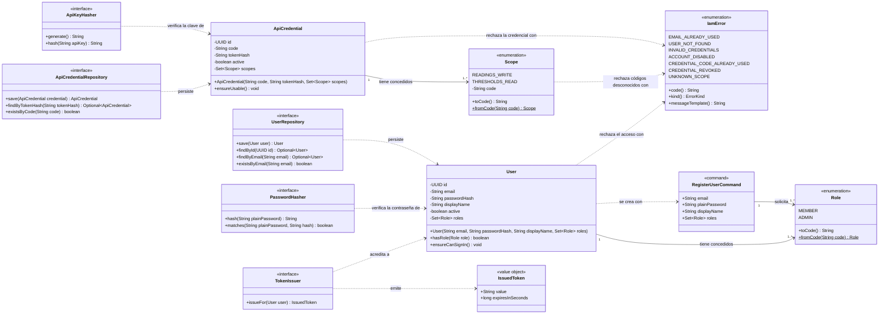
```mermaid
classDiagram
    direction LR

    class User {
        -UUID id
        -String email
        -String passwordHash
        -String displayName
        -boolean active
        -Set~Role~ roles
        +User(String email, String passwordHash, String displayName, Set~Role~ roles)
        +hasRole(Role role) boolean
        +ensureCanSignIn() void
    }

    class ApiCredential {
        -UUID id
        -String code
        -String tokenHash
        -boolean active
        -Set~Scope~ scopes
        +ApiCredential(String code, String tokenHash, Set~Scope~ scopes)
        +ensureUsable() void
    }

    class Role {
        <<enumeration>>
        MEMBER
        ADMIN
        +toCode() String
        +fromCode(String code)$ Role
    }

    class Scope {
        <<enumeration>>
        READINGS_WRITE
        THRESHOLDS_READ
        -String code
        +toCode() String
        +fromCode(String code)$ Scope
    }

    class IssuedToken {
        <<value object>>
        +String value
        +long expiresInSeconds
    }

    class RegisterUserCommand {
        <<command>>
        +String email
        +String plainPassword
        +String displayName
        +Set~Role~ roles
    }

    class IamError {
        <<enumeration>>
        EMAIL_ALREADY_USED
        USER_NOT_FOUND
        INVALID_CREDENTIALS
        ACCOUNT_DISABLED
        CREDENTIAL_CODE_ALREADY_USED
        CREDENTIAL_REVOKED
        UNKNOWN_SCOPE
        +code() String
        +kind() ErrorKind
        +messageTemplate() String
    }

    class UserRepository {
        <<interface>>
        +save(User user) User
        +findById(UUID id) Optional~User~
        +findByEmail(String email) Optional~User~
        +existsByEmail(String email) boolean
    }

    class ApiCredentialRepository {
        <<interface>>
        +save(ApiCredential credential) ApiCredential
        +findByTokenHash(String tokenHash) Optional~ApiCredential~
        +existsByCode(String code) boolean
    }

    class PasswordHasher {
        <<interface>>
        +hash(String plainPassword) String
        +matches(String plainPassword, String hash) boolean
    }

    class ApiKeyHasher {
        <<interface>>
        +generate() String
        +hash(String apiKey) String
    }

    class TokenIssuer {
        <<interface>>
        +issueFor(User user) IssuedToken
    }

    User "1" --> "1..*" Role : tiene concedidos
    ApiCredential "1" --> "1..*" Scope : tiene concedidos
    RegisterUserCommand "1" --> "1..*" Role : solicita
    User ..> RegisterUserCommand : se crea con
    User ..> IamError : rechaza el acceso con
    ApiCredential ..> IamError : rechaza la credencial con
    Scope ..> IamError : rechaza códigos desconocidos con
    TokenIssuer ..> IssuedToken : emite
    TokenIssuer ..> User : acredita a
    UserRepository ..> User : persiste
    ApiCredentialRepository ..> ApiCredential : persiste
    PasswordHasher ..> User : verifica la contraseña de
    ApiKeyHasher ..> ApiCredential : verifica la clave de
```

La separación entre persona y máquina no es cosmética: determina cómo se guarda cada secreto. La contraseña de una persona se cifra con un algoritmo lento y con sal, de modo que dos cuentas con la misma contraseña producen hashes distintos; la clave del Edge, en cambio, se reduce a un hash determinista, porque el sistema necesita localizar la credencial a partir de la clave que llega en cada petición, y eso exige una columna indexable. Esa diferencia justifica que existan dos puertos, `PasswordHasher` y `ApiKeyHasher`, en lugar de uno solo.

Ambos agregados guardan su identificador y su código de forma inmutable y exponen un método que decide si la credencial sirve: `ensureCanSignIn` en el caso de la persona y `ensureUsable` en el de la máquina. La comprobación vive en el dominio y no en la capa de seguridad para que una cuenta desactivada o una credencial revocada se rechacen por la misma regla, con independencia de por dónde llegue la petición.

##### <i>**4.2.2.6.2. Bounded Context Database Design Diagram.**</i>

El bounded context persiste en el esquema IAM, con cuatro tablas: una por cada identidad y una tabla de unión por cada catálogo de permisos, ya que tanto los roles de una persona como los alcances de una máquina son conjuntos.

<em>Figura 54.</em> Diagrama de base de datos del bounded context IAM.

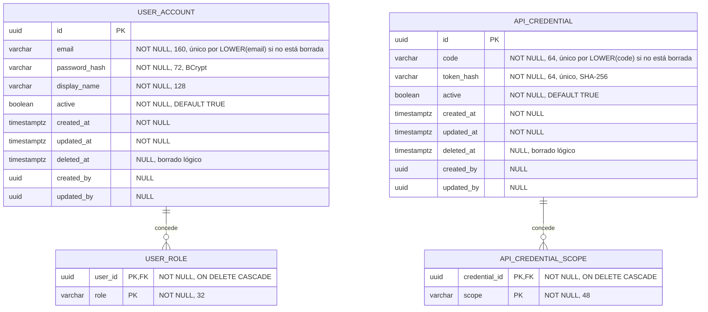
```mermaid
erDiagram
    USER_ACCOUNT ||--o{ USER_ROLE : "concede"
    API_CREDENTIAL ||--o{ API_CREDENTIAL_SCOPE : "concede"

    USER_ACCOUNT {
        uuid id PK
        varchar email "NOT NULL, 160, único por LOWER(email) si no está borrada"
        varchar password_hash "NOT NULL, 72, BCrypt"
        varchar display_name "NOT NULL, 128"
        boolean active "NOT NULL, DEFAULT TRUE"
        timestamptz created_at "NOT NULL"
        timestamptz updated_at "NOT NULL"
        timestamptz deleted_at "NULL, borrado lógico"
        uuid created_by "NULL"
        uuid updated_by "NULL"
    }

    USER_ROLE {
        uuid user_id PK, FK "NOT NULL, ON DELETE CASCADE"
        varchar role PK "NOT NULL, 32"
    }

    API_CREDENTIAL {
        uuid id PK
        varchar code "NOT NULL, 64, único por LOWER(code) si no está borrada"
        varchar token_hash "NOT NULL, 64, único, SHA-256"
        boolean active "NOT NULL, DEFAULT TRUE"
        timestamptz created_at "NOT NULL"
        timestamptz updated_at "NOT NULL"
        timestamptz deleted_at "NULL, borrado lógico"
        uuid created_by "NULL"
        uuid updated_by "NULL"
    }

    API_CREDENTIAL_SCOPE {
        uuid credential_id PK, FK "NOT NULL, ON DELETE CASCADE"
        varchar scope PK "NOT NULL, 48"
    }
```

Las dos tablas de unión llevan clave primaria compuesta —`(user_id, role)` y `(credential_id, scope)`—, lo que impide conceder dos veces el mismo permiso sin necesidad de una restricción adicional, y se borran en cascada con su identidad: un rol sin persona a la que pertenecer no significa nada.

Los índices únicos son parciales y merecen atención. `ux_user_account_email` se declara sobre `LOWER(email)` y solo sobre las filas cuyo `deleted_at` es nulo: el correo no distingue mayúsculas a efectos de identidad, y una cuenta dada de baja no debe bloquear el alta de otra con el mismo correo. `ux_api_credential_token`, en cambio, es total y sin condición, porque el hash del token se consulta en cada petición del Edge y debe resolverse por índice aunque la credencial esté revocada; solo así el rechazo de una credencial revocada puede explicarse con el error correspondiente en lugar de confundirse con una clave inexistente.

El tamaño de `password_hash` está fijado en 72 caracteres, que es la longitud de un hash BCrypt, y el de `token_hash` en 64, la de un SHA-256 en hexadecimal. Ninguna de las dos columnas guarda el secreto en claro: la clave de máquina se muestra una sola vez, en la respuesta a su creación, y no vuelve a ser recuperable.

### 4.2.3. Bounded Context: Insights

Es el contexto analítico: no captura telemetría, sino que la recibe ya calculada desde Monitoring a través de una capa anticorrupción y le aplica estadística (correlación de Pearson, regresión lineal, detección de anomalías por z-score) para responder preguntas que requieren historia larga, como si el ruido de una sala proviene de la ocupación o del ambiente, o si su temperatura sigue a la del exterior por un mal aislamiento. Complementa esa serie con observaciones periódicas del clima externo (OpenWeather) para poder correlacionar interior y exterior, y siempre acompaña cada conclusión con el tamaño de muestra que la respalda, rechazando períodos con datos insuficientes.

#### <i>**4.2.3.1. Domain Layer.**</i>

Este contexto no gestiona telemetría cruda; consume series ya calculadas y produce conclusiones estadísticas sobre el confort de una sala.

**Aggregates:**

* `WeatherObservation`: Medición histórica del clima exterior, con `observedAt`, `tempC`, `rhPct` y `condition`.

**Value Objects:**

* `ReadingPoint`: Un punto reducido de la serie temporal de una sala (`ts`, `laeq`, `backgroundNoise`, `tempC`, `ppd`, `occupiedPct`); es el vocabulario propio del contexto, independiente del agregado `RoomReading` de Monitoring.
* `Correlation`: Coeficiente de Pearson entre dos series junto al tamaño de muestra, con `isReliable()` y `strength()` (negligible/weak/moderate/strong).
* `Trend`: Recta ajustada por mínimos cuadrados (`slopePerHour`, `rSquared`, `sampleSize`), con criterio propio de fiabilidad.
* `RoomAnalytics`: Resultado agregado del análisis de una sala en un periodo (ruido vs. ocupación, deriva térmica, interior vs. exterior, anomalías de ruido).

**Domain Services:**

* `ComfortAnalyticsService`: Servicio de dominio puro (sin persistencia) que calcula correlaciones de Pearson, regresión lineal simple y detección de anomalías por z-score sobre una serie de `ReadingPoint`.

**Repositories/Ports (Interfaces):**

* `WeatherObservationRepository`: Persistencia del histórico de clima exterior.
* `ReadingSeriesProvider`: Puerto de salida (ACL) que declara la necesidad de series de lecturas, sin saber que las provee Monitoring.
* `OutdoorWeatherProvider`: Puerto de salida (ACL) que declara la necesidad del clima actual, sin saber que lo sirve OpenWeather.

**Domain Errors:**

* `InsightsError`: Catálogo de errores (`RANGE_INVERTED`, `RANGE_TOO_SHORT`).

#### <i>**4.2.3.2. Interface Layer.**</i>

**Controllers:**

* `RoomAnalyticsController`: Expone `GET /api/v1/insights/rooms/{roomId}`, con rango `from`/`to` obligatorio; responde `422` cuando no hay suficientes datos para un análisis confiable.

#### <i>**4.2.3.3. Application Layer.**</i>

**Query Services:**

* `AnalyzeRoomUseCaseImpl`: Orquesta la obtención de la serie de lecturas y del clima exterior, y delega el cálculo estadístico en `ComfortAnalyticsService`; rechaza rangos con muestra insuficiente.

**Command/Scheduled Services:**

* `SampleOutdoorWeatherUseCaseImpl`: Toma una muestra puntual del proveedor de clima y la persiste, construyendo el histórico necesario para correlacionar hacia atrás.

**Outbound Services (ACL):**

* `ExternalMonitoringService`: Único punto del contexto que conoce a Monitoring; implementa `ReadingSeriesProvider` traduciendo `RoomReading` a `ReadingPoint`.

#### <i>**4.2.3.4. Infrastructure Layer.**</i>

**Persistence/Repositories:**

* `WeatherObservationRepositoryImpl`: Implementación JPA de `WeatherObservationRepository`.

**External Services:**

* `OpenWeatherAdapter` / `OpenWeatherClient`: Implementan `OutdoorWeatherProvider` consumiendo la API de OpenWeather, con DTOs de respuesta (`CurrentWeatherResponse`, `MainResponse`, `WeatherResponse`).
* `OutdoorWeatherSampler`: Tarea programada que invoca periódicamente `SampleOutdoorWeatherUseCase`.

**Configuration:**

* `InsightsErrorCatalogConfiguration`: Publica el catálogo `InsightsError`.

#### <i>**4.2.3.5. Bounded Context Software Architecture Component Level Diagrams.**</i>

La solución despliega un único container para los servicios en la nube —la aplicación `cloud-api`, construida con Spring Boot 4 sobre Java 21—, dentro del cual cada bounded context ocupa su propio paquete y no comparte clases con los demás. El diagrama descompone ese container en los componentes de Insights, agrupados por la capa a la que pertenecen, e indica para cada uno su tecnología y su responsabilidad.

<em>Figura 55.</em> Diagrama de componentes del bounded context Insights dentro del container cloud-api.

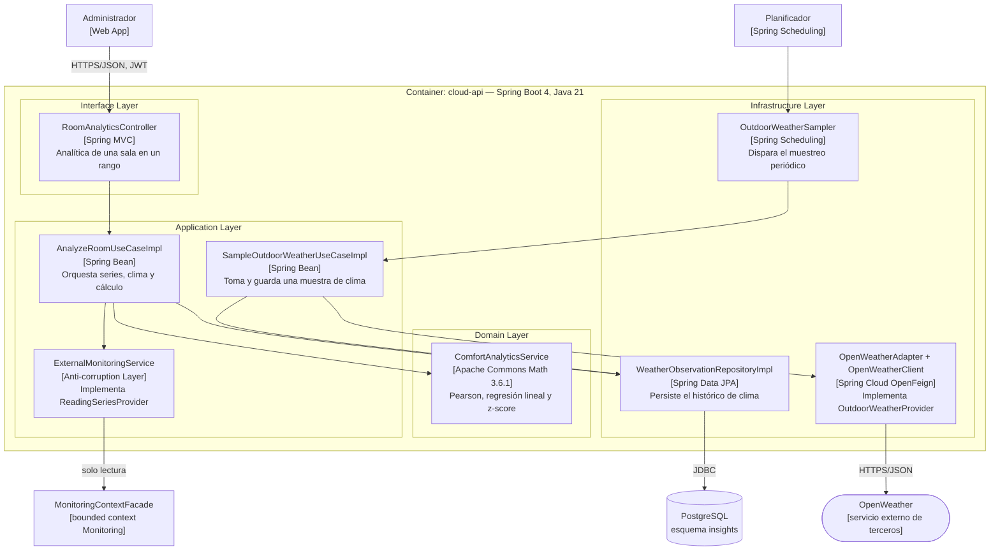
```mermaid
flowchart TB
    admin["Administrador<br/>[Web App]"]
    reloj["Planificador<br/>[Spring Scheduling]"]

    subgraph cont["Container: cloud-api — Spring Boot 4, Java 21"]
        direction TB
        subgraph il["Interface Layer"]
            rac["RoomAnalyticsController<br/>[Spring MVC]<br/>Analítica de una sala en un rango"]
        end
        subgraph al["Application Layer"]
            ana["AnalyzeRoomUseCaseImpl<br/>[Spring Bean]<br/>Orquesta series, clima y cálculo"]
            smp["SampleOutdoorWeatherUseCaseImpl<br/>[Spring Bean]<br/>Toma y guarda una muestra de clima"]
            acl["ExternalMonitoringService<br/>[Anti-corruption Layer]<br/>Implementa ReadingSeriesProvider"]
        end
        subgraph dl["Domain Layer"]
            cas["ComfortAnalyticsService<br/>[Apache Commons Math 3.6.1]<br/>Pearson, regresión lineal y z-score"]
        end
        subgraph inf["Infrastructure Layer"]
            sampler["OutdoorWeatherSampler<br/>[Spring Scheduling]<br/>Dispara el muestreo periódico"]
            ow["OpenWeatherAdapter + OpenWeatherClient<br/>[Spring Cloud OpenFeign]<br/>Implementa OutdoorWeatherProvider"]
            repo["WeatherObservationRepositoryImpl<br/>[Spring Data JPA]<br/>Persiste el histórico de clima"]
        end
    end

    mon["MonitoringContextFacade<br/>[bounded context Monitoring]"]
    db[("PostgreSQL<br/>esquema insights")]
    api(["OpenWeather<br/>[servicio externo de terceros]"])

    admin -->|"HTTPS/JSON, JWT"| rac
    reloj --> sampler
    rac --> ana
    sampler --> smp
    ana --> acl
    acl -->|"solo lectura"| mon
    ana --> cas
    ana --> repo
    smp --> ow
    smp --> repo
    ow -->|"HTTPS/JSON"| api
    repo -->|"JDBC"| db
```

Este contexto es el que consume el **servicio externo de terceros** exigido por la arquitectura de la solución. La correlación entre temperatura interior y exterior solo puede calcularse hacia atrás si el histórico exterior existe, y OpenWeather sirve el clima actual, no el pasado; por eso `OutdoorWeatherSampler` acumula observaciones periódicamente en lugar de consultarlas en el momento del análisis. Si el servicio externo no responde, la analítica se degrada de forma controlada: el resto de indicadores se calcula igual y solo la correlación interior-exterior se declara sin datos suficientes.

#### <i>**4.2.3.6. Bounded Context Software Architecture Code Level Diagrams.**</i>

El nivel de código detalla la implementación del contexto en dos diagramas: el de clases del Domain Layer, que describe el modelo y sus relaciones, y el de base de datos, que describe cómo se persiste.

##### <i>**4.2.3.6.1. Bounded Context Domain Layer Class Diagrams.**</i>

El Domain Layer de Insights no contiene telemetría, sino los resultados de interpretarla. Su única pieza persistente es `WeatherObservation`; todo lo demás son value objects que expresan una conclusión estadística junto con la evidencia que la sostiene, y un servicio de dominio puro que los calcula.

<em>Figura 56.</em> Diagrama de clases del Domain Layer del bounded context Insights.

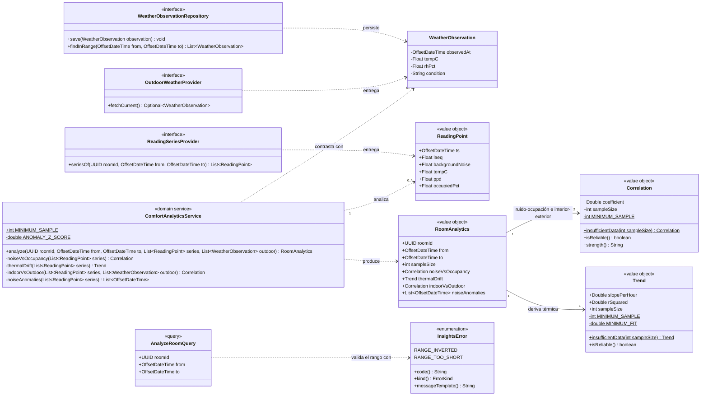
```mermaid
classDiagram
    direction LR

    class WeatherObservation {
        -OffsetDateTime observedAt
        -Float tempC
        -Float rhPct
        -String condition
    }

    class ReadingPoint {
        <<value object>>
        +OffsetDateTime ts
        +Float laeq
        +Float backgroundNoise
        +Float tempC
        +Float ppd
        +Float occupiedPct
    }

    class Correlation {
        <<value object>>
        +Double coefficient
        +int sampleSize
        -int MINIMUM_SAMPLE$
        +insufficientData(int sampleSize)$ Correlation
        +isReliable() boolean
        +strength() String
    }

    class Trend {
        <<value object>>
        +Double slopePerHour
        +Double rSquared
        +int sampleSize
        -int MINIMUM_SAMPLE$
        -double MINIMUM_FIT$
        +insufficientData(int sampleSize)$ Trend
        +isReliable() boolean
    }

    class RoomAnalytics {
        <<value object>>
        +UUID roomId
        +OffsetDateTime from
        +OffsetDateTime to
        +int sampleSize
        +Correlation noiseVsOccupancy
        +Trend thermalDrift
        +Correlation indoorVsOutdoor
        +List~OffsetDateTime~ noiseAnomalies
    }

    class ComfortAnalyticsService {
        <<domain service>>
        +int MINIMUM_SAMPLE$
        -double ANOMALY_Z_SCORE$
        +analyze(UUID roomId, OffsetDateTime from, OffsetDateTime to, List~ReadingPoint~ series, List~WeatherObservation~ outdoor) RoomAnalytics
        -noiseVsOccupancy(List~ReadingPoint~ series) Correlation
        -thermalDrift(List~ReadingPoint~ series) Trend
        -indoorVsOutdoor(List~ReadingPoint~ series, List~WeatherObservation~ outdoor) Correlation
        -noiseAnomalies(List~ReadingPoint~ series) List~OffsetDateTime~
    }

    class AnalyzeRoomQuery {
        <<query>>
        +UUID roomId
        +OffsetDateTime from
        +OffsetDateTime to
    }

    class InsightsError {
        <<enumeration>>
        RANGE_INVERTED
        RANGE_TOO_SHORT
        +code() String
        +kind() ErrorKind
        +messageTemplate() String
    }

    class WeatherObservationRepository {
        <<interface>>
        +save(WeatherObservation observation) void
        +findInRange(OffsetDateTime from, OffsetDateTime to) List~WeatherObservation~
    }

    class ReadingSeriesProvider {
        <<interface>>
        +seriesOf(UUID roomId, OffsetDateTime from, OffsetDateTime to) List~ReadingPoint~
    }

    class OutdoorWeatherProvider {
        <<interface>>
        +fetchCurrent() Optional~WeatherObservation~
    }

    RoomAnalytics "1" --> "2" Correlation : ruido-ocupación e interior-exterior
    RoomAnalytics "1" --> "1" Trend : deriva térmica
    ComfortAnalyticsService ..> RoomAnalytics : produce
    ComfortAnalyticsService "1" ..> "0..*" ReadingPoint : analiza
    ComfortAnalyticsService "1" ..> "0..*" WeatherObservation : contrasta con
    AnalyzeRoomQuery ..> InsightsError : valida el rango con
    ReadingSeriesProvider ..> ReadingPoint : entrega
    OutdoorWeatherProvider ..> WeatherObservation : entrega
    WeatherObservationRepository ..> WeatherObservation : persiste
```

`Correlation` y `Trend` comparten un rasgo que ordena todo el contexto: **ninguna conclusión viaja sin su tamaño de muestra**. Ambos exponen `isReliable()` y un constructor estático `insufficientData`, de modo que la falta de datos es un resultado legítimo y no una excepción. Un coeficiente de correlación calculado sobre cinco minutos de lecturas es aritméticamente válido y estadísticamente inútil; obligar a que el valor viaje acompañado del número de muestras impide presentarlo como si significara algo. Por eso `Correlation.strength()` devuelve `insufficient_data` antes que una etiqueta cualitativa cuando no se alcanza el mínimo de treinta observaciones.

`ReadingPoint` es la traducción anticorrupción de la lectura de Monitoring: seis campos frente a los más de veinte del agregado original, porque el análisis estadístico solo necesita el instante y las magnitudes que correlaciona. `ComfortAnalyticsService` es un servicio de dominio puro —no consulta repositorios ni conoce la persistencia— y recibe las dos series ya resueltas, lo que permite ejercitarlo con datos sintéticos sin levantar la infraestructura.

##### <i>**4.2.3.6.2. Bounded Context Database Design Diagram.**</i>

El bounded context persiste en el esquema Insights una sola tabla, y no es telemetría propia: es el histórico del clima exterior que el sistema va acumulando para poder correlacionarlo hacia atrás con las lecturas de cada sala.

<em>Figura 57.</em> Diagrama de base de datos del bounded context Insights.

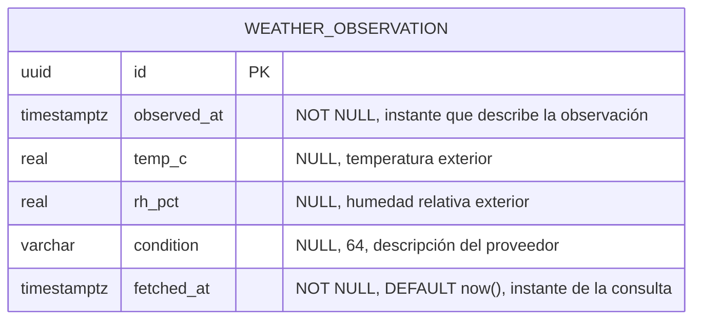
```mermaid
erDiagram
    WEATHER_OBSERVATION {
        uuid id PK
        timestamptz observed_at "NOT NULL, instante que describe la observación"
        real temp_c "NULL, temperatura exterior"
        real rh_pct "NULL, humedad relativa exterior"
        varchar condition "NULL, 64, descripción del proveedor"
        timestamptz fetched_at "NOT NULL, DEFAULT now(), instante de la consulta"
    }
```

La tabla no guarda ninguna referencia a salas ni a locales, y es deliberado: el clima exterior no pertenece a ninguna sala en particular, sino al momento. La correlación entre temperatura interior y exterior se resuelve en la capa de aplicación, emparejando cada observación con la lectura más próxima en el tiempo a través del puerto `ReadingSeriesProvider`. Persistir aquí una clave de Monitoring ataría los dos contextos sin ganar nada.

`observed_at` y `fetched_at` responden a preguntas distintas y por eso conviven: la primera es el instante que la observación describe, la segunda el instante en que el sistema la pidió al proveedor externo. Cuando el servicio meteorológico devuelve un dato con retraso o repite la última medición disponible, la diferencia entre ambas columnas lo delata, y permite descartar observaciones obsoletas sin perderlas.

La tabla tampoco lleva columnas de auditoría, por el mismo criterio que la telemetría de Monitoring: nadie edita ni borra una observación meteorológica, de modo que `created_by` y `updated_by` estarían vacías en todas las filas. Su trazabilidad es precisamente el par de marcas de tiempo.

### 4.2.4. Bounded Context: Monitoring

Es el *core domain* de la plataforma: administra la estructura física del negocio (locales, salas y sus tipos), los dispositivos IoT que reportan por cada sala, y recibe la telemetría agregada por minuto que sube el Edge, deduplicándola y autoprovisionando salas y dispositivos desconocidos. Expone además una fachada de anticorrupción (`MonitoringContextFacade`) que es la única puerta por la que Alerting e Insights acceden a sus datos, de modo que ningún otro contexto conoce sus repositorios ni su modelo interno.

#### <i>**4.2.4.1. Domain Layer.**</i>

**Aggregates:**

* `Site`: Local físico (coworking) donde se instalan los dispositivos; modelado desde el inicio para soportar múltiples locales aunque hoy exista uno solo.
* `RoomType`: Clasifica las salas por actividad (p. ej. cabina de llamadas, zona común), que es lo que da sentido a los umbrales de Alerting.
* `Room`: Sala instrumentada, identificada por el `code` que reporta el firmware; nace activa y sin clasificar, y se autorregistra la primera vez que un dispositivo desconocido reporta por ella.
* `RoomReading`: Agregado por minuto de una sala (acústica, clima, confort, ocupación y calidad del dato), con `isReliable()` para excluir minutos incompletos de los cálculos estadísticos.

**Entities:**

* `Device`: Módulo ESP32 que reporta por una sala, con `lastSeen`, `lastSeq` y `lostBatches`; se mantiene separado de `Room` para que sustituir un módulo no le cueste a la sala su historial.

**Value Objects:**

* `AcousticMetrics`: Niveles de presión sonora ISO 1996 (`laeq`, `l10`, `l50`, `l90`, `lmax`, `lmin`), con `backgroundNoise()` e `intrusivePeaks()`.
* `Climate`: Temperatura y humedad relativa del sensor SHT31.
* `ThermalComfort`: Confort térmico ISO 7730 / Fanger (`pmv`, `ppd`, `verdict`), con `isAcceptable()` según ASHRAE 55.
* `Occupancy`: Porcentaje de ocupación y transiciones detectadas por el sensor de presencia mmWave.
* `DataQuality`: Lotes recibidos vs. esperados, para distinguir un minuto sólido de uno construido con datos incompletos.

**Domain Services:**

* No se define un servicio de dominio propio: los cálculos acústicos y de confort ya llegan resueltos desde el Edge, y el cloud solo agrega lo que necesita historia larga o varias salas (eso vive en Insights).

**Repositories (Interfaces):**

* `SiteRepository`, `RoomTypeRepository`, `RoomRepository`, `RoomReadingRepository`, `DeviceRepository`.

**Domain Errors:**

* `MonitoringError`: Catálogo de errores del contexto (`ROOM_NOT_FOUND`, `SITE_NOT_FOUND`, `ROOM_TYPE_FROM_ANOTHER_SITE`, `READING_BATCH_EMPTY`, `NO_SITE_AVAILABLE`, entre otros).

#### <i>**4.2.4.2. Interface Layer.**</i>

**Controllers:**

* `SitesController`: Expone `/api/v1/sites` para dar de alta y listar locales y sus tipos de sala.
* `RoomsController`: Expone `/api/v1/rooms` para listar salas (incluyendo las no clasificadas), consultarlas, obtener su serie temporal o su última lectura, y clasificarlas.
* `ReadingsController`: Expone `POST /api/v1/readings`, único punto de entrada de la telemetría subida por el Edge, protegido con el scope de máquina `SCOPE_readings:write`.

**Anti-Corruption Layer (saliente, hacia otros contextos):**

* `MonitoringContextFacade` / `MonitoringContextFacadeImpl`: Única superficie pública de este contexto hacia Alerting e Insights; delega en los casos de uso, nunca en los repositorios directamente.

#### <i>**4.2.4.3. Application Layer.**</i>

**Command Services:**

* `CreateSiteUseCaseImpl`, `CreateRoomTypeUseCaseImpl`, `ClassifyRoomUseCaseImpl`: Altas y clasificación, validando pertenencia al mismo local.
* `IngestReadingsUseCaseImpl`: Procesa el lote del Edge con tres responsabilidades: deduplica lecturas (entrega *at-least-once*), autoprovisiona salas y dispositivos desconocidos, y refleja el estado del dispositivo sin recalcular sus contadores.

**Query Services:**

* `ListSitesUseCaseImpl`, `ListRoomTypesUseCaseImpl`, `ListRoomsUseCaseImpl`, `ListUnclassifiedRoomsUseCaseImpl`, `GetRoomUseCaseImpl`, `GetLatestReadingUseCaseImpl`, `GetReadingsInRangeUseCaseImpl`.

#### <i>**4.2.4.4. Infrastructure Layer.**</i>

**Persistence/Repositories:**

* `SiteRepositoryImpl`, `RoomTypeRepositoryImpl`, `RoomRepositoryImpl`, `RoomReadingRepositoryImpl`, `DeviceRepositoryImpl`: Implementaciones JPA con sus entidades (`SiteEntity`, `RoomEntity`, `RoomReadingEntity`, `RoomTypeEntity`, `DeviceEntity`), mappers y repositorios Spring Data correspondientes.

**Configuration:**

* `MonitoringErrorCatalogConfiguration`: Publica el catálogo `MonitoringError`.

#### <i>**4.2.4.5. Bounded Context Software Architecture Component Level Diagrams.**</i>

La solución despliega un único container para los servicios en la nube —la aplicación `cloud-api`, construida con Spring Boot 4 sobre Java 21—, dentro del cual cada bounded context ocupa su propio paquete y no comparte clases con los demás. El diagrama descompone ese container en los componentes de Monitoring, agrupados por la capa a la que pertenecen, e indica para cada uno su tecnología y su responsabilidad.

<em>Figura 58.</em> Diagrama de componentes del bounded context Monitoring dentro del container cloud-api.

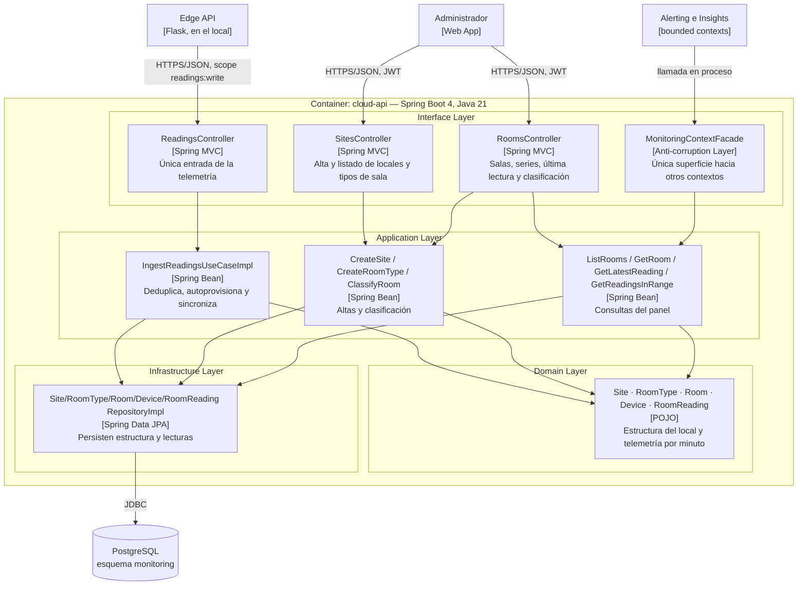
```mermaid
flowchart TB
    admin["Administrador<br/>[Web App]"]
    edge["Edge API<br/>[Flask, en el local]"]

    subgraph cont["Container: cloud-api — Spring Boot 4, Java 21"]
        direction TB
        subgraph il["Interface Layer"]
            sites["SitesController<br/>[Spring MVC]<br/>Alta y listado de locales y tipos de sala"]
            rooms["RoomsController<br/>[Spring MVC]<br/>Salas, series, última lectura y clasificación"]
            reads["ReadingsController<br/>[Spring MVC]<br/>Única entrada de la telemetría"]
            facade["MonitoringContextFacade<br/>[Anti-corruption Layer]<br/>Única superficie hacia otros contextos"]
        end
        subgraph al["Application Layer"]
            ing["IngestReadingsUseCaseImpl<br/>[Spring Bean]<br/>Deduplica, autoprovisiona y sincroniza"]
            alta["CreateSite / CreateRoomType / ClassifyRoom<br/>[Spring Bean]<br/>Altas y clasificación"]
            qry["ListRooms / GetRoom / GetLatestReading / GetReadingsInRange<br/>[Spring Bean]<br/>Consultas del panel"]
        end
        subgraph dl["Domain Layer"]
            agg["Site · RoomType · Room · Device · RoomReading<br/>[POJO]<br/>Estructura del local y telemetría por minuto"]
        end
        subgraph inf["Infrastructure Layer"]
            repos["Site/RoomType/Room/Device/RoomReading RepositoryImpl<br/>[Spring Data JPA]<br/>Persisten estructura y lecturas"]
        end
    end

    otros["Alerting e Insights<br/>[bounded contexts]"]
    db[("PostgreSQL<br/>esquema monitoring")]

    admin -->|"HTTPS/JSON, JWT"| sites
    admin -->|"HTTPS/JSON, JWT"| rooms
    edge -->|"HTTPS/JSON, scope readings:write"| reads
    otros -->|"llamada en proceso"| facade
    reads --> ing
    sites --> alta
    rooms --> alta
    rooms --> qry
    facade --> qry
    ing --> agg
    alta --> agg
    qry --> agg
    ing --> repos
    alta --> repos
    qry --> repos
    repos -->|"JDBC"| db
```

`ReadingsController` es el único punto por el que entra telemetría, y `IngestReadingsUseCaseImpl` concentra las tres responsabilidades que hacen tolerante la ingesta: deduplica por sala y minuto, porque el Edge entrega con garantía *at-least-once*; autoprovisiona la sala y el dispositivo cuando reportan por primera vez, de modo que instalar un módulo no exige configurar nada por adelantado; y refleja el estado del dispositivo descartando los lotes que llegan fuera de orden.

`MonitoringContextFacade` merece atención por su ubicación: vive en la Interface Layer, junto a los controladores REST, y no en la de aplicación. La razón es que cumple la misma función que un controlador —exponer el contexto al exterior— solo que su protocolo es una llamada en proceso en lugar de HTTP. Delega en los casos de uso y nunca en los repositorios, con lo que Alerting e Insights quedan sujetos a las mismas reglas de negocio que cualquier consumidor externo.

#### <i>**4.2.4.6. Bounded Context Software Architecture Code Level Diagrams.**</i>

El nivel de código detalla la implementación del contexto en dos diagramas: el de clases del Domain Layer, que describe el modelo y sus relaciones, y el de base de datos, que describe cómo se persiste.

##### <i>**4.2.4.6.1. Bounded Context Domain Layer Class Diagrams.**</i>

Monitoring es el bounded context más extenso de la solución, por lo que su Domain Layer se presenta en dos diagramas complementarios: el primero recoge los agregados, la entidad y los value objects que componen el modelo; el segundo, los puertos de persistencia que el dominio declara.

<em>Figura 59.</em> Modelo del Domain Layer del bounded context Monitoring.

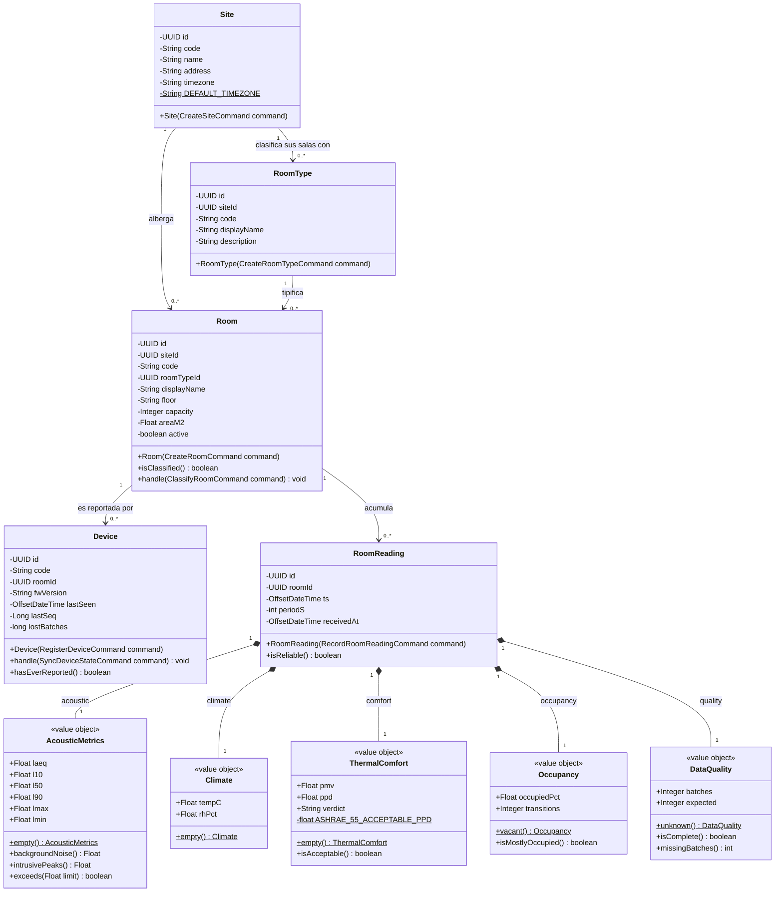
```mermaid
classDiagram
    direction TB

    class Site {
        -UUID id
        -String code
        -String name
        -String address
        -String timezone
        -String DEFAULT_TIMEZONE$
        +Site(CreateSiteCommand command)
    }

    class RoomType {
        -UUID id
        -UUID siteId
        -String code
        -String displayName
        -String description
        +RoomType(CreateRoomTypeCommand command)
    }

    class Room {
        -UUID id
        -UUID siteId
        -String code
        -UUID roomTypeId
        -String displayName
        -String floor
        -Integer capacity
        -Float areaM2
        -boolean active
        +Room(CreateRoomCommand command)
        +isClassified() boolean
        +handle(ClassifyRoomCommand command) void
    }

    class Device {
        -UUID id
        -String code
        -UUID roomId
        -String fwVersion
        -OffsetDateTime lastSeen
        -Long lastSeq
        -long lostBatches
        +Device(RegisterDeviceCommand command)
        +handle(SyncDeviceStateCommand command) void
        +hasEverReported() boolean
    }

    class RoomReading {
        -UUID id
        -UUID roomId
        -OffsetDateTime ts
        -int periodS
        -OffsetDateTime receivedAt
        +RoomReading(RecordRoomReadingCommand command)
        +isReliable() boolean
    }

    class AcousticMetrics {
        <<value object>>
        +Float laeq
        +Float l10
        +Float l50
        +Float l90
        +Float lmax
        +Float lmin
        +empty()$ AcousticMetrics
        +backgroundNoise() Float
        +intrusivePeaks() Float
        +exceeds(Float limit) boolean
    }

    class Climate {
        <<value object>>
        +Float tempC
        +Float rhPct
        +empty()$ Climate
    }

    class ThermalComfort {
        <<value object>>
        +Float pmv
        +Float ppd
        +String verdict
        -float ASHRAE_55_ACCEPTABLE_PPD$
        +empty()$ ThermalComfort
        +isAcceptable() boolean
    }

    class Occupancy {
        <<value object>>
        +Float occupiedPct
        +Integer transitions
        +vacant()$ Occupancy
        +isMostlyOccupied() boolean
    }

    class DataQuality {
        <<value object>>
        +Integer batches
        +Integer expected
        +unknown()$ DataQuality
        +isComplete() boolean
        +missingBatches() int
    }

    Site "1" --> "0..*" RoomType : clasifica sus salas con
    Site "1" --> "0..*" Room : alberga
    RoomType "1" --> "0..*" Room : tipifica
    Room "1" --> "0..*" Device : es reportada por
    Room "1" --> "0..*" RoomReading : acumula
    RoomReading "1" *-- "1" AcousticMetrics : acoustic
    RoomReading "1" *-- "1" Climate : climate
    RoomReading "1" *-- "1" ThermalComfort : comfort
    RoomReading "1" *-- "1" Occupancy : occupancy
    RoomReading "1" *-- "1" DataQuality : quality
```

<em>Figura 60.</em> Puertos de persistencia y catálogo de errores del bounded context Monitoring.

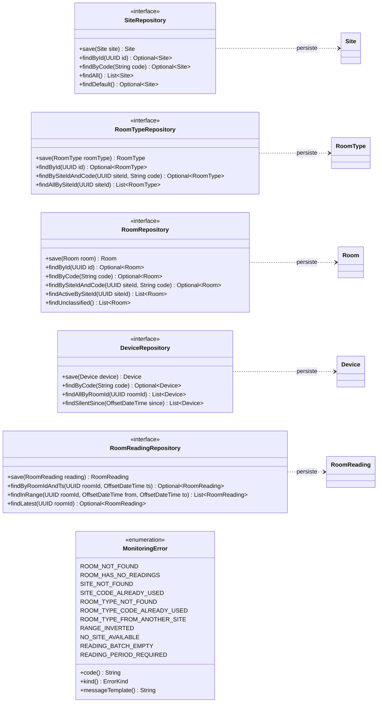
```mermaid
classDiagram
    direction LR

    class SiteRepository {
        <<interface>>
        +save(Site site) Site
        +findById(UUID id) Optional~Site~
        +findByCode(String code) Optional~Site~
        +findAll() List~Site~
        +findDefault() Optional~Site~
    }

    class RoomTypeRepository {
        <<interface>>
        +save(RoomType roomType) RoomType
        +findById(UUID id) Optional~RoomType~
        +findBySiteIdAndCode(UUID siteId, String code) Optional~RoomType~
        +findAllBySiteId(UUID siteId) List~RoomType~
    }

    class RoomRepository {
        <<interface>>
        +save(Room room) Room
        +findById(UUID id) Optional~Room~
        +findByCode(String code) Optional~Room~
        +findBySiteIdAndCode(UUID siteId, String code) Optional~Room~
        +findActiveBySiteId(UUID siteId) List~Room~
        +findUnclassified() List~Room~
    }

    class DeviceRepository {
        <<interface>>
        +save(Device device) Device
        +findByCode(String code) Optional~Device~
        +findAllByRoomId(UUID roomId) List~Device~
        +findSilentSince(OffsetDateTime since) List~Device~
    }

    class RoomReadingRepository {
        <<interface>>
        +save(RoomReading reading) RoomReading
        +findByRoomIdAndTs(UUID roomId, OffsetDateTime ts) Optional~RoomReading~
        +findInRange(UUID roomId, OffsetDateTime from, OffsetDateTime to) List~RoomReading~
        +findLatest(UUID roomId) Optional~RoomReading~
    }

    class MonitoringError {
        <<enumeration>>
        ROOM_NOT_FOUND
        ROOM_HAS_NO_READINGS
        SITE_NOT_FOUND
        SITE_CODE_ALREADY_USED
        ROOM_TYPE_NOT_FOUND
        ROOM_TYPE_CODE_ALREADY_USED
        ROOM_TYPE_FROM_ANOTHER_SITE
        RANGE_INVERTED
        NO_SITE_AVAILABLE
        READING_BATCH_EMPTY
        READING_PERIOD_REQUIRED
        +code() String
        +kind() ErrorKind
        +messageTemplate() String
    }

    SiteRepository ..> Site : persiste
    RoomTypeRepository ..> RoomType : persiste
    RoomRepository ..> Room : persiste
    DeviceRepository ..> Device : persiste
    RoomReadingRepository ..> RoomReading : persiste
```

`RoomReading` compone cinco value objects en lugar de aplanar veinte campos sueltos, y cada uno responde por una dimensión del confort con su propio vocabulario: `AcousticMetrics` expone `backgroundNoise()` e `intrusivePeaks()`, que devuelven los percentiles L90 y L10 de la norma ISO 1996 bajo el nombre que usa el negocio; `ThermalComfort` conoce el umbral de PPD del 10 % que la norma ASHRAE 55 considera aceptable. Los cinco ofrecen un constructor estático para el caso vacío —`empty()`, `vacant()`, `unknown()`—, de modo que una lectura a la que le falta un sensor se representa sin recurrir a valores nulos dispersos por el agregado.

`DataQuality` merece mención aparte porque sostiene la fiabilidad de todo lo que se calcula después: compara los lotes recibidos con los esperados en el minuto, y `RoomReading.isReliable()` delega en él. Un minuto construido con la mitad de las muestras es un dato legítimo para mostrar en el panel, pero no para promediar en una serie histórica, y esa distinción se decide aquí y no en Insights.

La entidad `Device` se mantiene separada de `Room` con una razón concreta: sustituir un módulo ESP32 averiado no puede costarle a la sala su historial de lecturas. Su método `handle` descarta los lotes que llegan con un número de secuencia inferior al último visto, lo que hace idempotente la sincronización de estado ante los reenvíos de una entrega *at-least-once*.

##### <i>**4.2.4.6.2. Bounded Context Database Design Diagram.**</i>

El bounded context persiste en el esquema Monitoring, con cinco tablas que reproducen la estructura física del negocio —local, tipos de sala, salas y dispositivos— más la telemetría que estos reportan.

<em>Figura 61.</em> Diagrama de base de datos del bounded context Monitoring.

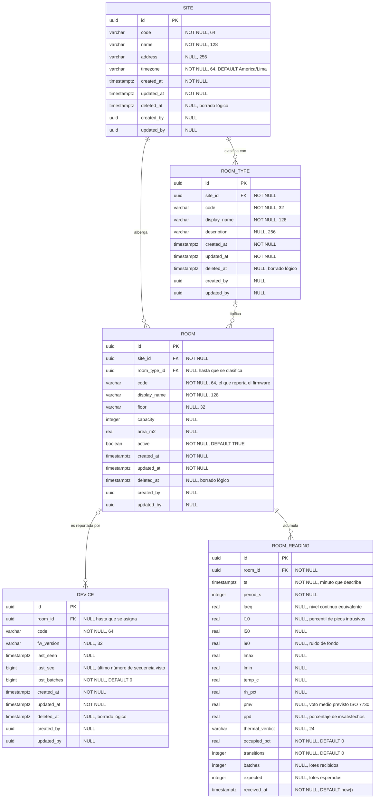
```mermaid
erDiagram
    SITE ||--o{ ROOM_TYPE : "clasifica con"
    SITE ||--o{ ROOM : "alberga"
    ROOM_TYPE |o--o{ ROOM : "tipifica"
    ROOM |o--o{ DEVICE : "es reportada por"
    ROOM ||--o{ ROOM_READING : "acumula"

    SITE {
        uuid id PK
        varchar code "NOT NULL, 64"
        varchar name "NOT NULL, 128"
        varchar address "NULL, 256"
        varchar timezone "NOT NULL, 64, DEFAULT America/Lima"
        timestamptz created_at "NOT NULL"
        timestamptz updated_at "NOT NULL"
        timestamptz deleted_at "NULL, borrado lógico"
        uuid created_by "NULL"
        uuid updated_by "NULL"
    }

    ROOM_TYPE {
        uuid id PK
        uuid site_id FK "NOT NULL"
        varchar code "NOT NULL, 32"
        varchar display_name "NOT NULL, 128"
        varchar description "NULL, 256"
        timestamptz created_at "NOT NULL"
        timestamptz updated_at "NOT NULL"
        timestamptz deleted_at "NULL, borrado lógico"
        uuid created_by "NULL"
        uuid updated_by "NULL"
    }

    ROOM {
        uuid id PK
        uuid site_id FK "NOT NULL"
        uuid room_type_id FK "NULL hasta que se clasifica"
        varchar code "NOT NULL, 64, el que reporta el firmware"
        varchar display_name "NOT NULL, 128"
        varchar floor "NULL, 32"
        integer capacity "NULL"
        real area_m2 "NULL"
        boolean active "NOT NULL, DEFAULT TRUE"
        timestamptz created_at "NOT NULL"
        timestamptz updated_at "NOT NULL"
        timestamptz deleted_at "NULL, borrado lógico"
        uuid created_by "NULL"
        uuid updated_by "NULL"
    }

    DEVICE {
        uuid id PK
        uuid room_id FK "NULL hasta que se asigna"
        varchar code "NOT NULL, 64"
        varchar fw_version "NULL, 32"
        timestamptz last_seen "NULL"
        bigint last_seq "NULL, último número de secuencia visto"
        bigint lost_batches "NOT NULL, DEFAULT 0"
        timestamptz created_at "NOT NULL"
        timestamptz updated_at "NOT NULL"
        timestamptz deleted_at "NULL, borrado lógico"
        uuid created_by "NULL"
        uuid updated_by "NULL"
    }

    ROOM_READING {
        uuid id PK
        uuid room_id FK "NOT NULL"
        timestamptz ts "NOT NULL, minuto que describe"
        integer period_s "NOT NULL"
        real laeq "NULL, nivel continuo equivalente"
        real l10 "NULL, percentil de picos intrusivos"
        real l50 "NULL"
        real l90 "NULL, ruido de fondo"
        real lmax "NULL"
        real lmin "NULL"
        real temp_c "NULL"
        real rh_pct "NULL"
        real pmv "NULL, voto medio previsto ISO 7730"
        real ppd "NULL, porcentaje de insatisfechos"
        varchar thermal_verdict "NULL, 24"
        real occupied_pct "NOT NULL, DEFAULT 0"
        integer transitions "NOT NULL, DEFAULT 0"
        integer batches "NULL, lotes recibidos"
        integer expected "NULL, lotes esperados"
        timestamptz received_at "NOT NULL, DEFAULT now()"
    }
```

Las cuatro tablas de estructura llevan auditoría completa y borrado lógico porque las edita una persona. **`room_reading` no lleva ninguna de esas columnas, y es deliberado**: es telemetría inmutable generada por máquina, nadie edita ni borra la lectura de un sensor, y esas cinco columnas estarían vacías en cientos de miles de filas. Su trazabilidad es el par `ts` y `received_at` —el minuto que describe frente al instante en que llegó—, cuya diferencia delata cortes de red y relojes desincronizados en el dispositivo.

Dos claves foráneas son deliberadamente opcionales. `room.room_type_id` nace nula porque la sala se da de alta sola la primera vez que un dispositivo desconocido reporta por ella, y es el administrador quien la clasifica después desde la aplicación web. `device.room_id` lo es por la misma razón: un módulo puede estar registrado antes de asignarse a una sala. Ambas nulabilidades sostienen el autoprovisionamiento descrito en el Application Layer, que permite instalar un dispositivo sin configurar nada por adelantado.

Los identificadores que maneja el firmware no son UUID: viajan en la columna `code` —`sala-01`, `esp32-sala-01`— y el dispositivo nunca ve la clave primaria. Las claves primarias son UUID versión 7, ordenados cronológicamente en sus 48 bits altos, de modo que ordenar por `id` equivale a ordenar por creación y las inserciones caen al final del índice en lugar de dispersarlo, lo que importa especialmente en `room_reading`, que crece un registro por sala y minuto.

El par `room_id` y `ts` identifica una lectura de forma única en la práctica, y es la base de la deduplicación: el Edge entrega con garantía *at-least-once*, de modo que el mismo minuto puede llegar más de una vez y el caso de uso de ingesta lo reconoce por esa pareja antes de insertarlo.

# Conclusiones

Al cierre de esta primera entrega, el equipo recoge las conclusiones alcanzadas durante la fase de análisis y diseño de la solución. Se ampliarán y corregirán en cada entrega posterior, conforme el producto se implemente y se valide con usuarios.

**Sobre la problemática y los segmentos.** La caracterización del problema confirmó que el disconfort acústico y térmico en espacios de trabajo compartidos no es un problema de percepción sino de medición: entre que la condición aparece y que el administrador se entera transcurre un intervalo durante el cual el miembro ya la está sufriendo. El administrador se entera tarde, por una queja sin detalle o por una sala que deja de reservarse, y para entonces la causa ya no es reconstruible. Esa asimetría de información es lo que la solución ataca, y ordena tanto los segmentos objetivo como el alcance del producto.

**Sobre el análisis competitivo.** Los productos existentes miden, pero no interpretan. Reportan niveles sonoros promedio sin aplicar los percentiles estadísticos de la norma ISO 1996 que distinguen un ruido de fondo permanente de picos intrusivos aislados, y reportan temperatura y humedad como valores independientes en lugar de traducirlos a un índice de confort normalizado según ISO 7730. Esa distancia entre el dato y la decisión es donde se sitúa la propuesta de valor.

**Sobre el diseño de la solución.** Aplicar Domain-Driven Design obligó a decidir dónde pasan las fronteras del sistema antes de escribir código, y esa decisión resultó ser la más determinante del proyecto. Separar la medición del estado actual de la analítica de largo plazo, y ambas de la política de umbrales, permitió que cada contexto evolucione sin arrastrar a los demás. La frontera se hizo física —un esquema de base de datos y una migración por bounded context, sin claves foráneas entre ellos— porque una frontera que solo existe en la documentación deja de existir en cuanto aprieta el plazo.

**Sobre el reparto entre dispositivo, borde y nube.** La arquitectura distribuida la impone el problema: el micrófono muestrea a dieciséis mil muestras por segundo, y transmitir eso sería inviable en ancho de banda y, sobre todo, equivaldría a grabar conversaciones de personas que no han dado su consentimiento. Calcular los indicadores en el dispositivo y descartar el audio convierte una restricción técnica en una garantía de privacidad que el producto puede sostener ante el cliente.

**Sobre el proceso de trabajo.** Documentar el diseño a partir de la implementación ya existente, en lugar de al revés, evitó que el informe y el código contaran cosas distintas: los diagramas de clases y de base de datos se transcriben de las clases del dominio y de las migraciones, de modo que cualquier integrante puede verificar uno contra el otro. La revisión sistemática de cada sección contra el enunciado y las rúbricas reveló defectos que una lectura corriente no detecta, como enlaces del índice que no resolvían o artefactos que parecían completos sin estarlo.

# Bibliografía

Airthings. (2026a). *Airthings for Business: indoor air quality monitoring*. https://www.airthings.com/business

Airthings. (2026b). *How does the ambient noise sensor work?* https://help.airthings.com/en/articles/9739502-how-does-the-ambient-noise-sensor-work

Autoridad de Transporte Urbano para Lima y Callao. (2024). *Monitoreo de ruido ambiental en la red de transporte de Lima y Callao*. ATU.

Berglund, B., Lindvall, T., & Schwela, D. H. (Eds.). (1999). *Guidelines for community noise*. World Health Organization. https://iris.who.int/handle/10665/66217

Binswanger Perú. (2026). *Reporte de mercado de oficinas y espacios flexibles en Lima Metropolitana*. Binswanger.

International Organization for Standardization. (2005). *ISO 7730:2005. Ergonomics of the thermal environment — Analytical determination and interpretation of thermal comfort using calculation of the PMV and PPD indices and local thermal comfort criteria*. ISO.

International Organization for Standardization. (2016). *ISO 1996-1:2016. Acoustics — Description, measurement and assessment of environmental noise — Part 1: Basic quantities and assessment procedures*. ISO.

Kaiterra. (2026). *Indoor air quality monitors and data platform*. https://www.kaiterra.com/

Ministerio de Trabajo y Promoción del Empleo. (2023). *Registro de empresas con trabajadores en modalidad de teletrabajo*. MTPE.

NTi Audio. (2026). *XL2 Sound Level Meter & Acoustic Analyzer*. https://www.nti-audio.com/en/products/xl2-sound-level-meter

Presidencia del Consejo de Ministros. (2003). *Decreto Supremo N.º 085-2003-PCM. Reglamento de Estándares Nacionales de Calidad Ambiental para Ruido*. Diario Oficial El Peruano.

# Anexos.

### Anexo A. Videos de Exposiciones

La relación de videos se amplía con cada entrega del proyecto.

| Entrega | Título del video | Enlace |
|:---|:---|:---|
| AV1 | *(pendiente de grabación)* | *(pendiente de publicación en Microsoft Stream)* |

*Nota.* Cada video de exposición se publica como URL privado en Microsoft Stream o Clipchamp, y se adjunta además como archivo `.mp4` con la nomenclatura `upc-pre-202620-1asi0572-8721-sensework-expo-av1.mp4`.

### Anexo B. Repositorios del proyecto

| Repositorio | Contenido | URL |
|:---|:---|:---|
| `Report` | el informe en Markdown | https://github.com/Grupo03-IOT/Report |
| `cloud-api` | RESTful API interno — Spring Boot 4, Java 21 | https://github.com/Grupo03-IOT/cloud-api |
| `edge-api` | Edge API — Flask, y el simulador del dispositivo | https://github.com/Grupo03-IOT/edge-api |

*Nota.* Todos pertenecen a la organización [Grupo03-IOT](https://github.com/Grupo03-IOT).
